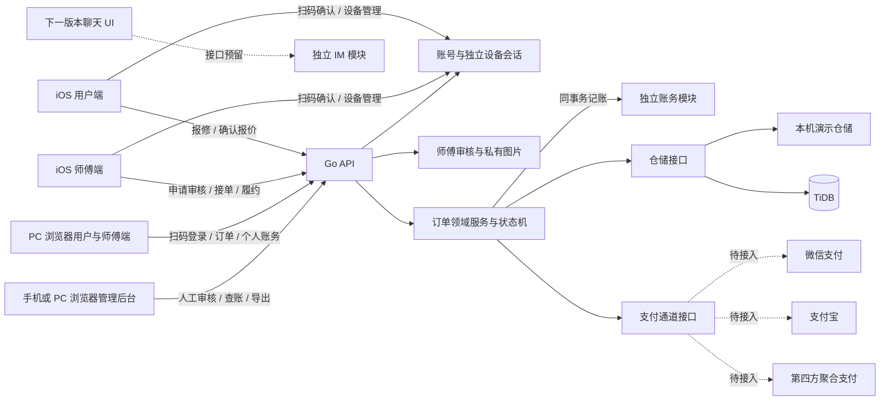
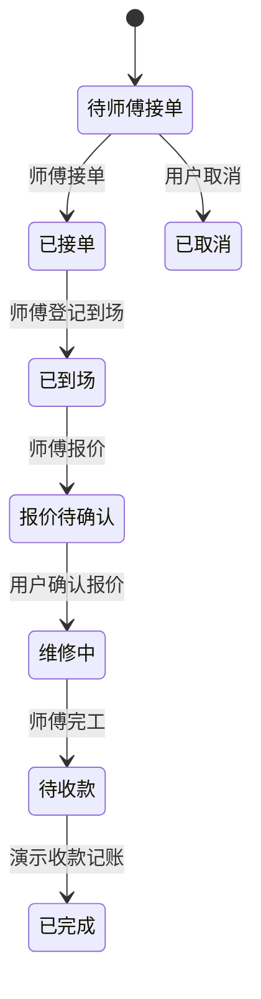

# 啄木鸟维修平台


[toc]

---

## 🔥 <font id=前言>前言</font>

本仓库包含维修撮合业务的跨端原型、后端 API、管理后台与部署材料，各端通过统一 API 合同逐步接通。

## 一、项目目标 <a href="#前言" style="font-size:17px; color:green;"><b>🔼</b></a> <a href="#🔚" style="font-size:17px; color:green;"><b>🔽</b></a>

本项目按“用户报修、平台派单、师傅上门、平台收款、师傅分润”的业务方向搭建跨端原型。首期交付 [**iOS**](https://developer.apple.com/ios/) 原生用户端 / 师傅端、[**Go**](https://go.dev/) API、[**TiDB**](https://docs.pingcap.com/tidb/stable/) 数据结构和 [**Web**](https://developer.mozilla.org/en-US/docs/Web) 管理后台。[**HarmonyOS**](https://developer.huawei.com/consumer/cn/) 7 端先保留独立目录，等哥确认 [**iOS**](https://developer.apple.com/ios/) 版本后再开始实现。

此目录里的 iOS、Go 和后台代码支持账号密码登录、各设备独立会话、手机扫码授权 PC、师傅私有图片资料与人工审核，以及可查询的模拟账务。微信、支付宝与聚合支付仍未接入，没有真实扣款或转账；`DEMO_MODE=false` 继续拒绝启动。

现阶段聚焦简单可用的业务基础：师傅上传资料和图片，由后台人工通过或驳回；账务关联订单、分润与结算核销，支持筛选、汇总和导出。真实支付结算及生产数据库运行方案仍暂缓，当前 TiDB 开发实例继续使用。“生产数据库方案”指将来真实订单数据的备份恢复、权限、故障应对和升级迁移安排，不要求现在更换数据库或搭建集群。[审计报告](审计报告-2026-10-05.md)与[修复验收记录](修复验收-2026-10-05.md)分别保留问题依据和验证结果。

后续功能见[心愿单](心愿单.md)：聊天 IM 下一版本实现，独立模块边界已预留；其它原生客户端按 iOS 验收后的节奏推进。

## 二、端目录 <a href="#前言" style="font-size:17px; color:green;"><b>🔼</b></a> <a href="#🔚" style="font-size:17px; color:green;"><b>🔽</b></a>

| 目录 | 当前内容 | 状态 |
| --- | --- | --- |
| [`iOS/`](iOS/README.md) | <u>[**Swift**](https://www.swift.org/)</u> 原生用户端和师傅端、开屏、主题、多语言、JobsByPods | 首期实现 |
| [`Server/`](Server/README.md) | [**Go**](https://go.dev/) API、领域状态机、[**TiDB**](https://docs.pingcap.com/tidb/stable/) 迁移和数据访问 | 首期实现 |
| [`WebAdmin/`](WebAdmin/README.md) | 管理员登录、订单、师傅审核、账务查询与导出，适配手机浏览器 | 首期实现 |
| [`HarmonyOS/`](HarmonyOS/README.md) | [**HarmonyOS**](https://developer.huawei.com/consumer/cn/) 7 独立端目录和对接说明 | 等 [**iOS**](https://developer.apple.com/ios/) 验收后实现 |
| [`Flutter/`](Flutter/README.md) | [**Flutter**](https://flutter.dev/) 独立端目录 | 预留 |
| [`Android/`](Android/README.md) | [**Android**](https://developer.android.com/) 独立端目录 | 预留 |
| [`Windows/`](Windows/README.md) | [**Windows**](https://www.microsoft.com/windows) 独立端目录 | 预留 |
| [`MacOS/`](MacOS/README.md) | [**macOS**](https://www.apple.com/macos/) 独立端目录 | 预留 |
| [`WeChatMiniProgram/`](WeChatMiniProgram/README.md) | [**微信小程序**](https://developers.weixin.qq.com/miniprogram/dev/framework/) 独立端目录 | 预留 |
| [`Web/`](Web/README.md) | 用户／师傅 PC 浏览器入口，扫码登录、订单操作与个人模拟账务 | 最小功能实现，完整 Web 客户端待扩展 |

## 三、架构与业务流 <a href="#前言" style="font-size:17px; color:green;"><b>🔼</b></a> <a href="#🔚" style="font-size:17px; color:green;"><b>🔽</b></a>



订单状态按顺序流转：



演示收款后，后端按 85% 师傅 / 15% 平台的原型参数生成分润台账，不产生真实交易。金额统一使用整数分，报价范围为 1 分至 100000000 分；先对师傅份额四舍五入，再用总额减去师傅份额得到平台费，保证总额守恒。重复演示收款和重复核销不新增台账、不撤销已核销状态。正式分润比例、退款、发票、佣金税务和支付结算规则需业务确认后再配置。

## 四、业务功能 <a href="#前言" style="font-size:17px; color:green;"><b>🔼</b></a> <a href="#🔚" style="font-size:17px; color:green;"><b>🔽</b></a>

### 4.1、[**iOS**](https://developer.apple.com/ios/) 用户端 <a href="#前言" style="font-size:17px; color:green;"><b>🔼</b></a> <a href="#🔚" style="font-size:17px; color:green;"><b>🔽</b></a>

- 按家电维修、清洗、安装、水电、疏通、防水、家具门窗、房屋修缮、数码维修等服务分类提交需求。
- 记录设备、故障描述、上门地址和期望时间；查看订单进度。
- 未接单订单可取消；用户确认师傅报价后进入维修中。
- 待付款订单显示“付款暂未接入”，不发起扣款。
- 业务首页前先确认用户或师傅身份并登录；个人中心头像内切换身份，退出后再登录所选角色账号。账号密码注册／登录，手机扫码授权 PC 登录；设备页查看并撤销本人会话，退出只结束当前设备会话。登录失败保留失败状态，须主动选择本地演示。
- 支持主题切换、简体中文 / 英文切换、服务地址配置和开屏开关。
- 页面进入和刷新时照常请求 [**Go**](https://go.dev/) API；[**iOS**](https://developer.apple.com/ios/) 先绘制本地样例立即显示，后台页面同样先出本地预览，请求失败 / 超时后继续使用本机演示数据。
- API 成功时用完整响应替换该环境 / 地址 / 角色 / 身份对应的快照，包括空列表；本地演示数据单独保存，失败写操作只修改演示副本。后续成功响应恢复服务端数据，不自动补发本地动作。
- 头 URL 按环境切换：本机测试为 `http://127.0.0.1:8080`（模拟器 / 本机浏览器）或 `http://192.168.1.7:8080`（当前 Mac 局域网，手机同网）；线上地址留空待配。iOS 的旧悬浮菜单已替换为本地 [`JobsDebugPanel`](iOS/JobsByPods/JobsDebugPanel@Pods/README.md)，Debug 圆按钮可拖动，push 环境列表和自定义功能，长按隐藏、重启恢复；面板跟随 App 的有效主题，已打开菜单和环境页也同步更新；选择按 Pod 保存的有效 URL 恢复，无效或未配置的旧线上选择回退有效本机测试。空线上配置仅展示配置状态，填入真实 URL 后自动加入二级环境列表；Release 固定线上配置、无工具入口且不读取 Debug 地址。Web 后台继续使用环境选择器。详见 [`iOS/README.md`](iOS/README.md)、[`WebAdmin/README.md`](WebAdmin/README.md) 与[真机联调说明](Deployment/Docker/Shared/README.md)。
- [**iOS**](https://developer.apple.com/ios/) API 客户端统一使用 Jobs `JobsNetworking`；业务层不直接调用 [**AFNetworking**](https://github.com/AFNetworking/AFNetworking)。当前端不使用旧 [**YTKNetwork**](https://github.com/yuantiku/YTKNetwork) 适配器，因此 [**CocoaPods**](https://cocoapods.org/) 不再安装这两个网络库。
- 订单列表无数据时显示 Jobs UIButton 空态按钮；[**iconfont**](https://www.iconfont.cn/) 图片先显示本地 Logo，再尝试加载网络图片，失败时继续显示本地 Logo。

### 4.2、[**iOS**](https://developer.apple.com/ios/) 师傅端 <a href="#前言" style="font-size:17px; color:green;"><b>🔼</b></a> <a href="#🔚" style="font-size:17px; color:green;"><b>🔽</b></a>

- 匿名演示可切换角色；登录后使用服务端账号的固定角色，师傅审核通过后查看接单大厅和自己的工单。
- 完成接单、登记到场、提交报价、登记完工等状态操作。
- 师傅可注册、上传1—6张私有图片并提交资料，查看审核状态与驳回原因；通过审核才能领取新工单。人工资料审核不包含 OCR、第三方实名核验、排班或真实定位。

### 4.3、[**Go**](https://go.dev/) 后端与管理后台 <a href="#前言" style="font-size:17px; color:green;"><b>🔼</b></a> <a href="#🔚" style="font-size:17px; color:green;"><b>🔽</b></a>

- API 负责订单创建、角色可见范围、工单状态校验、演示支付意图和管理报表。
- 内存仓储可离线演示；设置 [**TiDB**](https://docs.pingcap.com/tidb/stable/) DSN 后使用 [**TiDB**](https://docs.pingcap.com/tidb/stable/) 持久化。
- [**Web**](https://developer.mozilla.org/en-US/docs/Web) 后台可查看订单、师傅列表、订单额、平台费、师傅分润和待人工核销台账。
- 后台支持管理员登录、师傅审核、账务流水筛选／汇总／CSV导出，并适配手机浏览器。模拟收款和人工核销在同事务写平衡账本，重复请求不重复记账；真实账与模拟账隔离，当前真实账为空。
- 用户／师傅 PC 浏览器入口为 `/portal/`，支持手机扫码授权登录；手机退出不撤销 PC，会话有效期内可继续使用。手机可查看本人登录设备并撤销指定设备。

### 4.4、前端无服务器演示与空态约定 <a href="#前言" style="font-size:17px; color:green;"><b>🔼</b></a> <a href="#🔚" style="font-size:17px; color:green;"><b>🔽</b></a>

- 前端不因没有已部署服务器而跳过 API：每次进入数据页或刷新时仍向配置的 [**Go**](https://go.dev/) API 发请求。
- 首屏可先画出本地样例立即展示 UI。请求成功时直接用服务器响应替换；请求失败、超时或响应无法解析时继续使用端内本地演示数据。接口恢复后，下一次请求成功即自动改用真数据，不需要切换“模拟 / 生产”模式。
- 写操作同样先调用 API；失败后在独立本地演示副本中应用动作，保留服务端拒绝或结果未知的提示，不把本地结果当成服务端成功。创建订单使用 `Idempotency-Key` 保证同一请求重试不会重复创建。
- 当前原型使用 2 秒请求超时，避免服务不可达时等很久才看到列表；部署环境可按网络条件调整。
- 所有动态列表必须提供真正的无数据占位；[**iOS**](https://developer.apple.com/ios/) 复用 Jobs `JobsEmptyAuto` 的 UIButton 空态配置，网页端使用带图、说明和重试入口的空态模块。
- UI 图片从 [**iconfont 阿里巴巴矢量图标库**](https://www.iconfont.cn/) 选择；先显示随包提供的本地 Logo，再发起网络图片加载，失败时继续显示本地 Logo。
- 这套流程应用于当前 [**iOS**](https://developer.apple.com/ios/)、WebAdmin 和 PC 浏览器入口。后续 [**Flutter**](https://flutter.dev/)、[**Android**](https://developer.android.com/)、鸿蒙 7、[**Windows**](https://www.microsoft.com/windows)、[**macOS**](https://www.apple.com/macos/)、微信小程序和完整用户 Web 端按同一合同实现；鸿蒙 7 仍在 [**iOS**](https://developer.apple.com/ios/) 验收后开始开发。

## 五、技术选择与版本基线 <a href="#前言" style="font-size:17px; color:green;"><b>🔼</b></a> <a href="#🔚" style="font-size:17px; color:green;"><b>🔽</b></a>

| 模块 | 技术 |
| --- | --- |
| [**iOS**](https://developer.apple.com/ios/) | <u>[**Swift**](https://www.swift.org/)</u>、[**UIKit**](https://developer.apple.com/documentation/uikit)、[**CocoaPods**](https://cocoapods.org/)、JobsSwiftDSL、JobsByUIKit、JobsSwiftSplash、JobsThemeCenter、Jobsl10n、JobsNetworking |
| API | [**Go**](https://go.dev/) 1.26.8 验证基线（模块最低 1.24.0）、标准库 `net/http`、`database/sql`、`go-sql-driver/mysql` |
| 数据库 | [**TiDB**](https://docs.pingcap.com/tidb/stable/)（[**MySQL**](https://www.mysql.com/) 协议） |
| [**iOS**](https://developer.apple.com/ios/) 依赖 | [**CocoaPods**](https://cocoapods.org/)，依赖声明拆分到 `iOS/Podfile.deps` |
| 管理后台 | [**HTML**](https://html.spec.whatwg.org/)、[**CSS**](https://www.w3.org/Style/CSS/)、原生 [**JavaScript**](https://developer.mozilla.org/en-US/docs/Web/JavaScript)，由 [**Go**](https://go.dev/) 同源提供 |
| 其他端 | [**Flutter**](https://flutter.dev/)、[**Android**](https://developer.android.com/)、[**HarmonyOS**](https://developer.huawei.com/consumer/cn/)、[**Windows**](https://www.microsoft.com/windows)、[**macOS**](https://www.apple.com/macos/)、[**微信小程序**](https://developers.weixin.qq.com/miniprogram/dev/framework/) |

## 六、部署与运行 <a href="#前言" style="font-size:17px; color:green;"><b>🔼</b></a> <a href="#🔚" style="font-size:17px; color:green;"><b>🔽</b></a>

### 6.1、一键后端部署 <a href="#前言" style="font-size:17px; color:green;"><b>🔼</b></a> <a href="#🔚" style="font-size:17px; color:green;"><b>🔽</b></a>

服务器部署脚本统一放在 [`Deployment/README.md`](Deployment/README.md)。[**Docker**](https://www.docker.com/) 与 [**Kubernetes**](https://kubernetes.io/) 两条路线按操作系统和发行版分别提供一键入口，负责安装容器环境、构建 [**Go**](https://go.dev/) API 镜像、启动 [**TiDB**](https://docs.pingcap.com/tidb/stable/) 与后台并执行数据库初始化。首次部署优先使用 [**Docker**](https://www.docker.com/) 路线；[**Kubernetes**](https://kubernetes.io/) 路线用于本机单节点验证和后续迁移准备。

完整反安装脚本独立放在同级的 [`unDeployment/README.md`](unDeployment/README.md)，按操作系统与发行版对应。是否保留项目数据在脚本运行时选择：默认先备份再卸载，也可永久清空，输入 `YES` 后执行。

### 6.2、软件准备 <a href="#前言" style="font-size:17px; color:green;"><b>🔼</b></a> <a href="#🔚" style="font-size:17px; color:green;"><b>🔽</b></a>

- [**macOS**](https://www.apple.com/macos/)、[**Xcode**](https://developer.apple.com/xcode/) 和 [**CocoaPods**](https://cocoapods.org/)，用于打开 [**iOS**](https://developer.apple.com/ios/) 工程；安装 [**CocoaPods**](https://cocoapods.org/) 后执行 `pod --version` 确认命令可用。
- [**Go**](https://go.dev/) 1.26.8，用于运行 API、迁移程序和统一验证；模块最低声明为 1.24.0。
- [**TiDB**](https://docs.pingcap.com/tidb/stable/) 实例（可选）；没有 [**TiDB**](https://docs.pingcap.com/tidb/stable/) 时 API 使用进程内内存仓储，重启后演示数据会清空。
- 浏览器用于访问 [**Web**](https://developer.mozilla.org/en-US/docs/Web) 管理后台。
- 没有 [**Go**](https://go.dev/) / [**TiDB**](https://docs.pingcap.com/tidb/stable/) 时可直接打开 `WebAdmin/index.html` 观察后台；页面会尝试访问本机 API，失败后显示可操作的本地演示数据。

### 6.3、[**iOS**](https://developer.apple.com/ios/) 安装和运行 <a href="#前言" style="font-size:17px; color:green;"><b>🔼</b></a> <a href="#🔚" style="font-size:17px; color:green;"><b>🔽</b></a>

```sh
cd iOS
pod install
open RepairMarketplace.xcworkspace
```

在 Xcode 中也可通过 `Behaviors → 🫘啄木鸟 iOS · Pod Install` 随时启动 [`iOS/ScriptsByPods/` 的手动安装入口](<iOS/ScriptsByPods/【MacOS@Xcode】🫘打开终端运行Pod Install.command/README.md>)。脚本打开终端，按回车确认后在 iOS 根目录检查并执行 `pod install`，完整输出写入系统临时目录中的 `repair-marketplace-pod-install.log`。工程中可从 `ScriptsByPods` 组查看脚本和 README；自定义 Behaviors 需在当前用户的 Xcode 中配置，迁移电脑或项目路径后重新选取脚本。它不依赖 [**Sourcetree**](https://www.sourcetreeapp.com/)，不自动安装升级运行环境，也不挂入编译流程。

`Podfile.deps` 由 `Podfile` 的安装钩子挂到 `Pods.xcodeproj` 根组，使用 `explicitFileType = text.script.ruby` 显示红钻；只添加文件引用，不加入 Build Phase。钩子会检查工程根对象和唯一引用，失败时恢复备份并告警跳过，不阻断依赖安装。

在 [**Xcode**](https://developer.apple.com/xcode) 选择 `RepairMarketplace` scheme 和 iPhone 模拟器后运行。真机打包时，在 Signing & Capabilities 选择自己的开发团队与唯一 Bundle ID。模拟器 API 默认地址是 `http://127.0.0.1:8080`，请求超时为 2 秒；真机通过 Debug 工具面板配置局域网地址，并让 [**Go**](https://go.dev/) 服务绑定该开发机的局域网网卡地址。非回环监听需要显式设置 `ALLOW_DEMO_NETWORK=true`。订单页每次进入或刷新都会尝试请求 API，成功后显示服务器数据，失败则使用独立本地演示数据。预约时间发送带时区的 RFC3339 时间或留空协商；iOS 当前最多展示最近 200 条，历史翻页尚未开放。登录会话和私有资料请仅在可信开发网络联调；真实运营另配 HTTPS 与生产数据方案。

归档发布：[**Xcode**](https://developer.apple.com/xcode) 选择 Generic [**iOS**](https://developer.apple.com/ios/) Device，执行 Product → Archive，再从 Organizer 导出 Ad Hoc、Development 或 App Store 包。发布前需配置签名、隐私说明、正式 Bundle ID、HTTPS 服务地址和完整生产访问和运维配置。

主 App target 最后一个 `Save Build IPA` Build Phase 自动调用 `iOS/ScriptsByDevTools/save_device_ipa_after_build.command/save_device_ipa_after_build.command`，无需手动打包：[**iOS**](https://developer.apple.com/ios/) 模拟器构建输出 `iOS/build/模拟器.ipa`，[**iOS**](https://developer.apple.com/ios/) 真机构建输出 `iOS/build/真机.ipa`。脚本先在系统临时目录复制 `.app` 到标准 `Payload/<App名>.app` 并生成 IPA；真机要求有效 [**Xcode**](https://developer.apple.com/xcode) 签名并通过严格校验，模拟器允许关闭代码签名。只有在压缩成功后才清空 `iOS/build/` 中全部内容（含隐藏文件、子目录、旧包和另一平台的包），再写入本次唯一 IPA；签名或压缩失败会保留原产物。日志同步到 [**Xcode**](https://developer.apple.com/xcode) 构建日志和系统临时目录中的 `save_device_ipa_after_build.log`。`模拟器.ipa` 仅供提取模拟器 App 使用，不能安装到真机或用于正式分发；`真机.ipa` 的使用仍受签名和描述文件约束。DerivedData 与构建中间目录必须位于 `iOS/build/` 外。

```sh
cd iOS
xcodebuild -workspace RepairMarketplace.xcworkspace -scheme RepairMarketplace -destination 'generic/platform=iOS Simulator' -derivedDataPath ./DerivedData build
```

该脚本是主 App target 的最后一个 Build Phase，不是整个 Scheme 的 Post-action；IPA 阶段通过不代表后续 Scheme 动作或测试都通过。

### 6.4、[**Go**](https://go.dev/) API 与 [**TiDB**](https://docs.pingcap.com/tidb/stable/) <a href="#前言" style="font-size:17px; color:green;"><b>🔼</b></a> <a href="#🔚" style="font-size:17px; color:green;"><b>🔽</b></a>

```sh
cd Server
cp .env.example .env
```

如使用 [**TiDB**](https://docs.pingcap.com/tidb/stable/)，在 `.env` 中设置 `TIDB_DSN`，格式为 `用户名:密码@tcp(主机:4000)/数据库名?tls=true&parseTime=true`；TLS 名称或 CA 配置按你的 [**TiDB**](https://docs.pingcap.com/tidb/stable/) 实例要求调整。程序会强制启用 `parseTime` 并默认使用 UTC。之后在当前终端加载变量并建表：

```sh
set -a
source .env
set +a
go mod download
go run ./cmd/migrate
go run ./cmd/api
```

存活检查为 `http://127.0.0.1:8080/healthz`；就绪检查 `/readyz` 会确认仓储和必需表可用，适用于容器 readiness；后台地址为 `http://127.0.0.1:8080/admin/`，PC 入口为 `/portal/`。`TIDB_DSN` 为空时使用内存仓储；配置 DSN 后使用 [**TiDB**](https://docs.pingcap.com/tidb/stable/)。迁移记录版本与校验和，重复执行不会覆盖已执行内容，种子数据单独处理；详见 [`Server/README.md`](Server/README.md)。`DEMO_MODE` 必须保持 `true`。默认只绑定 `127.0.0.1`，非回环开发监听须显式设置 `ALLOW_DEMO_NETWORK=true`；监听许可与账号认证分别控制。

后台首先展示独立登录入口，包含登录、开户说明与恢复码找回密码。主管理员首次启动自动创建为 `admin / admin`，无须手动填写 `.env`。管理员登录后在“设置 → 账号管理”新增管理员或普通账号，管理员可审核身份、重置所有用户密码、封停／解封账号；普通账号可处理业务和修改自己的密码，不能审核身份、新增账号、修改他人密码或封停账号。封停和密码修改撤销旧会话，重复部署不覆盖既有密码或权限。各平台部署入口每次重建当前源码并部署，已配置的 Docker 局域网网卡入口自动保留。`SESSION_TTL_HOURS` 默认 24 小时；手机退出只撤销该会话，PC 会话持续到过期或被手机撤销。私有图片与数据库一起保存，部署说明见对应 Docker／Kubernetes Shared README。

### 6.5、[**Web**](https://developer.mozilla.org/en-US/docs/Web) 管理后台 <a href="#前言" style="font-size:17px; color:green;"><b>🔼</b></a> <a href="#🔚" style="font-size:17px; color:green;"><b>🔽</b></a>

[**Go**](https://go.dev/) 服务运行后打开 `/admin/`。后台复用实际同源端口，包括 Kubernetes 的 8081，不需要独立安装前端依赖或打包。没有服务时也可直接用浏览器打开 `WebAdmin/index.html`：本地假数据立即显示，并请求 `http://127.0.0.1:8080`；各 API 最多等待 2 秒，覆盖完整正文读取。每个模块标记数据来源，合法空列表显示空态，坏响应按同样规则回退。订单、师傅和台账可按游标加载更多。失败写操作保留原因并在独立副本演示，服务恢复后下一次刷新自动使用真数据。

## 七、API 入口 <a href="#前言" style="font-size:17px; color:green;"><b>🔼</b></a> <a href="#🔚" style="font-size:17px; color:green;"><b>🔽</b></a>

| 方法 | 路径 | 用途 |
| --- | --- | --- |
| `GET` | `/healthz` | 服务存活检查 |
| `GET` | `/readyz` | 仓储与表结构就绪检查 |
| `GET` | `/api/v1/categories` | 服务分类 |
| `POST` | `/api/v1/auth/register`、`/api/v1/auth/login` | 普通用户／师傅账号注册与登录 |
| `GET` / `POST` | `/api/v1/auth/me`、`/api/v1/auth/logout` | 当前账号信息／仅退出当前会话 |
| `GET` / `DELETE` | `/api/v1/auth/devices`、`/api/v1/auth/devices/{id}` | 手机查看／撤销本人设备会话 |
| `POST` | `/api/v1/auth/qr/challenges` 及其 `inspect`、`approve`、`poll` 子路径 | PC 创建二维码、手机查看并确认、PC 一次兑换 |
| `POST` / `GET` | `/api/v1/worker-assets`、`/api/v1/worker-assets/{id}` | 上传图片／鉴权读取私有图片 |
| `GET` / `POST` | `/api/v1/workers/me/application` | 查看／提交本人师傅申请 |
| `GET` / `POST` | `/api/v1/admin/worker-applications`、`/api/v1/admin/worker-applications/{id}/review` | 管理员查询／人工审核申请 |
| `GET` / `POST` | `/api/v1/orders` | 查询当前角色订单 / 创建用户订单 |
| `POST` | `/api/v1/orders/{id}/accept` | 师傅接单 |
| `POST` | `/api/v1/orders/{id}/arrive` | 登记到场 |
| `POST` | `/api/v1/orders/{id}/quote` | 提交报价（分） |
| `POST` | `/api/v1/orders/{id}/confirm-quote` | 用户确认报价 |
| `POST` | `/api/v1/orders/{id}/complete` | 师傅登记完工 |
| `POST` | `/api/v1/orders/{id}/cancel` | 用户取消待接单订单 |
| `POST` | `/api/v1/payment-intents` | 微信 / 支付宝 / 聚合支付接口占位，返回未接入 |
| `GET` | `/api/v1/admin/dashboard` | 管理统计 |
| `GET` | `/api/v1/admin/orders` | 管理订单列表 |
| `GET` | `/api/v1/admin/workers` | 师傅列表 |
| `GET` | `/api/v1/admin/settlements` | 分润台账 |
| `POST` | `/api/v1/admin/orders/{id}/demo-collect` | 写入演示收款记录 |
| `POST` | `/api/v1/admin/settlements/{id}/manual-paid` | 模拟人工核销分润，不发生转账 |
| `GET` | `/api/v1/ledger/journals`、`/api/v1/ledger/summary` | 本人账务流水与筛选范围汇总 |
| `GET` | `/api/v1/admin/ledger/journals`、`/api/v1/admin/ledger/summary`、`/api/v1/admin/ledger/export.csv` | 管理员流水／汇总／CSV 导出 |

真实账号使用 `Authorization: Bearer <token>`，角色与身份由服务端会话确定；伪造 `X-Actor-Role`、`X-Actor-ID` 不能取得管理员权限。`ALLOW_ANONYMOUS_DEMO=true` 时仅允许固定演示用户／师傅身份，匿名演示师傅只能查看和操作演示用户的订单；后台审核、图片、设备管理与账务仍要求有效会话。手机能力由登录声明的设备类型授予，当前未接入硬件可信认证。

列表维持数组响应，支持 `limit`（订单默认 100，账务默认 50，最大 200）与 `cursor`；`X-Next-Cursor` 表示下一页。角色与主体过滤在仓储层执行，后台统计覆盖整体数据。账务按 `mode=simulated|actual` 隔离，日期范围为起点包含、终点不包含；汇总覆盖全部筛选流水，CSV 超过 10000 条拒绝导出。机器错误码、输入约束和跨端接口合同位于 [`Server/api/openapi.yaml`](Server/api/openapi.yaml)。

## 八、后续阶段 <a href="#前言" style="font-size:17px; color:green;"><b>🔼</b></a> <a href="#🔚" style="font-size:17px; color:green;"><b>🔽</b></a>

1、评审 [**iOS**](https://developer.apple.com/ios/) 用户端和师傅端；确认信息架构、下单字段和工单流程。

2、[**iOS**](https://developer.apple.com/ios/) 验收后按已确认的 API 和状态机实现 [**HarmonyOS**](https://developer.huawei.com/consumer/cn/) 7 原生端。

3、下一版本实现独立聊天 IM。短信登录、细分后台权限、完整审计日志等扩展需另行确认；本期已有账号密码、私有图片申请与人工审核。

4、设计支付与分账方案，依序接入微信支付、支付宝、第四方聚合支付，并补齐退款、对账、签名验签和回调幂等。

5、沿现有 [**OpenAPI**](https://www.openapis.org/) 合同补齐新端，再复用到 [**Flutter**](https://flutter.dev/)、[**Android**](https://developer.android.com/)、[**Windows**](https://www.microsoft.com/windows)、[**macOS**](https://www.apple.com/macos/)、微信小程序和完整 Web 端。具体后续范围统一记录在[心愿单](心愿单.md)。

## 九、验证入口与状态 <a href="#前言" style="font-size:17px; color:green;"><b>🔼</b></a> <a href="#🔚" style="font-size:17px; color:green;"><b>🔽</b></a>

统一入口与依赖见 [`Validation/README.md`](Validation/README.md)：

```sh
node Validation/validate.mjs
```

- Go 格式、`go test -race -p 1 ./...`、`go vet ./...` 与独立 API 的真实 HTTP 账号／审核／扫码／多设备／维修／账务全流程已通过。独立临时 TiDB 的同一 HTTP 流程、悲观／乐观事务、迁移兼容／校验／并发锁和创建／接单／收款／扫码幂等合同已通过。
- WebAdmin 17 组与 PC 7 组故障／业务回归通过；真实浏览器检查管理员登录、同源端口、空列表、手机宽度及 PC 二维码渲染通过，无未捕获脚本异常。
- iOS 61 个 App Swift 文件语法，账号／资料／账务／设备／扫码和原有金额／快照／回退业务回归通过。最新源码完整 Debug／Release 模拟器构建均通过，包含 arm64 与 x86_64。所有完整构建使用隔离副本，关闭 `Save Build IPA` 阶段，当前工程已有 IPA 不被替换。
- 82 个部署 / 反安装 Shell 文件与 1 个 iOS 打包脚本语法通过；9 个 PS1（含验证入口）BOM / Parser 和两个部署模拟回归通过。本机 Parser 使用 PowerShell 7.6.6；Windows PowerShell 5.1 的实机执行、各 Linux 发行版安装仍未验收。
- `.github/workflows/validate.yml` 已准备 macOS / Windows CI；当前目录尚无 Git 元数据，远端工作流尚未运行。没有初始化仓库、提交或推送。
- 历史 iPhone 签名、IPA 导出和安装验证仍可参考 iOS 说明；当前修复没有重新安装真机、重启现有 Docker / Kubernetes 服务或迁移其数据。现有 JobsDebugPanel、依赖和签名配置保留；第三方依赖原有非阻断警告仍可能出现。

统一入口最后结果为 0 失败、0 跳过。原型问题对账见[修复验收记录](修复验收-2026-10-05.md)，本期新增功能与保留边界见[业务基础验收](业务基础验收-2026-10-05.md)。

<a id="🔚" href="#前言" style="font-size:17px; color:green; font-weight:bold;">我是有底线的➤点我回到首页</a>
