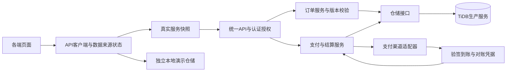

# 啄木鸟维修平台：代码与项目审计报告

[toc]

---

## 🔥 前言

审计日期：2026-10-05。基线为用户保存的原始需求、现行工程与已确认的项目约束。交付范围为审计报告；本轮未修改业务源码、部署配置或既有 README，未部署、卸载、重启运行环境，未创建提交或推送。

检查覆盖 `iOS/App/`、本地框架接入、`Server/`、`WebAdmin/`、`Deployment/`、`unDeployment/`、根目录说明和预留客户端。读取 <u>[**Swift**](https://www.swift.org/)</u> 基准工程相关实现，核对 Jobs 规范；第三方与生成源码不作为整改对象。没有原版 App 的完整页面、抓包或操作样本，因此不对视觉还原度及原版全部功能作通过结论。

## 一、总体判断 <a href="#前言" style="font-size:17px; color:green;"><b>🔼</b></a> <a href="#🔚" style="font-size:17px; color:green;"><b>🔽</b></a>

**现有成果是有可复用基础的维修业务演示原型，建议保留现有技术路线并分阶段升级。当前尚不具备真实客户运营、真实收款和自动分账条件。**

- [**iOS**](https://developer.apple.com/ios/) 已有用户／师傅工作流，并实际接入 Jobs 主题、语言、开屏、网络、图片和空态模块；用户／师傅目前在一个 App 内切换演示角色，符合首期验证思路。是否最终拆成两个安装包属于后续发行选择。
- [**Go**](https://go.dev/) 已按 HTTP、领域服务、仓储、支付接口分层。抢单使用状态条件更新；演示收款采用事务及结算订单唯一约束。没有证据支持推翻现有后端重写。
- [**Docker**](https://www.docker.com/)／[**Kubernetes**](https://kubernetes.io/) 已有两条完整目录路线、38 个部署入口与38个反安装入口，并共享应用镜像。宿主机准备容器环境、容器内编译 Go 的做法符合降低环境维护成本的目标。
- 已复现报价崩溃、旧缓存复活、后台跨部署请求、超时失效和 Windows 编码问题。这些应先于扩展新客户端处理。
- 没有真实支付符合“暂不接支付”的要求；但当前支付接口仍需完善，未来不能只替换一个渠道适配器就视为接入完成。

优先级定义：**P0 为启用对应真实用户、资金功能或公网部署前必须完成的门槛；资金链路在真实支付／结算启用前完成。P1 为影响当前功能验收、数据可靠性或部署安全的问题；P2 为维护性、体验、扩展与交付一致性升级。** P0 条目包含已明确声明的演示边界，不等同于本地演示已经发生事故。

## 二、原始需求对账 <a href="#前言" style="font-size:17px; color:green;"><b>🔼</b></a> <a href="#🔚" style="font-size:17px; color:green;"><b>🔽</b></a>

| 原始目标 | 当前证据 | 判断与升级方向 |
| --- | --- | --- |
| Swift 原生首期，Go 后端 | `iOS/`、`Server/` 有实际代码 | 已落地技术路线 |
| 全端独立目录，先做 iOS | 其他七个客户端目录含预留 README | 符合阶段要求；预留目录不能计为已实现客户端 |
| 用户端与师傅端 | 下单、取消、确认报价；接单、到场、报价、完工 | 已有演示闭环；真实账号、师傅入驻／审核与收益查询待补 |
| 平台收款后给师傅分润 | 后台模拟收款、85／15 台账、人工核销 | 有演示记账；没有真实资金流、提现、退款和对账 |
| 微信、支付宝、第四方聚合支付预留 | 三个 Provider、Gateway、支付 API | 三渠道当前返回501，正确保持未接入；实际接入合同不完整 |
| 按 Swift 基准平移 | JobsByPods、SnapKit、开屏、主题、Jobsl10n、JobsNetworking | 框架接入已完成；业务控制器与 DSL 写法只部分对齐 |
| 解耦 Podfile | `Podfile.deps` 逐条依赖；Pods 工程唯一 Ruby 类型引用 | 结构正确；本轮未重复安装或进行红钻视觉验收 |
| TiDB、封装与解耦 | 仓储接口、内存／TiDB 实现、初始化 SQL | 原型可用；生产存储、迁移版本、过滤分页、权限待升级 |
| 管理后台 | 订单、师傅、指标和结算台账 | 有演示后台；缺真实管理员权限、调度与师傅审核操作 |
| Docker／Kubernetes 双路线 | 镜像共用；Compose、Minikube、K3s 清单 | 可继续沿用；当前 Kubernetes 是单节点验证方案 |
| Windows／macOS／Linux 与芯片检测 | 各平台入口、17种 Linux 发行版入口、架构分支 | 已有实现；默认 Windows 编码存在缺陷，其他系统实机覆盖不足 |
| 每个部署脚本配 README | 入口和共享组件均有说明 | 文档覆盖较完整；存在大小写链接和验证状态陈旧问题 |
| 最小开销部署 | Go 编译进容器，后端／后台同源部署 | 开发演示开销合理；真实 TiDB 服务、备份与可用性需单独核算 |

[**Swift**](https://www.swift.org/) 按 Jobs 约定采用原生 UIKit；[**SnapKit**](https://github.com/SnapKit/SnapKit) 约束与 [**CocoaPods**](https://cocoapods.org/) 依赖体系已经存在。后续 [**Flutter**](https://flutter.dev/)、[**Android**](https://developer.android.com/)、[**HarmonyOS**](https://developer.huawei.com/consumer/cn/)、[**Windows**](https://www.microsoft.com/windows)、[**macOS**](https://www.apple.com/macos/)、[**微信小程序**](https://developers.weixin.qq.com/miniprogram/dev/framework/) 和用户 [**Web**](https://developer.mozilla.org/en-US/docs/Web) 端应复用稳定 API 合同。当前目录已迁移到现行工作区，无须按旧提示词再次搬回桌面。

## 三、优先修复的问题（P1） <a href="#前言" style="font-size:17px; color:green;"><b>🔼</b></a> <a href="#🔚" style="font-size:17px; color:green;"><b>🔽</b></a>

### 3.1、F01：后台会跨 Docker／Kubernetes 请求数据 <a href="#前言" style="font-size:17px; color:green;"><b>🔼</b></a> <a href="#🔚" style="font-size:17px; color:green;"><b>🔽</b></a>

位置：[`WebAdmin/environment.js`](./WebAdmin/environment.js)，22—25行。

仅当页面端口是8080时使用页面同源地址。首次打开 `http://127.0.0.1:8081/admin/` 时，实际默认 API 仍为 `http://127.0.0.1:8080`。若跨源请求被拒绝，会回退演示；若允许跨源或同源策略变化，则可能读写另一条部署的数据。Kubernetes 后台显示200不能证明其业务 API 接到了 Kubernetes。

**复现：**隔离运行实际环境脚本，页面 origin设为8081、无保存配置，`activeAPIBase()` 返回8080。

**升级：**服务托管的后台优先使用经确认的页面 origin，不写死8080；静态离线预览再使用测试默认值。保留手动地址设置，并显示当前 API 地址／服务实例，分别验收8080、8081、自定义端口与局域网入口。

### 3.2、F02：iOS 报价金额输入可使 App 崩溃 <a href="#前言" style="font-size:17px; color:green;"><b>🔼</b></a> <a href="#🔚" style="font-size:17px; color:green;"><b>🔽</b></a>

位置：[`MarketplaceViewController.swift`](./iOS/App/Modules/MarketplaceViewController.swift)，493—497行。

`Double(amount) > 0` 不保证结果可转为 `Int64`。输入 `999999999999999999999999999999999999` 后，金额乘100再直接转换会触发越界 trap；输入 `0.001` 元则转换为0分并继续发送。隔离提取实际表达式已复现 signal5；`128.50` 的正常结果为12850分。

**升级：**使用十进制金额解析，限定两位小数、至少1分、明确业务上限，并检查有限值与转换范围。前端与后端执行相同金额规则，禁止以浮点数决定资金最终结果。

### 3.3、F03：服务端空列表后，断网会重新出现旧订单 <a href="#前言" style="font-size:17px; color:green;"><b>🔼</b></a> <a href="#🔚" style="font-size:17px; color:green;"><b>🔽</b></a>

位置：[`MarketplaceStore.swift`](./iOS/App/Services/MarketplaceStore.swift)，21—29、108—139行。

成功列表请求与单条写入共用按ID合并的缓存。空列表不会清除旧记录；首次合并还会把两条默认演示单放进同一缓存。已有环境／地址隔离，但没有同一环境内的远端快照／演示副本隔离。

**复现：**真实GET返回 `[real-1]` → 下次GET返回 `[]` → 断网；最终离线列表包含 `real-1` 和两条演示订单。

**升级：**按环境、服务地址、角色和账号保存远端权威快照，成功列表请求完整替换，成功空响应保存为空；演示订单单独存储。单条成功写入可以更新对应快照，但不能让演示记录混入真实列表。保留断网可演示能力。

### 3.4、F04：写操作失败的原因丢失，重复创建没有幂等保护 <a href="#前言" style="font-size:17px; color:green;"><b>🔼</b></a> <a href="#🔚" style="font-size:17px; color:green;"><b>🔽</b></a>

位置：[`MarketplaceStore.swift`](./iOS/App/Services/MarketplaceStore.swift)，69—72、97—103行；[`WebAdmin/admin.js`](./WebAdmin/admin.js)，361—377行；[`marketplace.go`](./Server/internal/service/marketplace.go)，40—67行。

401／403／409等业务拒绝与断网、超时全部走同一演示回退。iOS模拟409接单后仍返回本地 `accepted`。后台写入被409拒绝后，成功的刷新GET会把提示恢复为“已连接”，拒绝原因没有展示。若服务端已创建订单但响应丢失，客户端再提交会多建一单；后端对相同幂等键也创建不同订单。

**升级：**保留用户要求的失败可演示行为，同时返回“远端结果／失败原因／独立演示结果”。明确提示“服务端拒绝”或“提交结果未知”，演示写入只落演示副本，不能自动重放成真实操作。真实创建、收款、退款等写操作使用持久化幂等键和结果查询。

### 3.5、F05：Web 的2秒超时未覆盖响应正文，异常结构也不会安全回退 <a href="#前言" style="font-size:17px; color:green;"><b>🔼</b></a> <a href="#🔚" style="font-size:17px; color:green;"><b>🔽</b></a>

位置：[`WebAdmin/admin.js`](./WebAdmin/admin.js)，161—190、317—335行。

`return response.json()` 后立即执行 `finally` 清除超时，正文仍在下载／解析时已经失去超时保护。隔离设置 `json()` 永不完成，确认请求未完成而计时器已清除。另一个复现中，HTTP200返回合法JSON `null` 被视为在线成功，随后渲染抛错，四块数据无法正常完成刷新。

**升级：**等待完整正文解析后再清理计时器；在请求边界验证数组、对象和关键字段，异常结构按现有规则回退并保留诊断原因。超时集中配置；部分接口失败时，各模块展示自己的来源与状态。

### 3.6、F06：离线收款不生成新结算，分润舍入也不一致 <a href="#前言" style="font-size:17px; color:green;"><b>🔼</b></a> <a href="#🔚" style="font-size:17px; color:green;"><b>🔽</b></a>

位置：[`WebAdmin/admin.js`](./WebAdmin/admin.js)，338—358行；[`marketplace.go`](./Server/internal/service/marketplace.go)，179—193、242—246行。

本地模拟收款只更新已经存在的 settlement，不创建缺失记录。复现一条待付款订单、空结算列表，收款后订单为completed但结算仍为0条。Web先四舍五入15%平台费，Go先四舍五入85%师傅费，10分订单分别得到“平台2／师傅8”和“平台1／师傅9”。Go未限定报价上限，极大值的浮点分润有精度损失，两个最大整数金额汇总还能溢出为负数。

**升级：**用整数分和整数比例确定唯一舍入规则，服务端保存该订单采用的比例版本与金额快照，客户端遵循同一演示算法。模拟收款按orderId幂等创建结算，重复操作不重复生成。报价上限与汇总溢出检查同时落地。85／15仍是演示参数，不能写成正式业务比例。

### 3.7、F07：Windows 默认 PowerShell 运行路径不兼容现有编码 <a href="#前言" style="font-size:17px; color:green;"><b>🔼</b></a> <a href="#🔚" style="font-size:17px; color:green;"><b>🔽</b></a>

位置：[`Docker入口`](./Deployment/Docker/Windows/deploy.ps1)、[`Kubernetes入口`](./Deployment/Kubernetes/Windows/deploy.ps1)、[`Docker共享实现`](./Deployment/Docker/Shared/deploy-windows.ps1)、[`Kubernetes共享实现`](./Deployment/Kubernetes/Shared/deploy-windows.ps1)。

四个部署PS1均为含中文的UTF-8无BOM文件，而 README 允许Windows自带PowerShell／右键运行。Windows PowerShell5.1会按系统旧编码读取这类文件。[微软的编码说明](https://learn.microsoft.com/en-us/powershell/module/microsoft.powershell.core/about/about_character_encoding)明确描述这一限制。

**验证：**UTF-8方式解析四个文件通过；按CP936／CP1252模拟5.1读入后，同一解析器报告字符串未终止等错误。此为编码及语法复现，不等同于Windows实机安装验证。

**升级：**默认兼容5.1时统一保存为UTF-8 BOM；或明确只支持PowerShell7并在入口检查版本。现有反安装共享Windows脚本已使用BOM，可统一规则。必须验证默认右键入口与中文输出。

### 3.8、F08：部署前没有可靠限定 Docker／K3s 操作目标 <a href="#前言" style="font-size:17px; color:green;"><b>🔼</b></a> <a href="#🔚" style="font-size:17px; color:green;"><b>🔽</b></a>

位置：[`macos-functions.zsh`](./Deployment/Docker/Shared/macos-functions.zsh)，170—183、337—342行；[`linux-functions.sh`](./Deployment/Docker/Shared/linux-functions.sh)，273—283行；[`deploy-windows.ps1`](./Deployment/Docker/Shared/deploy-windows.ps1)，215—228行。

`docker info` 成功只证明当前选中的daemon可用。用户已有远端context、`DOCKER_HOST`或`DOCKER_CONTEXT`时，构建与固定项目名的Compose操作会作用于那个daemon，健康检查却仍检查本机回环地址。它可能已经改动远端服务，最后才报告本机检查失败。Linux函数隔离测试使用假docker命令确认远端环境变量被保留；本轮未连接远端daemon。[Docker官方context说明](https://docs.docker.com/engine/manage-resources/contexts/)。

Linux K3s还有同类问题：[`deploy-linux.sh`](./Deployment/Kubernetes/Shared/deploy-linux.sh) 78—95行调用的kubectl未指定配置，root直接运行时可继承指向其他集群的 `KUBECONFIG`，导致镜像导入本机而清单应用到其他集群。K3s仅在未设置该变量时自动采用本机默认配置。[K3s官方CLI说明](https://docs.k3s.io/cli)。

**升级：**执行前读取并展示context、endpoint、daemon架构与项目名；标准本机入口拒绝远端目标或显式绑定已确认的本机context。K3s统一使用已验证的本机kubeconfig，并核对集群／节点身份。远端部署独立参数化，健康检查地址随目标一致，并核对既有项目归属。

### 3.9、F09：K3s 复用已有多节点集群时，应用镜像只存在于一个节点 <a href="#前言" style="font-size:17px; color:green;"><b>🔼</b></a> <a href="#🔚" style="font-size:17px; color:green;"><b>🔽</b></a>

位置：[`Kubernetes/deploy-linux.sh`](./Deployment/Kubernetes/Shared/deploy-linux.sh)，66—95行；[`workloads.yaml`](./Deployment/Kubernetes/Shared/workloads.yaml)，109—111行。

已有K3s会直接复用，未限制为本项目单节点；镜像只通过当前主机 `k3s ctr images import` 导入，API却采用 `imagePullPolicy: Never`。如果Pod调度到另一节点，该节点没有应用镜像，会无法启动。没有在真实多节点集群执行本轮测试。

**升级：**当前单节点入口明确验证集群归属及只有一个目标节点；进阶集群使用镜像仓库、不可变版本／digest与节点架构匹配的镜像。现有三平台都已有rollout restart，不应误判为“重复部署完全不会更新Pod”。镜像策略参见[Kubernetes官方说明](https://kubernetes.io/docs/concepts/containers/images/)。

### 3.10、F10：Linux 的 live-restore 环境下，备份可能仍有写入者 <a href="#前言" style="font-size:17px; color:green;"><b>🔼</b></a> <a href="#🔚" style="font-size:17px; color:green;"><b>🔽</b></a>

位置：[`uninstall-linux.sh`](./unDeployment/Shared/uninstall-linux.sh)，64附近的环境检查、97—123行。

标准路径已经先停服务再归档；macOS还会等待Docker后端退出。条件性风险在于Linux未排除 `live-restore=true`，只停止daemon／containerd服务不保证所有容器写入者已退出。Docker官方明确说明[live restore可使容器在daemon不可用时继续运行](https://docs.docker.com/engine/daemon/live-restore/)；[containerd官方service](https://raw.githubusercontent.com/containerd/containerd/main/containerd.service)采用 `KillMode=process`，停止主服务也不保证shim／容器进程全部退出。随后 `tar -tf` 成功只能证明归档可读，不能证明数据库一致。

**升级：**识别该配置后安全停止，或在已授权的完整反安装范围内优雅停止容器，复验运行容器与残留写入者均已退出再归档。不得用“归档可读”替代恢复验收。本轮未启用该选项或执行真实卸载。

### 3.11、F11：数据库不可用时，API仍报告健康且没有完整请求时限 <a href="#前言" style="font-size:17px; color:green;"><b>🔼</b></a> <a href="#🔚" style="font-size:17px; color:green;"><b>🔽</b></a>

位置：[`httpapi/server.go`](./Server/internal/httpapi/server.go)，51行；[`cmd/api/main.go`](./Server/cmd/api/main.go)，46—50行；[`workloads.yaml`](./Deployment/Kubernetes/Shared/workloads.yaml)，137—145行。

隔离仓储模拟数据库故障，订单API返回500而 `/healthz` 仍返回200；Kubernetes就绪与存活探针都复用这一入口。服务只设置请求头与空闲超时，正文读取、响应写入和运行中的数据库查询缺少明确服务端期限。

**升级：**保留轻量存活检查，新增短超时的 `/readyz` 检查仓储与所需schema；readiness失败停止接流量，不能因暂时数据库故障把liveness也变成不断重启。增加合理的正文／响应／查询时限与请求标识。数据库故障测试使用独立替身或测试库，不能停现有实例验收。

## 四、其余代码与项目升级（P2） <a href="#前言" style="font-size:17px; color:green;"><b>🔼</b></a> <a href="#🔚" style="font-size:17px; color:green;"><b>🔽</b></a>

| 编号 | 问题、位置 | 升级与验收 |
| --- | --- | --- |
| Q01 | `MarketplaceViewController.swift` 607行，首页、列表、表单、设置、加载集中；31／61／543／573行等有裸UIKit创建与配置 | 拆分页面、订单卡、报价表单和ViewModel；复用BaseVC、Jobs工厂与当前类型DSL、SnapKit；固定UI属性／懒加载，动态UI用强类型集合持有 |
| Q02 | VC284／325／382／445行、Domain43／88行、`SceneDelegate.swift:42`：分类未译、组合动态key查不到译文、开屏选system语言 | 分类用稳定code＋显示名称；静态key参数化后插入金额等变量；补英文，开屏遵循App当前语言。用户自由输入不强制翻译 |
| Q03 | `MarketplaceViewController.swift:296`：开屏开启时按钮写“下次启动展示”，点击却关闭 | 标题表达下一次点击动作，或用开关清楚表达当前状态；重复启动验证 |
| Q04 | VC208／305／369行附近：有环境revision，但缺页面／角色请求代次保护；非空列表缺直接刷新 | 增加页面代次与取消令牌；迟到旧页响应不更新当前状态；提供刷新、分页和按需复用 |
| Q05 | `marketplace.go:70`、`tidb.go:87`、`marketplace.go:217`：全量取订单后过滤；后台四API各调用AdminData | 在仓储按账号／角色／状态查询与分页；统计SQL单独聚合或提供一次dashboard快照，避免每次刷新重复全量扫描 |
| Q06 | `cmd/migrate/main.go:36`固定001文件、40行按分号切割；SQL57行重跑演示数据 | 增加迁移版本／校验／并发互斥；演示seed独立；兼容DDL部分成功后的续跑，验证升级旧数据库不改已有业务数据 |
| Q07 | `httpapi/server.go:244`仅解码一个JSON对象；`marketplace.go:44`只检查非空 | 验证JSON尾部EOF、字段长度、分类code、预约时间格式／时区和金额上限；内存仓储与TiDB应返回一致的业务错误 |
| Q08 | `repository.go:139`重复人工核销返回成功，`tidb.go:264`重复核销可能返回NotFound；无仓储契约测试 | 明确重复操作的幂等语义与错误码，两种仓储运行同一组契约测试；真实支付Intent DTO补齐稳定JSON字段命名 |
| Q09 | `linux-functions.sh:265`安装手工Buildx，`uninstall-linux.sh:162`残留清单只有手工Compose | 对齐安装／卸载清单，记录归属，验证由本项目安装的Buildx也已处理；禁止盲删他人手工工具 |
| Q10 | 根`.gitignore:1—5`写`IOS/`，实际`iOS/`；根README122、Deployment/README183及多处平台README写`undeployment/`，实际`unDeployment/` | 统一目录大小写；在大小写敏感文件系统检查忽略规则与文档链接。当前macOS可能掩盖这些问题 |
| Q11 | 本目录无`.git`、无CI、无自有自动化测试；README219仍写Go编译未确认 | 建立版本与发布记录、基础CI和测试；版本管理操作另行落实；文档分别记录历史／本轮验证和未覆盖系统 |
| Q12 | 开发镜像使用`:local`，K3s采用stable动态通道，安装下载校验与版本记录不足 | 保留开发便利，发布方案增加集中版本清单、下载hash／签名校验、镜像digest、发布标识与回滚点；不要机械升级所有依赖 |

现有 `JobsByPods/` 与原Swift基准已形成两份可独立变化的源码。建议记录来源版本与项目差异，后续按明确基线同步自有封装；不反向覆盖基准，不改第三方或生成文件，也不因名称含Jobs就推定所有权。

## 五、真实运营前的门槛（P0） <a href="#前言" style="font-size:17px; color:green;"><b>🔼</b></a> <a href="#🔚" style="font-size:17px; color:green;"><b>🔽</b></a>

| 门槛 | 当前状态与证据 | 必须达到的结果 |
| --- | --- | --- |
| 身份、权限、入驻 | `httpapi/server.go:214—240`信任角色／ID头；任意自造workerId可接单，后台admin头即可访问 | 服务端校验真实会话，身份从认证结果派生；账号隔离、管理员权限、师傅审核状态／技能／服务区域校验、关键操作审计 |
| 未接单订单隐私 | `marketplace.go:89`向任意师傅返回待接订单完整地址；iOS缓存存于UserDefaults | 接单大厅只展示必要区域信息；已分配师傅才获取完整联系资料；账号切换／退出清理个人缓存，定义本地数据保护和保留期限 |
| 可实际履约的订单 | 当前输入只有设备、故障、地址和自由文本预约时间，无完整联系人模型 | 客户联系人／联系方式、可验证地址、预约时段；师傅资料、审核、接单资格；订单取消／改期与异常处理；后台实际调度和查询 |
| 支付与分账 | 三渠道均501；`marketplace.go:201—214`未传金额、未验订单／归属、丢弃网关Reference与RedirectURL | 服务端决定应付金额与归属；支付意图、验签回调、幂等到账、退款、对账、分润冻结／释放、提现或渠道分账、失败补偿。平台收款／分账合同确定后选择具体渠道能力 |
| 生产数据库与访问边界 | Compose与K8s均为TiDB unistore单实例，root空口令、TLS关闭；`Config.Validate:29`只拦一种0.0.0.0字符串 | 独立生产配置、TiDB受支持存储拓扑或生产服务、应用最小权限账号与Secret/TLS、入口HTTPS和访问控制；明确容器内部监听与宿主暴露边界 |
| 可恢复与可发布 | 已有原始环境归档，但未完成真实恢复演练；Release线上地址仍为空 | 数据逻辑备份／恢复校验、发布回滚、指标告警；Release必须配置并验证正式地址、签名和分发。保留开发离线预览，防止把空地址演示包误发为上线包 |

`DEMO_MODE=false` 被拒绝、默认端口回环绑定、支付入口禁用是已有的正确防护。`APP_ADDR=:8080`等仍可通过配置校验，容器内部使用这种监听有实际需要；升级时应显式表达“演示网络暴露授权”并校验部署端口，不能简单禁止所有非回环地址而破坏容器和已授权的局域网联调。

当前分润台账是记录，不代表平台已经收款、师傅已经到账。正式系统必须把订单、支付、结算三个状态机分别定义，只有可靠到账凭据才能推进资金状态。

## 六、建议继续沿用的架构 <a href="#前言" style="font-size:17px; color:green;"><b>🔼</b></a> <a href="#🔚" style="font-size:17px; color:green;"><b>🔽</b></a>

先将Go保持为**模块清楚的单体服务**，按账号／师傅、服务目录、订单、支付、结算、运营划分职责。继续使用已有Repository与Gateway接口，HTTP只负责请求解析、认证和响应，业务状态与金额规则归领域服务。不需要把Swift的链式语法强行搬到Go，也不需要为当前体量拆微服务。

跨端扩展前，补齐一份 [**OpenAPI**](https://spec.openapis.org/oas/latest.html) 合同与共享业务样例，规定稳定分类code、订单动作、时间格式、金额单位、错误码、分页、认证、幂等和字段兼容规则。OpenAPI用于描述接口；业务状态转换仍由后端统一校验，不能仅靠生成客户端保证正确。

iOS先拆分Home／Orders／Settings、订单卡与报价表单，以及对应ViewModel；网络继续用JobsNetworking，基础UI继续复用Jobs封装。Web保持轻量同源托管即可，先修数据和权限，再根据后台复杂度决定是否引入额外前端框架。

## 七、最低开销与部署进阶顺序 <a href="#前言" style="font-size:17px; color:green;"><b>🔼</b></a> <a href="#🔚" style="font-size:17px; color:green;"><b>🔽</b></a>

| 阶段 | 建议落地内容 | 验收条件 |
| --- | --- | --- |
| 1、稳定本机原型 | 修F01—F07；保留现有Docker／TiDB演示与Kubernetes验证环境 | 端口不串、金额不崩溃、空数据不复活、断网／拒绝信息明确、三端分润一致、Windows默认入口可解析 |
| 2、稳定部署与交付 | 修F08—F11和Q09—Q12；补迁移、故障探测、API合同与基础测试 | 操作目标可确认；单节点边界明确；安装／卸载对齐；旧数据升级与恢复可验证；版本可追溯 |
| 3、受控真实试点 | 完成身份、审核、联系方式、权限、生产数据库、HTTPS与备份；支付仍可暂不接入 | 真实用户数据隔离、师傅可联系履约、后台可处理异常、恢复演练通过；资金入口保持明确禁用 |
| 4、接入资金闭环 | 完成渠道接入、支付／退款／对账／分润／结算与审计 | 重复回调、超时、退款、渠道故障均不能重复收款或重复分润；订单、渠道和台账能对齐 |
| 5、业务规模扩大 | 根据实测CPU、内存、查询、队列与可用性需求扩展；再决定Kubernetes多节点方案 | 镜像仓库、多架构、Secret、入口、存储、备份、迁移Job、监控和回滚完整；压测证明收益 |

两条部署路线继续维护。开发阶段用Docker Compose减少操作步骤，Kubernetes用于持续验证清单和迁移能力；**订单增加并不自动意味着必须切换Kubernetes**。先解决过滤分页、重复扫描与数据库瓶颈，再根据多节点、高可用、滚动发布和维护能力决定切换时点。这是基于现有实现的工程建议，尚无容量压测支持具体订单阈值。

**启动Kubernetes入口不会迁移Docker已有数据。** Compose命名卷与Kubernetes PVC是两套独立数据库存储。换路线前必须确定复用同一个外部TiDB服务，或执行停写、逻辑导出／导入、数据与账务核对、切流及回滚；不能把两条脚本都能启动当成数据迁移已完成。日常项目停止／删除也宜另设轻量入口，保留现有全机反安装作为明确确认后的环境卸载操作。

当前 `--store=unistore` 的低成本演示不能外推为TiDB生产高可用方案。官方架构包含SQL层、PD与TiKV等组件；生产选型应在坚持TiDB的前提下比较托管服务与完整自建拓扑的实际费用、备份与维护成本。本报告未估算云账单，也未建议替换指定数据库。[TiDB官方架构](https://docs.pingcap.com/tidb/stable/tidb-architecture/)。

macOS／Windows支持矩阵应作为本地开发环境矩阵；云服务器生产运行应选择已经实际验收的受支持Linux环境。Windows ARM64缺少当前固定Minikube官方发布物已被脚本明确拒绝，不属于“漏写架构检测”；不应假装该组合已支持。

## 八、本轮验证与边界 <a href="#前言" style="font-size:17px; color:green;"><b>🔼</b></a> <a href="#🔚" style="font-size:17px; color:green;"><b>🔽</b></a>

| 验证 | 结果 | 能说明的范围 |
| --- | --- | --- |
| Go `go test ./...`、`go vet ./...` | 通过；8个包均无自有测试文件 | 后端可构建、基础静态检查通过；不能当作业务测试覆盖 |
| 临时Go审计探针 `go test -race -v ./...` | 10个探针断言成立，无race报告 | 内存仓储／HTTP／配置与金额等隔离行为；包含问题复现，不代表问题已修复 |
| 并发接单与模拟收款 | 64次并发接单只1赢家；64次模拟收款只1条结算 | 内存仓储已具备正确并发基础；TiDB生产事务实测仍待执行 |
| 支付禁用 | 微信、支付宝、聚合三渠道均返回501 | 本轮没有发起真实扣款／转账 |
| iOS实际Domain／Store隔离验证 | 复现缓存复活、409本地状态；报价表达式复现崩溃与0分 | 网络与Defaults使用内存替身，不接现有API、不改真实App偏好 |
| iOS语法与工程结构 | 9个App Swift解析；Ruby、plist、打包脚本语法通过；两工程可只读打开 | 不是完整UIKit／Pods编译；Podfile.deps唯一且Ruby文件类型正确 |
| Web语法与隔离验证 | 两个JS语法通过；6组故障复现断言成立 | 环境地址、正文超时、响应结构、离线结算、舍入与错误提示 |
| Shell与PowerShell | 80个Shell文件语法通过；7个PS1按UTF-8解析通过，但4个部署PS1旧编码模拟失败 | 语法／编码结论；没有执行各系统真实安装或卸载 |
| 文档路径 | 根与Deployment说明存在大小写敏感链接问题 | macOS能打开不代表Linux可用 |

Go工具链只在临时目录准备，采用官方1.26.8归档及校验；模块按工程现有 `go.sum` 验证，使用 `-mod=readonly`，没有修改依赖清单。审计程序和替身均置于系统临时目录。

本轮没有执行 `pod install`、`xcodebuild`、部署入口、卸载入口或数据库迁移，没有访问／修改现有8080／8081实例数据。没有验证当前完整Debug／Release／真机构建、主题截图、真实多语言界面、各Linux发行版实装、Windows默认右键完整运行、TiDB真实事务、恢复演练、容量压测或支付渠道。

永久记忆中已有macOS ARM64的Docker／Minikube成功记录和iOS历史构建／安装记录；本报告将它们作为历史背景，未重做这些操作，也未将历史结果标成本轮通过。根目录没有Git元数据、没有CodeGraph索引；本轮不初始化索引。Swift基准有索引，已先使用CodeGraph定位相关模块。

## 九、版本基线与资料核验 <a href="#前言" style="font-size:17px; color:green;"><b>🔼</b></a> <a href="#🔚" style="font-size:17px; color:green;"><b>🔽</b></a>

容器当前使用Go1.26.8，官方发布历史确认其在2026-09-01发布且仍处于支持范围。无需仅为了版本数字改成1.27；`go.mod` 的1.22可表示最低语言要求，但README应区分最低语法版本和实际受支持的开发／生产工具链。[Go官方发布与支持政策](https://go.dev/doc/devel/release)。

Minikube固定版本、TiDB镜像版本与Docker平台要求应集中记录，并按每个平台分别验证。后续升级以修复需要、支持窗口、兼容性和回滚能力决定，不以“全部换最新”为验收标准。

`go-sql-driver/mysql`当前锁定1.8.1，官方已有后续版本；升级前核对变更并运行TiDB仓储契约回归。本轮未执行完整依赖漏洞扫描，不能据锁定版本判定“存在可利用漏洞”或“已经无漏洞”。三份Go文件尚未满足gofmt格式，属于低优先级维护项。[MySQL驱动官方发布记录](https://github.com/go-sql-driver/mysql/releases)。

本报告的代码问题以当前源码和隔离复现为依据；外部事实使用正文附近所列官方资料。未成功读取的官方页面没有被用作已核验依据。修复工作开始后，应按本报告验收条件重新验证，不能将本次“问题复现成功”当成修复通过。

<a id="🔚" href="#前言" style="font-size:17px; color:green; font-weight:bold;">我是有底线的➤点我回到首页</a>
