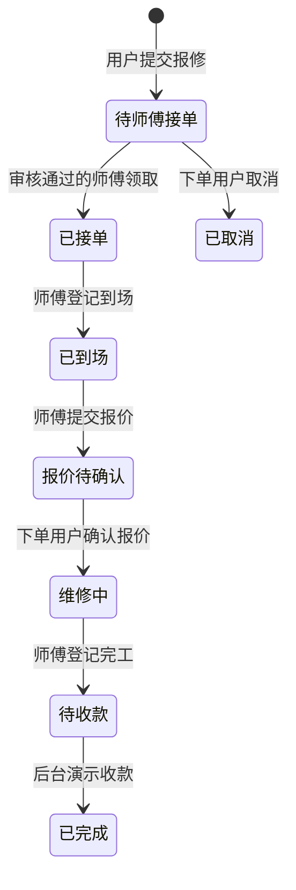
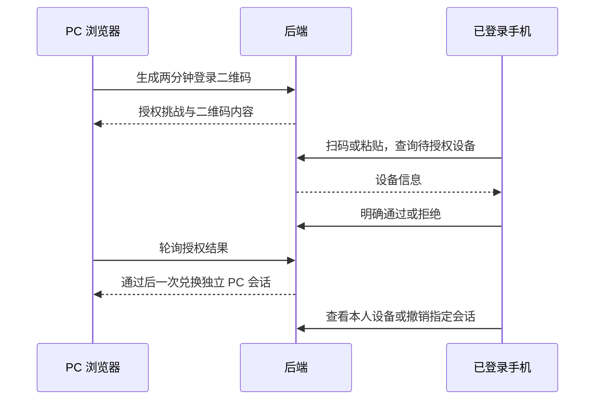

# 啄木鸟维修平台 · 阶段封板说明

[toc]

---

## 🔥 前言

封板日期：**2026-10-05（北京时间）**。本说明记录当前源码、已部署后台与已有验收的业务基线，作为暂停需求扩展后继续开发的交接依据。当前阶段为可联调、可演示的维修业务原型，真实支付与生产运营能力尚未交付。

目前已经形成“选择身份 → 登录 → 用户报修 → 已审核师傅接单 → 到场报价 → 用户确认 → 维修完工 → 后台模拟收款 → 分润记账 → 人工核销”的工作流。账号管理、师傅人工审核、多设备登录和 PC 扫码授权已接入；不同前端的功能入口存在差异，下文逐项说明。

本次封板只形成文档基线，保留现有代码、服务和数据；未创建提交、发布标签或备份包。新增业务需求暂缓，后续恢复开发时以本说明与[心愿单](心愿单.md)核对范围。

## 一、当前各端完成情况 <a href="#前言" style="font-size:17px; color:green;"><b>🔼</b></a> <a href="#🔚" style="font-size:17px; color:green;"><b>🔽</b></a>

| 模块 | 当前内容 | 封板状态 |
| --- | --- | --- |
| [**iOS**](https://developer.apple.com/ios/) 手机 App | 同一 App 内提供用户、师傅两种独立业务入口；采用 <u>[**Swift**](https://www.swift.org/)</u> 原生界面 | 已实现；最新身份流程仍需真机重新运行验收 |
| Web 管理后台 `WebAdmin/` | 登录门禁、订单与经营概览、师傅审核、模拟收款与核销、账务、设置和账号管理 | 已实现并更新本机部署；适配电脑和手机浏览器 |
| PC 浏览器入口 `Web/` | 用户／师傅密码登录或手机扫码授权、订单操作、本人账务 | 最小业务入口已实现，完整客户端仍待扩展 |
| [**Go**](https://go.dev/) 后端 `Server/` | 账号、会话、订单状态机、师傅审核、私有图片、账务、API 合同 | 已实现；内存与 [**TiDB**](https://docs.pingcap.com/tidb/stable/) 两种仓储 |
| [**Docker**](https://www.docker.com/)／[**Kubernetes**](https://kubernetes.io/) | 两条部署路线、平台入口、数据库迁移、持久化配置和健康检查 | 脚本已实现；macOS ARM64 曾实跑两条路线，当前新版主要运行在 Docker 8080 |
| [**Android**](https://developer.android.com/)／[**Flutter**](https://flutter.dev/)／[**HarmonyOS**](https://developer.huawei.com/consumer/cn/) | 独立目录与对接说明 | 预留，尚无完整业务客户端；鸿蒙按 iOS 验收后的节奏推进 |
| [**Windows**](https://www.microsoft.com/windows)／[**macOS**](https://www.apple.com/macos/) 原生客户端／[**微信小程序**](https://developers.weixin.qq.com/miniprogram/dev/framework/) | 独立目录与对接说明 | 预留；对应系统的部署脚本不等于客户端已完成 |

## 二、身份与权限 <a href="#前言" style="font-size:17px; color:green;"><b>🔼</b></a> <a href="#🔚" style="font-size:17px; color:green;"><b>🔽</b></a>

### 2.1、四种角色 <a href="#前言" style="font-size:17px; color:green;"><b>🔼</b></a> <a href="#🔚" style="font-size:17px; color:green;"><b>🔽</b></a>

| 身份 | 服务端角色 | 主要业务 |
| --- | --- | --- |
| 下单用户 | `customer` | 创建、查看本人订单；待接单时取消；确认报价 |
| 师傅 | `worker` | 提交审核资料；通过审核后领取订单；履约、报价、完工；查看本人分润 |
| 后台管理员 | `admin` | 全部后台业务、身份审核、创建后台账号、重置任意用户密码、封停／解封账号 |
| 后台普通用户 | `operator` | 订单、经营概览、模拟收款、核销与账务；只能修改自己的密码 |

**后台普通用户与手机端下单用户是两个不同角色。** 后台设置创建的是 `admin` 或 `operator`；手机端注册创建的是 `customer` 或 `worker`。后台账号不能作为手机端维修业务身份登录。

默认 `admin` 账号由程序初始化，初始密码为 `admin`，重复部署保留已修改的密码。当前所有 `admin` 账号具有同一组完整后台权限，没有另设“超级管理员”角色或更细的权限勾选模型。角色在创建时确定，当前没有修改已有账号角色、编辑账号资料或删除账号的操作。

### 2.2、后台权限表 <a href="#前言" style="font-size:17px; color:green;"><b>🔼</b></a> <a href="#🔚" style="font-size:17px; color:green;"><b>🔽</b></a>

| 功能 | 管理员 | 后台普通用户 |
| --- | --- | --- |
| 查看全量订单、师傅业务列表、经营概览 | 可以 | 可以 |
| 演示收款、人工核销、查账、筛选和导出 | 可以 | 可以 |
| 查看审核资料并通过／驳回师傅申请 | 可以 | 不显示入口，API 拒绝访问 |
| 在设置中创建后台账号并分配角色 | 可以 | 不可以 |
| 修改自己的密码 | 可以，须验证原密码 | 可以，须验证原密码 |
| 重置其他用户密码，包含手机用户和师傅 | 可以 | 不可以 |
| 封停／解封指定账号 | 可以；不允许封停自己 | 不可以 |
| 生成、保存本人一次性恢复码 | 可以 | 可以 |

权限由服务端校验，前端同步控制页面和操作入口。密码变更或封停会撤销该账号已有会话与相关扫码授权；解封后需要重新登录，旧会话不会恢复。

## 三、前端已实现的业务功能 <a href="#前言" style="font-size:17px; color:green;"><b>🔼</b></a> <a href="#🔚" style="font-size:17px; color:green;"><b>🔽</b></a>

### 3.1、iOS 用户与师傅 App <a href="#前言" style="font-size:17px; color:green;"><b>🔼</b></a> <a href="#🔚" style="font-size:17px; color:green;"><b>🔽</b></a>

- **身份入口**：进入业务主页前先选择“我是用户”或“我是师傅”，再登录／注册对应角色账号。账号角色不匹配时拒绝进入；本地演示须主动选择。
- **用户报修**：选择家电维修、清洗、安装、水电、疏通、防水、家具门窗、房屋修缮或数码维修，填写设备、故障、地址、预约时间或协商上门。
- **用户订单**：查看本人订单与进度；待接单时取消；师傅报价后确认。待付款显示付款尚未接入，不发起真实扣款。
- **师傅认证**：填写资料，从相册选取 1—6 张图片上传，提交人工审核；查看待审核、通过或驳回状态及原因。相册上传入口已实现，尚无拍照上传资质入口。
- **师傅工单**：通过审核后查看可接订单；查看自己的工单，依次接单、登记到场、提交报价、登记完工。
- **师傅账务**：提供“我的账务与分润”页面，查看本人模拟流水、汇总及核销相关记录。手机下单用户当前没有独立账务页面入口。
- **账号与设备**：个人中心头像进入账号页，可修改本人密码、退出当前会话、切换身份；设备页查看和撤销本人登录设备。手机当前没有忘记密码或生成恢复码的页面入口。
- **扫码授权**：真实相机扫码与文本粘贴两种入口，先查看待授权 PC 设备，再明确通过／拒绝；没有从相册识别登录二维码的入口。
- **通用体验**：主题、简体中文／英文、开屏设置、完整空态与重新加载、本地 Logo 图片兜底。Debug 使用 JobsDebugPanel 切换服务地址，Release 固定线上配置，不继承 Debug 测试地址。

订单和个人账务当前最多展示最近 **200 条**，尚无历史翻页。业务页面按当前身份渲染，用户下单与师傅接单不再在主页并列显示两套身份操作。

### 3.2、Web 管理后台 <a href="#前言" style="font-size:17px; color:green;"><b>🔼</b></a> <a href="#🔚" style="font-size:17px; color:green;"><b>🔽</b></a>

- 未登录仅显示独立登录页，包含登录、注册说明、忘记密码及立体科技风展示；业务工作台登录后才显示。
- “注册”展示账号开通说明，实际创建操作在管理员登录后的“设置”中完成；不提供公开注册管理员申请。
- 业务页显示订单、师傅业务列表、订单额、平台费、师傅分润和待核销台账；支持刷新和游标加载更多。
- 管理员查看师傅资料与私有图片，填写审核结果／驳回原因，执行通过或驳回；审核针对提交版本，旧版本审核不能覆盖新资料。
- 提供演示收款与人工核销操作，账务按订单、人员、日期、来源等条件筛选，查看汇总并导出 CSV。
- 设置页提供当前账号、退出、本人改密、生成和下载恢复码；管理员另有账号列表、新增账号、重置密码、封停／解封。
- 提供测试／线上环境、头 URL 配置与复制地址；线上地址尚未配置。页面适配手机浏览器，宽表在各自区域横向查看。

后台会话只放在当前页面内存中，刷新页面需要重新登录。登录、账号创建、改密、恢复码和审核等身份操作失败时保留真实失败，不生成本地登录或审核成功。

### 3.3、PC 用户／师傅入口 <a href="#前言" style="font-size:17px; color:green;"><b>🔼</b></a> <a href="#🔚" style="font-size:17px; color:green;"><b>🔽</b></a>

- `/portal/` 提供 PC 二维码登录、密码登录、当前会话恢复和退出；扫码成功前不创建本地登录身份。
- 用户可提交分类、设备、故障和地址，查看本人订单并确认报价；当前没有预约时间字段、取消订单按钮。
- 师傅可查看和操作获授权工单，执行接单、到场、报价、完工；审核资料需通过手机提交。
- 用户和师傅都可查询本人账务；订单、账务支持游标加载更多。
- 当前没有注册、忘记密码、本人改密、设备管理、师傅资料上传或审核页面。此入口是最小浏览器客户端，不具备 iOS 全部功能。

## 四、后端已经承担的能力 <a href="#前言" style="font-size:17px; color:green;"><b>🔼</b></a> <a href="#🔚" style="font-size:17px; color:green;"><b>🔽</b></a>

| 模块 | 已实现能力 | 主要实现位置 |
| --- | --- | --- |
| 账号与权限 | 固定角色注册／登录、默认管理员初始化、后台创建账号、本人改密、管理员重置、封停／解封、恢复码 | `Server/internal/identity/`、`Server/internal/httpapi/account_management.go` |
| 设备与扫码 | 各设备独立会话、本人设备列表／撤销、两分钟二维码、手机确认／拒绝、一次兑换 PC 会话 | `Server/internal/identity/devices*.go` |
| 订单 | 创建、本人／师傅／后台可见范围、状态迁移、金额与预约校验、同键创建幂等、并发接单保护 | `Server/internal/domain/`、`Server/internal/service/`、`Server/internal/repository/` |
| 师傅与图片 | 申请、资料版本、人工审核、接单资格、私有图片上传／读取与持久化 | `Server/internal/workers/` |
| 账务 | 模拟收款、85%／15% 分润、人工核销、平衡账本、筛选／汇总／CSV、模拟与真实来源隔离 | `Server/internal/ledger/` |
| 支付合同 | 三种支付渠道接口、未接入响应；没有真实扣款或转账 | `Server/internal/payment/` |
| 数据与运行 | 内存／TiDB 仓储、版本迁移与校验、独立种子数据、健康与就绪检查、静态前端托管 | `Server/migrations/`、`Server/internal/migration/`、`Server/cmd/` |
| 聊天边界 | 独立模块与适配契约草案 | `Server/internal/im/`，没有运行中的聊天服务 |

接口合同入口为 [`Server/api/openapi.yaml`](Server/api/openapi.yaml)，当前版本 `1.3.0`。数据库迁移已到 `006_account_access.sql`；账号、订单、付款记录、分润／核销、审核资料、图片元数据和账本均有对应结构。

## 五、已经串联的业务工作流 <a href="#前言" style="font-size:17px; color:green;"><b>🔼</b></a> <a href="#🔚" style="font-size:17px; color:green;"><b>🔽</b></a>

### 5.1、手机身份与登录 <a href="#前言" style="font-size:17px; color:green;"><b>🔼</b></a> <a href="#🔚" style="font-size:17px; color:green;"><b>🔽</b></a>

启动 → 没有有效业务身份时进入身份选择 → 选择用户／师傅 → 登录已有账号或注册同角色账号 → 进入对应主页。有已保存会话时恢复对应身份；服务器拒绝认证时回到未登录状态，不伪造成功。

个人中心头像 → 账号页 → 确认切换身份 → 退出当前会话、清理当前身份状态 → 重新选择并登录另一角色。切换身份不是给同一个账号临时改角色；退出当前手机不会同时退出其它已登录设备。

### 5.2、后台开户、改密与封停 <a href="#前言" style="font-size:17px; color:green;"><b>🔼</b></a> <a href="#🔚" style="font-size:17px; color:green;"><b>🔽</b></a>

管理员登录 → 设置 → 填写账号、显示名和密码 → 选择管理员／普通后台用户 → 服务端创建 → 新账号登录并取得对应权限。当前账号创建和改密使用至少 12 字符的新密码规则；默认初始化密码是单独的兼容例外。

本人改密：验证原密码 → 保存新密码 → 撤销已有会话 → 重新登录。忘记密码：使用此前登录时生成并保存的一次性恢复码 → 设置新密码；无恢复码时联系管理员重置。当前没有短信验证码、邮件找回或短信通知。

管理员可选择任意账号重置密码，或封停／解封。封停阻止后续登录与业务访问，不删除用户、订单或账务；不会自动取消或转派该账号关联的维修订单。

### 5.3、师傅资料与人工审核 <a href="#前言" style="font-size:17px; color:green;"><b>🔼</b></a> <a href="#🔚" style="font-size:17px; color:green;"><b>🔽</b></a>

师傅注册／登录 → 填写资料、上传 1—6 张私有图片 → 提交申请 → 管理员查看资料和图片 → 通过或填写原因驳回 → 师傅查看结果。

通过后允许领取新单。驳回后可修改资料重新提交；再次提交进入待审核，暂停领取新单，已经接到的订单可继续履约。后端在接单事务中复核资格，页面显示“已审核”不能替代此校验。

此处“身份审核”实际指师傅资料与资质图片人工审核，普通下单用户没有实名审核工作流。审核不包含第三方实名核验、图片文字识别、真实定位或排班系统；资料图片仅所属师傅或管理员可读取。

### 5.4、维修订单状态流转 <a href="#前言" style="font-size:17px; color:green;"><b>🔼</b></a> <a href="#🔚" style="font-size:17px; color:green;"><b>🔽</b></a>

以下 [**Mermaid**](https://mermaid.js.org) 流程对应当前真实状态机：

| 状态 | 服务端值 | 下一步及操作者 |
| --- | --- | --- |
| 待师傅接单 | `pending_worker` | 合格师傅接单；或本人取消 |
| 已接单 | `accepted` | 接单师傅登记到场 |
| 已到场 | `arrived` | 接单师傅提交报价 |
| 报价待确认 | `quote_pending` | 本人确认报价 |
| 维修中 | `in_service` | 接单师傅登记完工 |
| 待收款 | `awaiting_payment` | 后台演示收款 |
| 已完成 | `completed` | 查询订单、付款、分润和核销记录 |
| 已取消 | `cancelled` | 保留记录，无继续履约动作 |

当前采用师傅主动领取，没有自动派单、管理员指定派单、转派或抢单匹配算法。取消仅允许本人在待接单时执行；没有接单后的取消协商、报价拒绝／改价流程、完工验收争议、评价或售后流程。

### 5.5、模拟收款、分润与核销 <a href="#前言" style="font-size:17px; color:green;"><b>🔼</b></a> <a href="#🔚" style="font-size:17px; color:green;"><b>🔽</b></a>

订单待收款 → 后台管理员／普通后台用户演示收款 → 订单完成并记录 `demo_paid` → 同事务生成分润和账本 → 分润处于 `pending_manual` → 后台人工核销 → 标记 `manually_paid` 并记账。

- 报价用整数分保存，范围为 1—100000000 分；本版采用 **师傅 85%、平台 15%** 原型规则。师傅份额四舍五入，平台费为总额减师傅份额，保证金额相加等于订单额。
- 重复演示收款或重复核销不重复生成分润、流水，不把已核销状态退回待核销。
- 后台可筛选、汇总和导出；iOS 师傅和 PC 用户／师傅只查询本人可见账务。汇总是筛选范围的发生额，不代表银行余额。
- **演示收款没有真实扣款，人工核销没有实际转账。** 微信、支付宝与第四方聚合支付均未配置，真实渠道返回未实现；不能据此认定已到账或已打款。
- 模拟账与真实账按来源分开，当前真实账为空。退款、支付回调、对账和真实结算尚未形成流程；账本内部冲正能力没有开放成业务 HTTP 操作。

### 5.6、手机授权 PC 与设备撤销 <a href="#前言" style="font-size:17px; color:green;"><b>🔼</b></a> <a href="#🔚" style="font-size:17px; color:green;"><b>🔽</b></a>

二维码不直接携带登录会话。PC 获得独立且能力受限的桌面会话，不能代替手机管理设备或授权其它 PC。手机退出只结束当前手机会话；撤销指定 PC、改密或封停会使对应会话失效。默认会话有效期 24 小时，可配置为 1—168 小时。

手机能力目前依据密码登录请求的设备类型授予，尚无硬件可信认证。相机扫码实现已存在，实体手机相机授权、相册上传和完整跨设备扫码仍需人工验收。

## 六、服务端数据与本地演示的边界 <a href="#前言" style="font-size:17px; color:green;"><b>🔼</b></a> <a href="#🔚" style="font-size:17px; color:green;"><b>🔽</b></a>

页面进入、刷新和业务写操作正常请求 API。服务不可达、超时或响应无效时，可显示本地样例并在独立演示副本上操作；后续成功响应替换为服务端数据，包括空列表。iOS 在业务主页前确认身份，WebAdmin 登录后显示工作台；PC 未登录仍可显示匿名／本地演示预览，不创建登录身份。

本地演示操作不自动补发服务端；失败写入保留“服务端拒绝”或“结果未知”的提示，不能将本地变更当作服务器成功。认证、密码、权限、扫码和资料审核不使用假成功回退。数据按环境、地址、角色和账号隔离，旧请求不能覆盖切换后的页面。

后端未配置 TiDB 时使用内存仓储，重启不保留业务数据；当前 Docker 部署使用 TiDB 持久化，数据库与私有图片分别存储，备份必须同时包含两者。数据库迁移包含版本、校验和、锁与失败状态保护，种子数据独立导入，不覆盖已有业务。

当前仍要求 `DEMO_MODE=true`，关闭演示模式会拒绝启动。动态列表有空态与重载，图片失败使用本地 Logo 兜底。

## 七、部署与验证基线 <a href="#前言" style="font-size:17px; color:green;"><b>🔼</b></a> <a href="#🔚" style="font-size:17px; color:green;"><b>🔽</b></a>

### 7.1、当前访问方式 <a href="#前言" style="font-size:17px; color:green;"><b>🔼</b></a> <a href="#🔚" style="font-size:17px; color:green;"><b>🔽</b></a>

| 场景 | 当前地址 |
| --- | --- |
| Mac 后台 | `http://127.0.0.1:8080/admin/` |
| PC 用户／师傅入口 | `http://127.0.0.1:8080/portal/` |
| 当前同网真机 API | `http://192.168.1.7:8080` |
| 就绪检查 | `/readyz` |

封板文档核对时，回环与局域网的 `/readyz` 均返回 `ready`。上述两个 IP 在当前 Mac 配置下通向同一个 Docker 后端；手机上的 `127.0.0.1` 指向手机本身，真机应使用 Mac 的局域网地址。局域网 IP 可能变化，应按当前网卡和部署配置核对。

Kubernetes 路线此前在 macOS ARM64 实跑通过，默认主机转发端口为 8081；此次文档核对时 8081 未连通，未启动端口转发，也未确认该路线已更新到本次账号权限代码。当前人工测试以 Docker 8080 为准。

### 7.2、构建与更新 <a href="#前言" style="font-size:17px; color:green;"><b>🔼</b></a> <a href="#🔚" style="font-size:17px; color:green;"><b>🔽</b></a>

对应平台部署入口每次执行构建并部署新版，无须人工先删除容器。macOS Docker 入口为 [`Deployment/Docker/macOS/deploy.command`](Deployment/Docker/macOS/deploy.command)；其它平台按 `Deployment/` 中对应目录执行。

Docker 入口沿用已配置的局域网绑定，保留数据库、图片数据卷和已有账号密码。Kubernetes 使用独立 PVC，与 Docker 卷不是同一份数据，切换路线不会自动迁移业务。

iOS 最新身份入口需要在 [**Xcode**](https://developer.apple.com/xcode/) 重新构建运行到真机。Debug／Release 完整模拟器编译已通过，未覆盖现有真机 IPA。完整反安装位于 `unDeployment/`，涉及共享容器环境与数据处理，当前没有执行真实卸载或恢复演练。

### 7.3、已有验证与剩余人工验收 <a href="#前言" style="font-size:17px; color:green;"><b>🔼</b></a> <a href="#🔚" style="font-size:17px; color:green;"><b>🔽</b></a>

| 范围 | 已有结果 | 尚未覆盖 |
| --- | --- | --- |
| 统一验证入口 | 最近代码验证 0 失败、0 跳过；含 Go 单元／竞态／静态、独立 HTTP、Web、Swift 核心、脚本检查 | 此次仅核对文档，没有重新执行完整业务验证 |
| 账号权限 | 管理员／普通用户、本人改密、任意账号重置、封停／解封、旧会话撤销、恢复码一次使用 | 真实运营下的人员权限流程 |
| TiDB | 独立临时数据库 HTTP；内存／悲观／乐观仓储合同，包括账户与会话行为 | 生产部署、故障恢复及备份还原演练 |
| Web | WebAdmin 19 组、PC 7 组回归；本机真实浏览器门禁、登录、设置、退出与手机布局通过 | 完整客户端体验、各浏览器全面兼容验收 |
| iOS | 最新源码 Debug／Release、arm64／x86_64 模拟器编译；身份首屏截图与业务核心回归通过 | 最新版真机完整流程、相机／相册／凭据存储权限、扫码与多设备人工测试 |
| 部署 | macOS ARM64 Docker 更新已实跑；Kubernetes 旧基线实跑；Linux／Windows 语法与隔离模拟 | 各发行版、Windows 实机安装与权限／网络流程；真实卸载恢复 |

人工验收可按“创建普通后台账号并核对权限 → 注册师傅并审核 → 用户下单 → 师傅履约 → 后台模拟收款与核销 → 核对账务 → 手机授权并撤销 PC → 改密与封停后确认旧会话失效”顺序执行。真实支付不纳入此封板验收。

## 八、未交付项与后续恢复入口 <a href="#前言" style="font-size:17px; color:green;"><b>🔼</b></a> <a href="#🔚" style="font-size:17px; color:green;"><b>🔽</b></a>

| 项目 | 当前边界 |
| --- | --- |
| 真实支付与真实资金 | 三渠道接口预留；扣款、回调、退款、对账、提现和真实结算未接入 |
| 聊天 IM | 仅独立模块草案；没有聊天 UI、消息、实时连接、附件、离线消息或推送 |
| 派单与售后 | 自动／指定派单、转派、已接单取消协商、报价拒绝／修改、评价、投诉争议和售后未实现 |
| 生产运行 | 正式 HTTPS、生产访问与运维配置、生产数据库备份恢复／权限／故障与升级方案尚未验收 |
| 认证扩展 | 短信／邮件认证、第三方实名、硬件可信设备认证未接入 |
| 前端补齐 | iOS 历史翻页、用户个人账务入口；PC 的注册／改密／资料提交等完整客户端能力待扩展 |
| 多端原生客户端 | Android、Flutter、鸿蒙、Windows、macOS、微信小程序及独立管理 App 未交付 |

后续恢复时，先完成最新真机与跨设备人工验收，再按已确认需求选择扩展项。支付、IM 和生产数据方案继续独立组织；本说明记录已有事实，不将后续项视为本版承诺。

## 九、代码与资料索引 <a href="#前言" style="font-size:17px; color:green;"><b>🔼</b></a> <a href="#🔚" style="font-size:17px; color:green;"><b>🔽</b></a>

| 内容 | 入口 |
| --- | --- |
| 项目总览与移动端 | [根 README](README.md)、[iOS README](iOS/README.md)、`iOS/App/Modules/`、`iOS/App/Services/` |
| 后台登录、设置与业务 | [WebAdmin README](WebAdmin/README.md)、[登录与设置逻辑](WebAdmin/auth.js)、[运营业务逻辑](WebAdmin/operations.js) |
| PC 入口 | [Web README](Web/README.md)、[PC 业务逻辑](Web/portal.js) |
| 后端与接口 | [Server README](Server/README.md)、[OpenAPI](Server/api/openapi.yaml)、`Server/internal/`、`Server/migrations/` |
| 部署与反安装 | [部署说明](Deployment/README.md)、[Docker 共享配置](Deployment/Docker/Shared/README.md)、[反安装说明](unDeployment/README.md) |
| 验收与后续范围 | [验证入口说明](Validation/README.md)、[修复验收](修复验收-2026-10-05.md)、[业务基础验收](业务基础验收-2026-10-05.md)、[心愿单](心愿单.md) |

部分旧验收记录描述的是较早阶段，包含“管理员无默认密码”“仅配置初始化”“尚未重部署”等历史口径。账号开通、权限、默认初始化及 Docker 部署现状，以本说明和当前代码为准；旧记录保留作为当时验证范围的依据。

<a id="🔚" href="#前言" style="font-size:17px; color:green; font-weight:bold;">我是有底线的➤点我回到首页</a>
