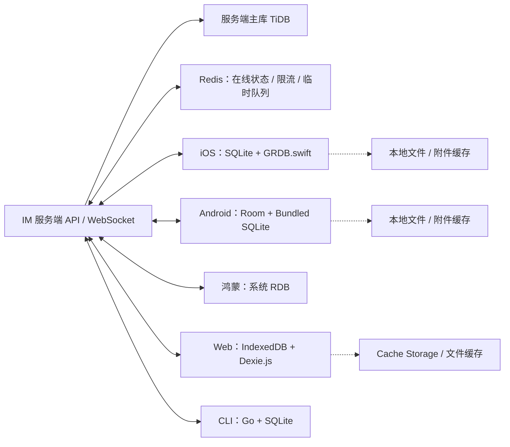

# `IM 各端数据库选型专项方案`


[toc]

---

## 🔥 <font id=前言>前言</font>

**专项版本**：`IM-baseline-20261008.1`  
**日期**：2026-10-08  
**状态**：工程选型建议，尚未完成真实依赖锁定、五端集成、容量压测、故障恢复和安全验收  
**适用范围**：独立从零实现的 IM；不修改既有维修业务代码，不把本专项的设计建议写成已交付能力  
**核心原则**：每个客户端端点使用一个本地数据库；服务端使用独立主库；同步、加密、附件和缓存不与数据库引擎混为一谈  

这份文档解决四个问题：

1、每一个端最终使用什么数据库。  
2、每一个端有哪些第一梯队、第二梯队平替。  
3、为什么当前不把 [**WCDB**](https://github.com/Tencent/wcdb) 强行铺到所有端。  
4、综合产品目标、平台能力、依赖复杂度、离线能力和后续维护后，为什么采用当前组合。

| 章节 | 章节 |
| :--- | :--- |
| [一、结论总览](#conclusion) | [七、Web 端](#web) |
| [二、选型层次与统一边界](#layers) | [八、CLI 端](#cli) |
| [三、IM 数据边界](#boundary) | [九、服务端主库](#server) |
| [四、iOS 端](#ios) | [十、横向平替与暂不选择项](#alternatives) |
| [五、Android 端](#android) | [十一、综合落地组合](#final-plan) |
| [六、鸿蒙端](#harmony) | [十二、实施与验收](#acceptance) |
| [十三、风险与维护边界](#risks) | [十四、最终结论](#final-conclusion) |

**重点入口**：[最终组合](#final-plan) · [各端梯队](#ios) · [一端一个数据库](#boundary) · [为什么不是全端 WCDB](#wcdb-boundary) · [验收清单](#acceptance-list)

## 一、<span id="conclusion">结论总览</span> <a href="#前言" style="font-size:17px; color:green;"><b>🔼</b></a> <a href="#🔚" style="font-size:17px; color:green;"><b>🔽</b></a>

### 1.1、<span id="recommended-matrix">当前推荐矩阵</span> <a href="#前言" style="font-size:17px; color:green;"><b>🔼</b></a> <a href="#🔚" style="font-size:17px; color:green;"><b>🔽</b></a>

| 端／层 | 数据库引擎或存储 | 访问层 | 当前选择 | 选择性质 |
| :--- | :--- | :--- | :--- | :--- |
| [**iOS**](https://developer.apple.com/ios/) | [**SQLite**](https://www.sqlite.org/about.html) | [**GRDB.swift**](https://github.com/groue/GRDB.swift) + 自有 `JobsIMStorage` | SQLite + GRDB.swift | 第一梯队首选 |
| [**Android**](https://developer.android.com/) | Bundled SQLite | [**Room**](https://developer.android.com/training/data-storage/room) + [**BundledSQLiteDriver**](https://developer.android.com/reference/androidx/sqlite/driver/bundled/BundledSQLiteDriver) | Room + BundledSQLiteDriver | 第一梯队首选 |
| [**HarmonyOS**](https://developer.huawei.com/consumer/cn/) RDB | [**HarmonyOS RDB**](https://developer.huawei.com/consumer/en/doc/harmonyos-guides-V3/basic-data-mgmt-0000000000026071-V3)，底层使用 SQLite | `relationalStore` / `@kit.ArkData` | 系统 RDB | 第一梯队首选 |
| Web | 浏览器原生 [**IndexedDB**](https://developer.mozilla.org/en-US/docs/Web/API/IndexedDB_API) | [**Dexie.js**](https://dexie.org/docs/Dexie.js) 可选封装 | IndexedDB + Dexie.js | 第一梯队首选 |
| CLI | SQLite | [**Go**](https://go.dev/) `database/sql` + [**modernc.org/sqlite**](https://pkg.go.dev/modernc.org/sqlite) | CGo-free SQLite | 第一梯队首选 |
| 服务端 | [**TiDB**](https://docs.pingcap.com/tidb/stable/) | Go `database/sql` +显式 SQL／迁移 | 沿用当前维修平台服务端基线 | 当前项目约束 |

> 说明：GRDB、Room、Dexie 和 `modernc.org/sqlite` 主要属于访问层、驱动或工具层，不是完全不同的数据库产品。当前组合的核心数据库事实是：移动端和 CLI 尽量统一在 SQLite 体系内，Web 使用浏览器标准 IndexedDB，服务端保持独立的 TiDB。

### 1.2、<span id="tier-summary">梯队摘要</span> <a href="#前言" style="font-size:17px; color:green;"><b>🔼</b></a> <a href="#🔚" style="font-size:17px; color:green;"><b>🔽</b></a>

| 端 | 第一梯队 | 第二梯队 | 特殊场景候选 | 不作为当前默认 |
| :--- | :--- | :--- | :--- | :--- |
| iOS | SQLite + GRDB.swift；[**WCDB**](https://github.com/Tencent/wcdb) | 原生 `sqlite3`、[**FMDB**](https://github.com/ccgus/fmdb)、[**SQLite.swift**](https://github.com/stephencelis/SQLite.swift)、[**Core Data**](https://developer.apple.com/documentation/coredata) / [**SwiftData**](https://developer.apple.com/documentation/swiftdata) | [**Couchbase Lite**](https://www.couchbase.com/products/lite/)：内置同步优先 | 为了统一而强行铺 WCDB |
| Android | Room + BundledSQLiteDriver；[**SQLDelight**](https://sqldelight.github.io/sqldelight/) + SQLite | 原生 SQLite API、SQLiteOpenHelper | [**Couchbase Lite**](https://www.couchbase.com/products/lite/)：文档同步优先 | 直接引入多套 ORM |
| 鸿蒙 | 系统 RDB | 原生 SQLite NDK／[**C++**](https://isocpp.org/) 桥接 | 跨平台 C++ 存储核心 | 轻量 KV 代替消息关系库 |
| Web | IndexedDB + Dexie.js | 原生 IndexedDB | [**SQLite WASM**](https://sqlite.org/wasm/doc/trunk/www/index.html) + OPFS；[**Couchbase Lite JS**](https://www.couchbase.com/products/lite/)：同步优先 | 用 `localStorage` 承载消息库 |
| CLI | `modernc.org/sqlite` | [**mattn/go-sqlite3**](https://github.com/mattn/go-sqlite3)；KV 存储引擎 | 只做在线命令时不落本地库 | 为了所谓性能自建数据库 |
| 服务端 | 当前项目 TiDB；独立 IM 可选 [**PostgreSQL**](https://www.postgresql.org/about/) | [**MySQL**](https://www.mysql.com/) / [**MariaDB**](https://mariadb.org/) | 分布式 KV：超大规模后评估 | 客户端直接连接服务端数据库 |

## 二、<span id="layers">选型层次与统一边界</span> <a href="#前言" style="font-size:17px; color:green;"><b>🔼</b></a> <a href="#🔚" style="font-size:17px; color:green;"><b>🔽</b></a>

### 2.1、<span id="engine-and-access">数据库引擎与访问层不是一回事</span> <a href="#前言" style="font-size:17px; color:green;"><b>🔼</b></a> <a href="#🔚" style="font-size:17px; color:green;"><b>🔽</b></a>

本专项将技术拆成四层，避免把“用了一个封装库”误认为“换了一种数据库”：

| 层次 | 负责内容 | 本专项示例 |
| :--- | :--- | :--- |
| 数据库引擎 | 文件格式、事务、索引、锁、崩溃恢复 | SQLite、IndexedDB、TiDB |
| 访问层／驱动 | 把平台语言接到数据库，提供查询、模型或生成代码 | GRDB.swift、Room、Dexie.js、`modernc.org/sqlite` |
| 业务存储层 | 统一消息模型、迁移、分页、Outbox、同步游标 | 自有 `JobsIMStorage` 或各端等价模块 |
| 同步与业务层 | 服务端协议、重试、幂等、冲突、E2EE、回执 | IM Sync、WebSocket、MLS、消息状态机 |

### 2.2、<span id="selection-principles">选型原则</span> <a href="#前言" style="font-size:17px; color:green;"><b>🔼</b></a> <a href="#🔚" style="font-size:17px; color:green;"><b>🔽</b></a>

1、**优先使用成熟引擎，不从零写数据库。** [**SQLite 官方说明**](https://www.sqlite.org/about.html)将其定位为进程内、无独立服务进程、事务型 SQL 引擎，并提供单文件、ACID 和长期稳定文件格式，适合移动端与 CLI 的本地消息存储。

2、**访问层服从平台，不追求所有端使用同一个封装库。** 同一套 IM 逻辑模型可以统一，具体数据库 API 应使用平台最成熟的方式。

3、**消息同步不交给本地数据库自动完成。** 数据库负责可靠保存本地状态；服务端同步负责游标、幂等、重试、撤回、删除、回执、补偿和冲突处理。

4、**先解决结构化消息，再解决附件和全文搜索。** 图片、音频、视频和文件默认放在文件系统、对象存储或受控缓存中；数据库保存元数据、哈希、权限、状态和本地路径。

5、**同一端不并行维护多套消息数据库。** 例如 Web 端的 IndexedDB 与 Dexie.js 是“一套数据库加一层封装”，不是两个数据库；Keychain、Keystore 或浏览器安全存储属于密钥保护边界，不算消息数据库。

### 2.3、<span id="platform-differences">为什么不强行让每一端都用 WCDB</span> <a href="#前言" style="font-size:17px; color:green;"><b>🔼</b></a> <a href="#🔚" style="font-size:17px; color:green;"><b>🔽</b></a>

[**WCDB**](https://github.com/Tencent/wcdb) 是很强的移动端候选：它基于 SQLite 和 [**SQLCipher**](https://www.zetetic.net/sqlcipher/)，提供 ORM、WINQ、连接池、加密、修复、迁移、全文搜索和压缩能力。它在 iOS、Android 或需要 C++／多语言共用存储核心时值得进入第一梯队。

但 WCDB 不是所有端的共同底座：

- 浏览器的标准持久化入口是 IndexedDB，不能把 iOS 的 WCDB 直接搬到浏览器。
- 鸿蒙系统有自己的 RDB 能力，直接使用系统数据库更贴合系统生命周期和权限模型。
- CLI 采用 Go，使用纯 Go SQLite 驱动更容易跨平台分发；引入 WCDB 会把 C++、绑定和构建链带进 CLI。
- 统一“数据库封装库”不等于统一“消息协议”。跨端真正需要统一的是表意、字段、迁移编号、消息状态和同步合同。
- WCDB 能力越完整，依赖和版本维护面也越大；当前项目从零开始，优先控制基础设施数量。

## 三、<span id="boundary">IM 数据边界</span> <a href="#前言" style="font-size:17px; color:green;"><b>🔼</b></a> <a href="#🔚" style="font-size:17px; color:green;"><b>🔽</b></a>

### 3.1、<span id="one-end-one-db">一端一个本地数据库</span> <a href="#前言" style="font-size:17px; color:green;"><b>🔼</b></a> <a href="#🔚" style="font-size:17px; color:green;"><b>🔽</b></a>

每个端点只建立一套消息本地库，库内通过表、索引或对象仓区分业务：

| 端 | 本地库建议名 | 库内主要内容 |
| :--- | :--- | :--- |
| iOS | `IMClient.sqlite` | 会话、消息、成员、草稿、Outbox、回执、同步游标、搜索索引 |
| Android | `im_client.db` | 会话、消息、成员、草稿、Outbox、回执、同步游标、搜索索引 |
| 鸿蒙 | `IMClient.db` | 会话、消息、成员、草稿、Outbox、回执、同步游标、搜索索引 |
| Web | `IMLocalDB` | 会话、消息、成员、草稿、Outbox、回执、同步游标、索引对象仓 |
| CLI | `im-cli.db` | 会话、消息、Outbox、回执、同步游标、离线命令记录 |

“一个端一个数据库”不意味着只有一张表，也不意味着所有附件都要塞进同一个文件。它表示同一端不为消息、草稿、Outbox、回执各自再造一套互相难以迁移的数据库。

### 3.2、<span id="data-ownership">本地库、服务端主库和辅助存储的职责</span> <a href="#前言" style="font-size:17px; color:green;"><b>🔼</b></a> <a href="#🔚" style="font-size:17px; color:green;"><b>🔽</b></a>



| 数据类别 | 权威位置 | 本地端保存内容 | 备注 |
| :--- | :--- | :--- | :--- |
| 消息正文与状态 | 服务端主库 | 已同步消息和本地状态 | E2EE 场景下服务端可只保存密文及必要路由字段 |
| 会话列表 | 服务端 + 本地投影 | 本地快速展示所需投影 | 服务端事件到达后增量更新 |
| Outbox | 本地端 | 待发送消息、幂等键、重试状态 | 发送成功后保留必要审计状态或清理 |
| 附件内容 | 对象存储／文件系统 | 本地缓存 | 数据库保存哈希、路径、大小、上传状态和权限摘要 |
| 在线状态 | [**Redis**](https://redis.io/) 或内存状态 | 本地短期状态 | 不作为历史消息主库 |
| 密钥材料 | 系统安全存储或受保护密钥容器 | 数据库只保存引用或加密元数据 | 不把明文密钥放普通消息表 |

### 3.3、<span id="common-schema">统一逻辑模型，不统一物理 API</span> <a href="#前言" style="font-size:17px; color:green;"><b>🔼</b></a> <a href="#🔚" style="font-size:17px; color:green;"><b>🔽</b></a>

各端应统一以下逻辑字段和语义，而不是强行共用同一个 ORM：

- `conversation_id`：会话 ID。
- `message_id`：服务端分配或可幂等推导的消息 ID。
- `client_message_id`：客户端生成的幂等 ID。
- `sender_id`、`receiver_id`／`group_id`：参与者关系。
- `server_sequence`：服务端排序序号；本地时间不能代替服务端顺序。
- `message_type`、`payload`、`payload_version`：消息类型、密文或正文载荷及版本。
- `delivery_state`、`read_state`、`deleted_at`：发送、送达、已读、删除状态。
- `sync_cursor`：每个账号、会话或同步分片的服务端游标。
- `schema_version`：本地库结构版本；必须有显式迁移和回滚策略。

## 四、<span id="ios">iOS 端选型</span> <a href="#前言" style="font-size:17px; color:green;"><b>🔼</b></a> <a href="#🔚" style="font-size:17px; color:green;"><b>🔽</b></a>

### 4.1、<span id="ios-current">第一梯队首选：SQLite + GRDB.swift + JobsIMStorage</span> <a href="#前言" style="font-size:17px; color:green;"><b>🔼</b></a> <a href="#🔚" style="font-size:17px; color:green;"><b>🔽</b></a>

**最终组合**：系统 SQLite 作为引擎，[**GRDB.swift**](https://github.com/groue/GRDB.swift) 作为 Swift 访问工具，再由自有 `JobsIMStorage` 做一层很薄的业务封装。

**选择理由**：

1、用户已经确认 iOS 本地消息引擎采用 SQLite，符合现有 <u>[**Swift**](https://www.swift.org/)</u>／[**UIKit**](https://developer.apple.com/documentation/uikit) 和 Jobs 自有工程路线。  
2、GRDB 面向应用开发，能够减少连接、事务、模型映射、观察和迁移的重复胶水代码，同时保留 SQL 的透明度。  
3、SQLite 的 WAL、事务、索引、FTS5 和单文件特性适合消息分页、会话列表、离线 Outbox 和本地搜索。  
4、自有 `JobsIMStorage` 隔离 GRDB 细节，未来可以替换访问层，不让业务页面直接依赖第三方 API。  
5、相比完整跨语言数据库框架，当前 iOS 只需解决 Swift 端本地存储，不需要先引入 C++ 核心。

**推荐边界**：

- 页面和 ViewModel 不直接拼接 SQL；查询集中在存储层。
- 所有写入通过事务和批量接口进入数据库。
- 迁移文件、迁移编号、校验摘要和回滚说明进入源码管理。
- FTS5 只索引可搜索字段；密文消息是否可搜索由 E2EE 设计单独决定。
- 大附件保存文件或对象存储引用，数据库不默认承载完整音视频。

### 4.2、<span id="ios-wcdb">第一梯队强平替：WCDB</span> <a href="#前言" style="font-size:17px; color:green;"><b>🔼</b></a> <a href="#🔚" style="font-size:17px; color:green;"><b>🔽</b></a>

如果出现以下条件，WCDB 可以升为 iOS 端首选：

- iOS 与 Android／CLI 需要共享 C++ 存储核心。
- 内置数据库加密、损坏修复、压缩、连接池和迁移能力比依赖面更重要。
- 团队已经有 WCDB 的维护经验，并愿意锁定其 SQLite／SQLCipher 版本。
- 需要对大批量消息写入、全文搜索和损坏恢复做过实测，结果明显优于薄封装方案。

当前不把它作为默认方案，是因为本项目从零开始、iOS 先走 Swift 原生路线，而且其他端并不能自然共享同一个 WCDB API。WCDB 是强平替，不是当前所有端的统一数据库。

### 4.3、<span id="ios-second-tier">第二梯队与特殊方案</span> <a href="#前言" style="font-size:17px; color:green;"><b>🔼</b></a> <a href="#🔚" style="font-size:17px; color:green;"><b>🔽</b></a>

| 方案 | 适用情况 | 不作为当前首选的原因 |
| :--- | :--- | :--- |
| 原生 `sqlite3` | 极简依赖、需要完全控制 SQL 和 C API | 连接池、观察、模型和迁移需要自己补齐 |
| FMDB / SQLite.swift | 已有项目历史包袱、团队熟悉 | 对当前新工程的并发、观察和业务封装收益不如 GRDB 明确 |
| Core Data / SwiftData | 纯 Apple 生态、对象图能力优先 | SQL 可见性、跨端逻辑一致性和迁移合同不如 SQLite 直观 |
| SQLite + SQLCipher | 只需要加密 SQLite | 需要单独设计密钥生命周期，不能替代业务存储层 |
| Couchbase Lite | 数据库内置双向同步和冲突解决是核心需求 | 文档模型、同步服务和整体生态更重，IM 的服务端协议仍然不能消失 |

## 五、<span id="android">Android 端选型</span> <a href="#前言" style="font-size:17px; color:green;"><b>🔼</b></a> <a href="#🔚" style="font-size:17px; color:green;"><b>🔽</b></a>

### 5.1、<span id="android-current">第一梯队首选：Room + BundledSQLiteDriver</span> <a href="#前言" style="font-size:17px; color:green;"><b>🔼</b></a> <a href="#🔚" style="font-size:17px; color:green;"><b>🔽</b></a>

**最终组合**：Android 端使用 Room 访问 SQLite，并优先采用 [**BundledSQLiteDriver**](https://developer.android.com/reference/androidx/sqlite/driver/bundled/BundledSQLiteDriver) 固定 SQLite 实现版本。

**选择理由**：

1、Room 是 Android 官方推荐的 SQLite 抽象层，能够在编译期检查 SQL，并提供实体、DAO 和迁移路径。  
2、Bundled SQLite 可以减少不同 Android 系统版本内置 SQLite 差异，便于 FTS、JSON、事务和测试行为保持一致。  
3、Room 与 [**Kotlin**](https://kotlinlang.org/) 协程、Flow、分页和 [**Jetpack Compose**](https://developer.android.com/develop/ui/compose) 业务层衔接自然，适合消息列表和会话列表的增量观察。  
4、仍然保留原生 SQL 能力，不会因为使用 Room 就失去 SQLite 的事务、索引和 FTS 能力。  
5、Android 端不需要为了追求跨端统一而引入 WCDB 的 C++ 构建链。

**版本边界**：Room 和 Bundled SQLite 的具体版本必须在实施时按目标 Kotlin、Android Gradle Plugin、最低系统和稳定发布线锁定；不把当时的 alpha 版本自动当成生产基线。

### 5.2、<span id="android-sqldelight">第一梯队平替：SQLDelight + SQLite</span> <a href="#前言" style="font-size:17px; color:green;"><b>🔼</b></a> <a href="#🔚" style="font-size:17px; color:green;"><b>🔽</b></a>

[**SQLDelight**](https://sqldelight.github.io/sqldelight/) 从 SQL 文件生成类型安全的 Kotlin API，并在编译期校验 schema、查询和迁移。它在以下情况下更有吸引力：

- 将来决定用 [**Kotlin Multiplatform**](https://kotlinlang.org/docs/multiplatform.html) 共享 Android、iOS、桌面或 Web 的数据库访问代码。
- 团队更偏好 SQL-first，而不是 Entity／Annotation-first。
- 希望数据库 schema 和查询直接成为跨端源码资产。

当前没有把 SQLDelight 放在 Android 默认方案之上，是因为 iOS 已明确走 Swift/UIKit/GRDB，现阶段没有必要为了共享 Kotlin 数据层再改变 iOS 技术路线。以后若产品改成 Kotlin Multiplatform 主线，SQLDelight 可以与 Room 重新竞争第一选择。

### 5.3、<span id="android-second-tier">第二梯队与特殊方案</span> <a href="#前言" style="font-size:17px; color:green;"><b>🔼</b></a> <a href="#🔚" style="font-size:17px; color:green;"><b>🔽</b></a>

| 方案 | 适用情况 | 不作为当前首选的原因 |
| :--- | :--- | :--- |
| 原生 SQLite API／SQLiteOpenHelper | 极简工程、需要手工控制全部生命周期 | DAO、迁移、查询检查和并发约束更多由团队自行承担 |
| WCDB | Android 与 C++／iOS 共享存储核心 | 引入绑定、构建和额外框架维护成本 |
| Couchbase Lite | 离线优先与数据库内置同步是核心 | JSON 文档模型和同步网关会扩大后端边界 |
| [**Realm**](https://www.mongodb.com/docs/atlas/device-sdks/realm-sdks/) | 已有历史项目且迁移成本很高 | 新项目需重新核对产品生命周期、同步能力和许可边界 |

## 六、<span id="harmony">鸿蒙端选型</span> <a href="#前言" style="font-size:17px; color:green;"><b>🔼</b></a> <a href="#🔚" style="font-size:17px; color:green;"><b>🔽</b></a>

### 6.1、<span id="harmony-current">第一梯队首选：系统 RDB／relationalStore</span> <a href="#前言" style="font-size:17px; color:green;"><b>🔼</b></a> <a href="#🔚" style="font-size:17px; color:green;"><b>🔽</b></a>

鸿蒙端使用系统提供的 RDB 能力，通过 `relationalStore`／`@kit.ArkData` 保存结构化消息。官方应用数据管理文档说明，HarmonyOS 的本地关系数据库能力以 SQLite 为底层基础，并提供关系型数据库、ORM 数据库和轻量偏好数据库等能力。

**选择理由**：

1、系统集成度最高，生命周期、权限、文件位置和系统升级行为由平台统一管理。  
2、消息、会话、成员、回执和 Outbox 都是结构化关系数据，RDB 比轻量 KV 更合适。  
3、不需要先把 C++、N-API、ABI 和跨架构打包引入鸿蒙工程。  
4、后续可在 RDB 上实现事务、索引、分页和本地迁移；具体 FTS 能力需按目标 HarmonyOS SDK 实测，不预先宣称完全等同所有 SQLite 扩展。

参考：[**HarmonyOS 应用数据管理官方文档**](https://developer.huawei.com/consumer/en/doc/harmonyos-guides-V3/basic-data-mgmt-0000000000026071-V3)。

### 6.2、<span id="harmony-second-tier">第二梯队：原生 SQLite NDK／C++ 桥接</span> <a href="#前言" style="font-size:17px; color:green;"><b>🔼</b></a> <a href="#🔚" style="font-size:17px; color:green;"><b>🔽</b></a>

只有在以下需求成立时，才考虑自行打包 SQLite 或接入共享 C++ 存储核心：

- 需要与 iOS、Android、CLI 共用一批 C++ 数据库代码。
- 系统 RDB 缺少已经验证的扩展能力，例如特定 FTS、VFS、加密或压缩。
- 已经完成目标设备上的冷启动、ABI、升级、数据迁移和崩溃恢复验证。

它的主要问题是工程链变重，调试和发布边界扩大；因此当前不作为默认方案。

### 6.3、<span id="harmony-third-tier">不适合消息主库的方案</span> <a href="#前言" style="font-size:17px; color:green;"><b>🔼</b></a> <a href="#🔚" style="font-size:17px; color:green;"><b>🔽</b></a>

偏好数据库或普通 KV 存储适合保存主题、开关、最近账号和轻量配置，不适合承载消息分页、会话关联、发送队列、已读回执和同步游标。它们可以存在，但不能替代鸿蒙端的 RDB。

## 七、<span id="web">Web 端选型</span> <a href="#前言" style="font-size:17px; color:green;"><b>🔼</b></a> <a href="#🔚" style="font-size:17px; color:green;"><b>🔽</b></a>

### 7.1、<span id="web-current">第一梯队首选：IndexedDB + Dexie.js</span> <a href="#前言" style="font-size:17px; color:green;"><b>🔼</b></a> <a href="#🔚" style="font-size:17px; color:green;"><b>🔽</b></a>

[**IndexedDB**](https://developer.mozilla.org/en-US/docs/Web/API/IndexedDB_API) 是浏览器提供的结构化本地数据库能力；[**Dexie.js**](https://dexie.org/docs/Dexie.js) 是它的封装库，不是第二个数据库。Web 端只建立一个 `IMLocalDB`，通过 object store 保存会话、消息、草稿、Outbox、回执和同步游标。

**选择理由**：

1、浏览器原生支持，不要求用户安装独立数据库服务。
2、支持异步事务、索引和较大规模本地缓存，适合离线浏览和断线重发。
3、Dexie 将原生 IndexedDB 的事件式 API、查询和版本升级封装得更适合 [**React**](https://react.dev/)／[**TypeScript**](https://www.typescriptlang.org/) 业务。
4、未来如果去掉 Dexie，仍然可以直接访问同一个 IndexedDB 数据库，不需要更换底层存储格式。

**必须明确的边界**：浏览器本地持久化受浏览器配额、用户清理、隐私模式和设备策略影响，不能代替服务端的消息权威存储，也不能单凭 Web 端事务成功证明云端已经可靠收讫。

### 7.2、<span id="web-second-tier">第二梯队：原生 IndexedDB</span> <a href="#前言" style="font-size:17px; color:green;"><b>🔼</b></a> <a href="#🔚" style="font-size:17px; color:green;"><b>🔽</b></a>

如果项目对第三方依赖极度敏感，可以直接使用原生 IndexedDB。这样可以少一个依赖，但需要自行处理：

- 版本升级和 object store 创建。
- 请求事件、事务中断和错误传播。
- 查询组合、观察变化和分页封装。
- 测试替身、浏览器差异和数据清理。

因此原生 IndexedDB 是可靠平替，不是当前开发效率的首选。

### 7.3、<span id="web-third-tier">第三梯队：SQLite WASM + OPFS</span> <a href="#前言" style="font-size:17px; color:green;"><b>🔼</b></a> <a href="#🔚" style="font-size:17px; color:green;"><b>🔽</b></a>

如果未来要求 Web 与 SQLite 共享大量 SQL、FTS 或复杂查询，可以评估 SQLite WASM 与 OPFS。它的优势是 SQL 和关系模型更接近移动端；代价是 WASM 体积、启动时间、浏览器兼容、Worker／线程、存储配额和迁移复杂度都会增加。当前 Web 端没有足够理由承担这些成本。

### 7.4、<span id="web-sync-special">同步优先的特殊候选：Couchbase Lite</span> <a href="#前言" style="font-size:17px; color:green;"><b>🔼</b></a> <a href="#🔚" style="font-size:17px; color:green;"><b>🔽</b></a>

[**Couchbase Lite**](https://www.couchbase.com/products/lite/) 将本地文档库、查询、离线能力、同步和冲突处理组合在一起。它只有在“数据库内置双向同步”本身就是产品核心时，才应进入 Web／移动端第一梯队；当前 IM 已经需要自有消息协议、权限、E2EE、撤回和服务端状态机，因此不采用它作为默认本地库。

## 八、<span id="cli">CLI 端选型</span> <a href="#前言" style="font-size:17px; color:green;"><b>🔼</b></a> <a href="#🔚" style="font-size:17px; color:green;"><b>🔽</b></a>

### 8.1、<span id="cli-current">第一梯队首选：Go + modernc.org/sqlite</span> <a href="#前言" style="font-size:17px; color:green;"><b>🔼</b></a> <a href="#🔚" style="font-size:17px; color:green;"><b>🔽</b></a>

CLI 使用 Go 的 `database/sql` 接口，加上 [**modernc.org/sqlite**](https://pkg.go.dev/modernc.org/sqlite)。该驱动提供 CGo-free 的 SQLite 移植，便于跨 macOS、Linux 和 Windows 架构分发，不需要用户额外安装 C 编译器链。

**选择理由**：

1、CLI 的重点是低门槛安装、跨平台编译和离线命令记录。
2、SQLite 逻辑模型可以与移动端保持一致，减少协议和数据解释分叉。
3、纯 Go 方案减少 CGo 对交叉编译、构建环境和部署脚本的影响。
4、消息量通常不是 CLI 端的主要瓶颈，优先选择分发稳定和工程可控。

需要注意，纯 Go 移植在 CPU 密集型场景可能慢于原生 C SQLite；正式实现仍需用消息导入、分页和全文检索基准测试确认，不能只凭“纯 Go”宣称性能更高。

### 8.2、<span id="cli-second-tier">第二梯队：mattn/go-sqlite3</span> <a href="#前言" style="font-size:17px; color:green;"><b>🔼</b></a> <a href="#🔚" style="font-size:17px; color:green;"><b>🔽</b></a>

`mattn/go-sqlite3` 直接绑定原生 C SQLite，成熟度和原生执行性能具有吸引力，但需要 CGo，导致交叉编译、构建镜像、系统编译器和目标架构处理更复杂。若基准测试证明 CLI 的 CPU 密集型查询已经成为实际瓶颈，再考虑替换驱动。

### 8.3、<span id="cli-no-kv">为什么不直接用 KV 数据库</span> <a href="#前言" style="font-size:17px; color:green;"><b>🔼</b></a> <a href="#🔚" style="font-size:17px; color:green;"><b>🔽</b></a>

[**Badger**](https://github.com/dgraph-io/badger)、[**Pebble**](https://github.com/cockroachdb/pebble)、[**RocksDB**](https://rocksdb.org/) 等 KV 引擎可以成为特殊性能实验对象，但消息系统需要按会话、序号、发送者、时间、状态和同步游标组合查询。除非明确放弃关系查询和 SQL 迁移，否则不把 KV 引擎作为 CLI 默认消息库。

## 九、<span id="server">服务端主库</span> <a href="#前言" style="font-size:17px; color:green;"><b>🔼</b></a> <a href="#🔚" style="font-size:17px; color:green;"><b>🔽</b></a>

### 9.1、<span id="server-current">当前项目选择：TiDB</span> <a href="#前言" style="font-size:17px; color:green;"><b>🔼</b></a> <a href="#🔚" style="font-size:17px; color:green;"><b>🔽</b></a>

服务端不是某一个客户端的“第二个本地数据库”，而是所有端共同访问的权威数据层。当前啄木鸟维修平台已经确定 Go + TiDB 的服务端路线，IM 作为独立解耦模块接入时，先沿用 TiDB，理由是：

- 现有部署、迁移、健康检查和运维经验可以复用。
- TiDB 提供 MySQL 兼容协议、分布式 SQL、水平扩展和强一致事务能力，适合未来规模上升后的演进。
- 不因为新增 IM 再引入一套 PostgreSQL 运维、备份和监控体系。
- IM 服务可以独立拆分表、服务和权限，不代表必须独立部署另一种数据库。

TiDB 是当前项目的工程连续性选择，不是“任何规模 IM 都必须使用 TiDB”。第一阶段本机内测仍要关注启动资源、部署复杂度和恢复耗时；如果实测规模长期很小，后续可评估单节点或托管化部署，但不能在没有迁移设计时随意更换。

### 9.2、<span id="server-postgres">独立 IM 从零部署的第一梯队平替：PostgreSQL</span> <a href="#前言" style="font-size:17px; color:green;"><b>🔼</b></a> <a href="#🔚" style="font-size:17px; color:green;"><b>🔽</b></a>

[**PostgreSQL**](https://www.postgresql.org/about/) 是独立 IM 项目从零选型时的强候选：ACID、约束、JSON/JSONB、全文搜索、复制和扩展能力完整，单机起步比分布式数据库更容易。若未来 IM 脱离啄木鸟平台、没有 TiDB 兼容和部署继承要求，PostgreSQL 可以升为服务端第一选择。

本项目当前不把它替换进来，原因不是 PostgreSQL 不好，而是要优先减少服务端数据库分叉，保留现有 Go/TiDB 交付合同。

### 9.3、<span id="server-second-tier">第二梯队与辅助组件</span> <a href="#前言" style="font-size:17px; color:green;"><b>🔼</b></a> <a href="#🔚" style="font-size:17px; color:green;"><b>🔽</b></a>

| 方案 | 定位 | 当前判断 |
| :--- | :--- | :--- |
| MySQL／MariaDB | 传统关系库、兼容性和人才储备好 | 可作为部署简化平替，但会偏离当前 TiDB 基线 |
| 分布式 KV | 超大规模消息路由或特定高吞吐场景 | 早期会损失关系查询、运营管理和迁移直观性 |
| [**Redis**](https://redis.io/) | 在线状态、限流、临时队列、短期缓存 | 继续作为辅助组件，不能做消息唯一权威库 |
| 对象存储 | 图片、视频、音频、文件内容 | 数据库只保存对象引用、哈希、权限和状态 |

## 十、<span id="alternatives">横向平替与暂不选择项</span> <a href="#前言" style="font-size:17px; color:green;"><b>🔼</b></a> <a href="#🔚" style="font-size:17px; color:green;"><b>🔽</b></a>

### 10.1、<span id="cross-platform-alternatives">横向强候选对比</span> <a href="#前言" style="font-size:17px; color:green;"><b>🔼</b></a> <a href="#🔚" style="font-size:17px; color:green;"><b>🔽</b></a>

| 候选 | 强项 | 主要代价 | 适合当前 IM 吗 |
| :--- | :--- | :--- | :--- |
| WCDB | SQLite 体系、加密、修复、压缩、ORM、移动端优化 | 跨端统一并不自然，绑定和依赖较重 | iOS 强平替；不是全端统一方案 |
| GRDB.swift | Swift 友好、SQL 透明、访问层薄、适合应用开发 | 主要解决 Swift 端，不覆盖 Android／鸿蒙／Web | 当前 iOS 首选 |
| Room | Android 官方生态、编译期 SQL 检查、迁移和观察 | 主要服务 Android／Kotlin 生态 | 当前 Android 首选 |
| SQLDelight | SQL-first、生成类型安全 API、KMP 友好 | 工具链和共享代码边界需要重新设计 | KMP 主线时升为第一梯队 |
| Couchbase Lite | 离线优先、内置同步、冲突处理、文档模型 | 引入同步服务和文档数据库思路 | 同步优先产品才选 |
| Realm／Atlas Device SDK | 过去上手简单、对象模型直观 | 新项目需要重新核对服务生命周期和同步路线 | 当前不列入默认梯队 |

### 10.2、<span id="wcdb-boundary">WCDB 的最终定位</span> <a href="#前言" style="font-size:17px; color:green;"><b>🔼</b></a> <a href="#🔚" style="font-size:17px; color:green;"><b>🔽</b></a>

WCDB 不是被否定，而是被放在正确的位置：

- **iOS 单端**：如果后续实测需要其修复、加密、压缩或连接池能力，可以直接替换当前 GRDB 访问层，业务层不应因此重写。
- **iOS + Android 共享 C++ 核心**：WCDB 的优先级明显提升。
- **需要数据库内置同步**：WCDB 仍然不是同步方案，需要另选 Couchbase Lite 或自建同步层。
- **Web／鸿蒙／CLI**：不因为 iOS 选择 WCDB 就强行引入同名或类似绑定。

### 10.3、<span id="realm-boundary">Realm 不作为新项目默认项</span> <a href="#前言" style="font-size:17px; color:green;"><b>🔼</b></a> <a href="#🔚" style="font-size:17px; color:green;"><b>🔽</b></a>

不是说 Realm 的本地对象库能力完全不可用，而是新项目要把产品生命周期、同步产品、服务端依赖和许可边界一起评估。MongoDB 已对 Atlas App Services 的部分能力发布弃用说明，故当前只把它作为历史项目迁移对象，不把它当作新 IM 的默认基础设施。实施时必须再次核对[**MongoDB 官方弃用说明**](https://www.mongodb.com/docs/atlas/app-services/deprecation/)。

## 十一、<span id="final-plan">综合落地组合</span> <a href="#前言" style="font-size:17px; color:green;"><b>🔼</b></a> <a href="#🔚" style="font-size:17px; color:green;"><b>🔽</b></a>

### 11.1、<span id="final-combination">最终采用的端侧组合</span> <a href="#前言" style="font-size:17px; color:green;"><b>🔼</b></a> <a href="#🔚" style="font-size:17px; color:green;"><b>🔽</b></a>

```text
iOS:
  SQLite + GRDB.swift + JobsIMStorage

Android:
  Bundled SQLite + Room + BundledSQLiteDriver

鸿蒙:
  HarmonyOS RDB / relationalStore

Web:
  IndexedDB + Dexie.js

CLI:
  Go database/sql + modernc.org/sqlite

服务端:
  Go + TiDB
  Redis 只承担在线状态、限流、临时队列和短期缓存
```

### 11.2、<span id="why-this-combination">综合下来为什么是这个选择</span> <a href="#前言" style="font-size:17px; color:green;"><b>🔼</b></a> <a href="#🔚" style="font-size:17px; color:green;"><b>🔽</b></a>

1、**符合已确认的项目边界。** iOS 保留 SQLite 和 Swift/UIKit 主线；维修平台服务端继续 Go + TiDB；IM 独立解耦，不把数据库选择反向扩散到旧业务源码。  
2、**每个端都使用自己的强项。** iOS 用 GRDB、Android 用 Room、鸿蒙用系统 RDB、Web 用 IndexedDB、CLI 用纯 Go SQLite，避免为形式上的统一引入不自然的绑定。  
3、**数据逻辑仍然可以统一。** 所有端共享消息字段语义、状态机、迁移编号和同步合同，不要求共享同一个 ORM 或数据库文件。  
4、**离线能力完整。** 移动端、Web 和 CLI 都能拥有本地消息、Outbox、草稿、游标和断线恢复，而服务端仍是权威来源。  
5、**依赖面可控。** 没有从零实现数据库，也没有在每个端同时维护 WCDB、Realm、Couchbase、多个 ORM 和多个同步框架。  
6、**未来可替换。** 业务只依赖自有存储接口；GRDB 可以换 WCDB，Dexie 可以退回原生 IndexedDB，CLI 驱动可以换原生 CGo，而不应改变上层消息协议。  
7、**适合从轻到重继承。** 基础版先完成可靠入库、分页、同步和恢复；标准版增加多媒体、群聊和搜索；高级版再叠加 E2EE、阅后即焚、加密和隐私增强。

### 11.3、<span id="dependency-policy">依赖与汇编边界</span> <a href="#前言" style="font-size:17px; color:green;"><b>🔼</b></a> <a href="#🔚" style="font-size:17px; color:green;"><b>🔽</b></a>

- 当前方案不是“零第三方依赖”，而是把依赖限制在成熟数据库引擎和薄访问层，逐项锁版本、记录许可证、生成 SBOM 并做升级验证。
- 应用层不直接编写汇编。SQLite、系统 RDB、Bundled SQLite、WASM 或加密库的底层可能自行包含 C、Rust、WASM 或平台优化代码，但这属于依赖内部实现，不是 IM 业务工程的直接开发要求。
- `modernc.org/sqlite` 的 CGo-free 只解决 Go 构建链问题，不代表它没有模块依赖，也不代表 CPU 密集型场景一定优于原生 C SQLite。
- SQLCipher、加密库、MLS／OpenMLS 和系统安全存储需要单独做许可证、安全审计和密钥生命周期评估，不能仅因为数据库选型完成就宣布高级私密能力完成。

## 十二、<span id="acceptance">实施与验收</span> <a href="#前言" style="font-size:17px; color:green;"><b>🔼</b></a> <a href="#🔚" style="font-size:17px; color:green;"><b>🔽</b></a>

### 12.1、<span id="implementation-order">实施顺序</span> <a href="#前言" style="font-size:17px; color:green;"><b>🔼</b></a> <a href="#🔚" style="font-size:17px; color:green;"><b>🔽</b></a>

1、先冻结逻辑消息模型、状态机、游标和幂等字段，不先写各端 ORM。  
2、为每端建立一个空库、版本表、迁移目录和最小连接检查。  
3、实现会话、消息、Outbox、同步游标和已读回执的事务闭环。  
4、接入 API／WebSocket 同步，验证断网、重连、重复下发、乱序、撤回、删除和账号切换。  
5、增加本地搜索、附件元数据、清理策略、数据库加密和密钥保护。  
6、完成压测、崩溃恢复、版本升级、异常迁移、备份导出和降级策略后，才能进入阶段封板。

### 12.2、<span id="acceptance-list">最低验收清单</span> <a href="#前言" style="font-size:17px; color:green;"><b>🔼</b></a> <a href="#🔚" style="font-size:17px; color:green;"><b>🔽</b></a>

| 类别 | 必须验证的内容 | 通过证据 |
| :--- | :--- | :--- |
| 正确性 | 单聊、群聊、文本、多媒体元数据、撤回、删除、已读和未读 | 各端自动化测试与接口回放 |
| 事务 | 批量入库中断、Outbox 与消息状态一致性、重复幂等 | 故障注入日志和数据库快照 |
| 同步 | 断网、重连、乱序、重复、分页、游标回退、账号切换 | 多端同步回放报告 |
| 性能 | 首屏会话列表、消息分页、批量写入、搜索和冷启动 | 固定数据规模下的基准报告 |
| 恢复 | 进程崩溃、系统强杀、磁盘空间不足、数据库损坏、迁移失败 | 恢复脚本和失败样本 |
| 升级 | 至少连续多版本迁移，旧数据不丢失，失败可识别 | migration checksum 与升级记录 |
| 安全 | 本地文件权限、密钥保护、密文落盘、日志脱敏、附件权限 | 安全测试报告 |
| 兼容 | iOS、Android、鸿蒙、主流浏览器、CLI 目标架构 | 构建矩阵和运行记录 |
| 许可 | 引擎、驱动、加密库、同步库和生成代码的许可证 | 依赖清单与 SBOM |

### 12.3、<span id="performance-boundary">容量与性能口径</span> <a href="#前言" style="font-size:17px; color:green;"><b>🔼</b></a> <a href="#🔚" style="font-size:17px; color:green;"><b>🔽</b></a>

文档中的“适合大量消息”“支持离线”“可扩展”都是工程设计判断，不是已经测出的 SLO。实施阶段至少要分别测试：

- 单个会话 10 万条、100 万条消息的分页和跳转。
- 多会话混合写入、批量回执和大批量同步。
- 本地全文搜索与按会话／时间／发送者的组合查询。
- 低端 Android、鸿蒙设备、Safari／移动浏览器和 CLI 多架构冷启动。
- 断网期间持续写入、恢复后重复同步和数据库升级。

测试数据、设备型号、SQLite／Room／RDB／浏览器版本和最终指标必须写入验收报告，不能把设计值当成已验证结果。

## 十三、<span id="risks">风险与维护边界</span> <a href="#前言" style="font-size:17px; color:green;"><b>🔼</b></a> <a href="#🔚" style="font-size:17px; color:green;"><b>🔽</b></a>

### 13.1、<span id="risk-matrix">主要风险</span> <a href="#前言" style="font-size:17px; color:green;"><b>🔼</b></a> <a href="#🔚" style="font-size:17px; color:green;"><b>🔽</b></a>

| 风险 | 表现 | 应对 |
| :--- | :--- | :--- |
| 把访问层当数据库 | 团队同时维护多个“数据库”，重复迁移 | 文档和代码中明确引擎、驱动、业务存储三层 |
| 端侧各自发明字段 | 同一消息在不同端状态含义不一致 | 先冻结逻辑 schema 和状态机 |
| 把本地成功当服务器收讫 | Web 或移动端显示已发送但服务端未确认 | 使用客户端状态、服务端确认和幂等键分层表达 |
| 过早引入同步数据库 | 依赖同步网关，反而无法控制 IM 协议 | 先自建同步合同，特殊需求再评估 Couchbase Lite |
| SQLite 扩展不一致 | FTS、JSON、加密在各平台行为不同 | 锁定版本并做跨端能力矩阵 |
| 浏览器存储被清理 | 离线历史或 Outbox 丢失 | 服务端是权威；重要待发送内容给出状态提示和补偿策略 |
| TiDB 对小规模本机过重 | 开发环境启动慢、资源要求高 | 保持兼容合同，优化本机部署脚本；必要时评估单节点或托管化 |
| 依赖升级破坏迁移 | Room、GRDB、RDB 或驱动改变行为 | 版本锁定、schema snapshot、升级前回放 |

### 13.2、<span id="maintenance-boundary">必须保留的工程资产</span> <a href="#前言" style="font-size:17px; color:green;"><b>🔼</b></a> <a href="#🔚" style="font-size:17px; color:green;"><b>🔽</b></a>

- 一份跨端逻辑 schema 与字段字典。
- 每个平台自己的迁移目录和版本校验。
- 同步协议、状态机、错误码和幂等规则。
- 各端数据库基准测试、故障注入和恢复脚本。
- 依赖版本、许可证、SBOM 和升级记录。
- “设计值／工程选定／实现完成／验收通过”四种状态的分离记录。

## 十四、<span id="final-conclusion">最终结论</span> <a href="#前言" style="font-size:17px; color:green;"><b>🔼</b></a> <a href="#🔚" style="font-size:17px; color:green;"><b>🔽</b></a>

当前不采用“所有端统一 WCDB”，而采用“**逻辑统一、引擎按端、同步自有、服务端独立**”的组合：

```text
iOS     → SQLite + GRDB.swift + JobsIMStorage
Android → Bundled SQLite + Room + BundledSQLiteDriver
鸿蒙    → HarmonyOS RDB / relationalStore
Web     → IndexedDB + Dexie.js
CLI     → Go + modernc.org/sqlite
服务端  → Go + TiDB；Redis 只做辅助状态与缓存
```

这套方案的核心收益不是“每个端都用了同一个名字”，而是：每个端都只有一个清晰的本地数据库，使用平台成熟能力；消息字段、同步合同、迁移语义和验收标准保持一致；WCDB 保留为 iOS／跨语言共享核心时的强平替；当真实压测和故障恢复证明某一端需要更强能力时，再按存储接口替换，不推翻业务层。

当前文档只是选型专项，不代表数据库已经实现、依赖已经锁定或任何端已经通过验收。

<a id="🔚" href="#前言" style="font-size:17px; color:green; font-weight:bold;">我是有底线的➤点我回到首页</a>
