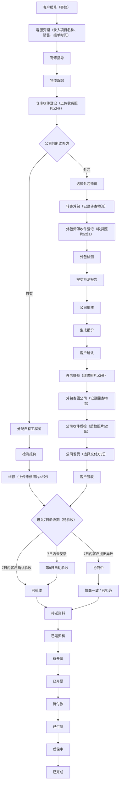
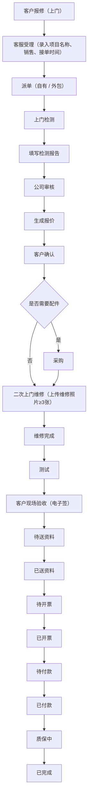
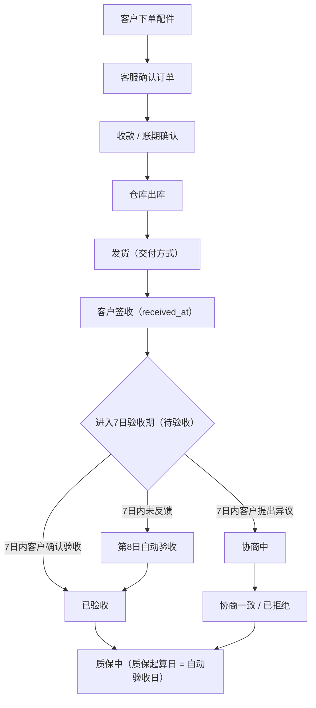
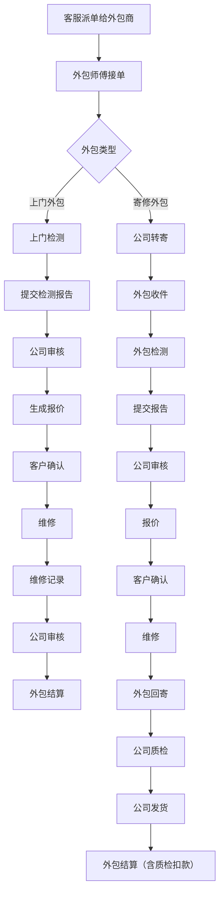
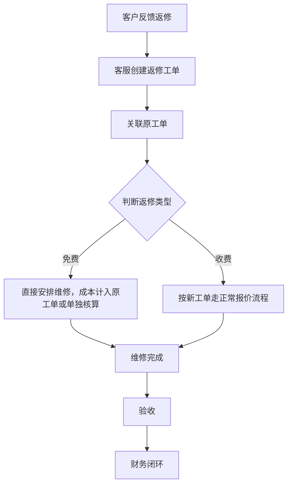
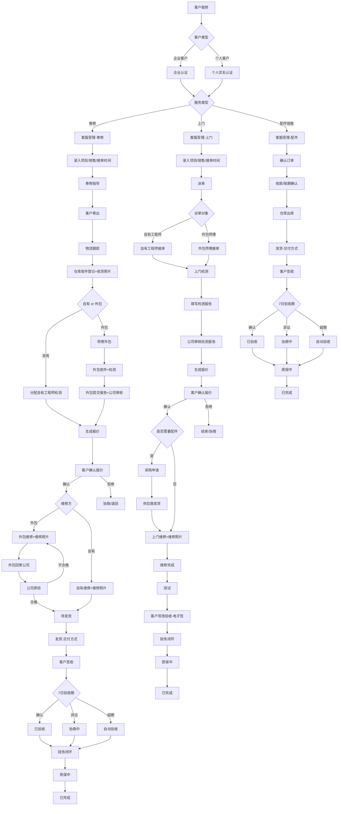
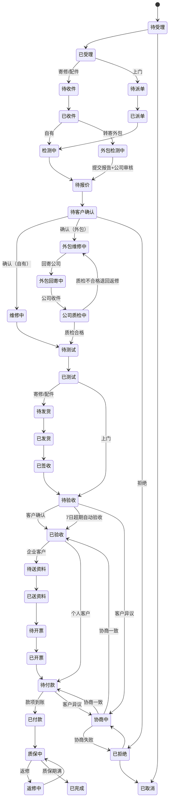
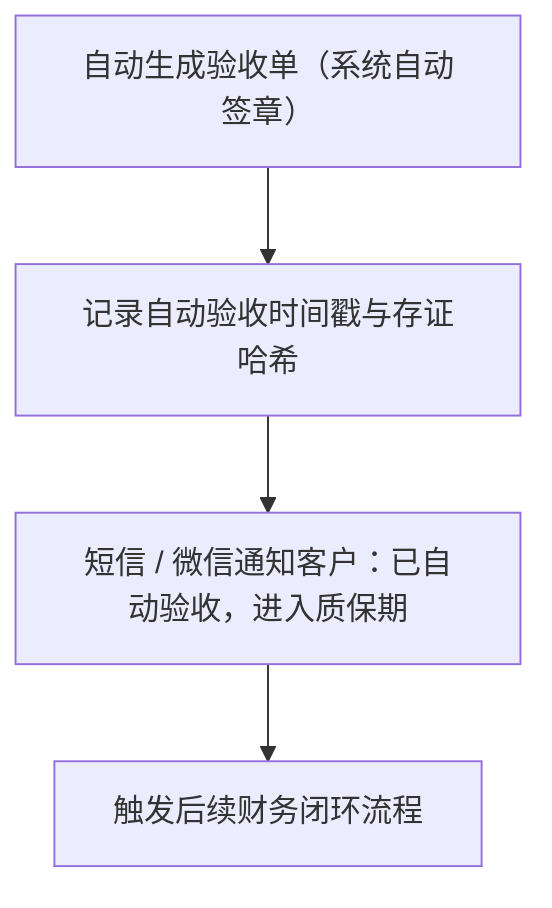
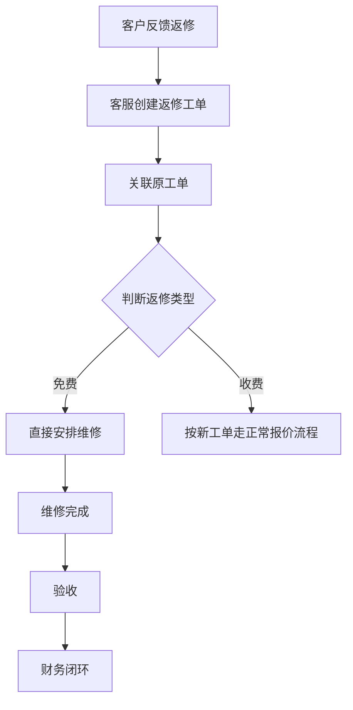
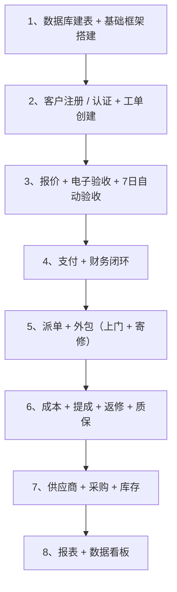

# `物业设备维修服务平台 PRD V3.4`


[toc]

---

## 🔥 <font id=前言>前言</font>

**版本**：V3.4  
**日期**：2026-10-06  
**状态**：正式  
**适用对象**：产品、开发、测试、运营、管理层  
**变更说明**：在 V3.3 基础上，新增**寄修配件外包维修**支持，包括外包模式、多段物流、公司质检、外包结算调整、状态机扩展。其余内容与 V3.3 一致。

**阅读说明**：流程统一以 [**Mermaid**](https://mermaid.js.org) 源码呈现；使用支持 Mermaid 的 [**Markdown**](https://markdown.cn) 阅读器查看图形。章节标题的 🔼 返回前言，🔽 跳到文末。以下目录、表清单与“关联阅读”均可在本文内跳转。

**快捷目录**：

| 章节 |
| :--- |
| [一、项目概述](#project-overview) |
| [二、用户角色与权限](#roles) |
| [三、核心业务流程](#business-flows) |
| [四、工单状态机](#work-order-states) |
| [五、功能需求](#features) |
| [六、非功能需求](#nonfunctional) |
| [七、技术架构建议](#architecture) |
| [八、数据库设计](#database) |
| [九、成本与提成管理](#cost-commission) |
| [十、返修管理](#rework) |
| [十一、质保管理](#warranty) |
| [十二、项目里程碑](#milestones) |
| [十三、验收标准](#acceptance-criteria) |
| [十四、风险与对策](#risks) |
| [十五、附录](#appendix) |
| [十六、开发建议](#development) |

**重点入口**：[权限矩阵](#permission-matrix) · [总体流程](#overall-flow) · [状态机](#state-diagram) · [7 日验收](#acceptance-window) · [外包结算](#db-outsource-settlement) · [数据库表索引](#table-index) · [原稿口径核对](#source-questions)

---

## 一、<span id="project-overview">项目概述</span> <a href="#前言" style="font-size:17px; color:green;"><b>🔼</b></a> <a href="#🔚" style="font-size:17px; color:green;"><b>🔽</b></a>

### 1.1、<span id="s-1-1">背景</span> <a href="#前言" style="font-size:17px; color:green;"><b>🔼</b></a> <a href="#🔚" style="font-size:17px; color:green;"><b>🔽</b></a>

公司主营芯片级维修，承接电梯设备、安防设备、消防设备、工控设备、多媒体设备等维修。业务模式包括：

- **寄修服务**：客户将电梯配件、消防配件、弱电配件等寄到公司维修。
- **上门检测报价**：针对二次供水控制柜、生活水泵、消防泵、污水泵、空调循环泵等，工程师上门检测后报价，客户确认后维修。
- **配件销售**：直接销售配件给客户。
- 维修资源包括自有维修师傅、外包维修师傅、设备供应商。
- **寄修配件维修也可外包给非公司维修师傅**，支持公司中转+质检模式。
- 客户类型包括**企业客户（B2B）**和**个人客户（B2C）**。
- 业务多为**账期交易**（企业客户），维修完成后需配合客户提供付款资料，等待客户内部报销流程，客户通知开票后才开票，开票后客户走付款流程，回款后订单闭环。
- 部分工单存在**渠道方和项目方提成**。
- 存在**返修**情况，需关联原工单。
- 寄修与配件销售采用**7日验收期**规则：签收后7日内客户未反馈问题，第8日自动验收，进入质保期。

现有流程依赖纸质验收单和电话/[**微信**](https://weixin.qq.com/)沟通，存在验收单签署难、报价无留痕、回款慢、成本不透明、外包与供应商协同效率低等痛点。

### 1.2、<span id="s-1-2">目标</span> <a href="#前言" style="font-size:17px; color:green;"><b>🔼</b></a> <a href="#🔚" style="font-size:17px; color:green;"><b>🔽</b></a>

- 电子验收单签署率 ≥ 90%
- 自动验收覆盖率 ≥ 95%
- 平均回款周期缩短 30%
- 客户投诉率下降 50%
- 工程师人效提升 20%
- 外包与供应商协同效率提升 40%
- 单均成本核算准确率 ≥ 95%
- 返修率统计准确率 ≥ 98%

### 1.3、<span id="s-1-3">范围</span> <a href="#前言" style="font-size:17px; color:green;"><b>🔼</b></a> <a href="#🔚" style="font-size:17px; color:green;"><b>🔽</b></a>

- **包含**：客户端小程序（企业+个人）、自有工程师端、外包师傅端、Web管理后台、供应商门户、集成电子签/物流/支付/发票/短信、成本管理、外包商管理、供应商管理、账期管理、提成管理、返修管理、项目管理、交付管理、验收时效管理、质保管理、寄修外包管理、公司质检管理。
- **不包含**：现场维修派单、IoT预测性维护、对外SaaS多租户（预留扩展）。


## 二、<span id="roles">用户角色与权限</span> <a href="#前言" style="font-size:17px; color:green;"><b>🔼</b></a> <a href="#🔚" style="font-size:17px; color:green;"><b>🔽</b></a>

### 2.1、<span id="s-2-1">角色定义</span> <a href="#前言" style="font-size:17px; color:green;"><b>🔼</b></a> <a href="#🔚" style="font-size:17px; color:green;"><b>🔽</b></a>

| 角色 | 终端 | 核心职责 |
| :--- | :--- | :--- |
| 企业客户 | [**微信小程序**](https://developers.weixin.qq.com/miniprogram/dev/framework/)/H5 | 报修、查看进度、确认报价、电子签、支付、开票、设备档案、返修申请、多联系人管理 |
| 个人客户 | 微信小程序/H5 | 报修、查看进度、确认报价、电子签、支付、设备档案、返修申请 |
| 客服/调度 | Web后台 | 接单、派单、审核报价、催款、客户管理、外包派单、录入项目/销售信息 |
| 自有工程师 | App/小程序 | 接单、上门检测、维修记录、配件申请、知识库、上传维修照片 |
| 外包师傅 | 小程序/H5 | 接单（上门/寄修）、提交检测报告、维修记录、申请结算、收件/回寄登记 |
| 仓库管理员 | Web后台 | 入库、出库、库存预警、旧件管理、采购收货、上传收货照片、转寄外包 |
| 质检员 | Web后台 | 外包回寄配件质检、上传质检照片、判定合格/不合格 |
| 财务 | Web后台 | 对账、收款确认、发票、外包结算、供应商付款、成本审核、提成结算、报表 |
| 供应商 | Web门户 | 接收采购单、发货、对账 |
| 管理员 | Web后台 | 权限、数据看板、系统设置 |

### 2.2、<span id="permission-matrix">角色权限矩阵</span> <a href="#前言" style="font-size:17px; color:green;"><b>🔼</b></a> <a href="#🔚" style="font-size:17px; color:green;"><b>🔽</b></a>

**关联阅读**：[各端功能需求](#features) · [权限相关表](#db-role-permission)

| 功能模块 | 企业客户 | 个人客户 | 客服/调度 | 自有工程师 | 外包师傅 | 仓库 | 质检员 | 财务 | 供应商 | 管理员 |
| :--- | :---: | :---: | :---: | :---: | :---: | :---: | :---: | :---: | :---: | :---: |
| 注册/登录 | ✅ | ✅ | ✅ | ✅ | ✅ | ✅ | ✅ | ✅ | ✅ | ✅ |
| 企业认证 | ✅ | ❌ | ❌ | ❌ | ❌ | ❌ | ❌ | ❌ | ❌ | ✅ |
| 个人实名认证 | ❌ | ✅ | ❌ | ❌ | ❌ | ❌ | ❌ | ❌ | ❌ | ✅ |
| 多联系人管理 | ✅ | ❌ | ✅ | ❌ | ❌ | ❌ | ❌ | ❌ | ❌ | ✅ |
| 在线报修 | ✅ | ✅ | ✅ | ❌ | ❌ | ❌ | ❌ | ❌ | ❌ | ❌ |
| 查看进度 | ✅ | ✅ | ✅ | ✅ | ✅ | ✅ | ✅ | ✅ | ❌ | ✅ |
| 报价确认 | ✅ | ✅ | ✅ | ❌ | ❌ | ❌ | ❌ | ❌ | ❌ | ❌ |
| 电子验收签署 | ✅ | ✅ | ❌ | ❌ | ❌ | ❌ | ❌ | ❌ | ❌ | ❌ |
| 支付 | ✅ | ✅ | ❌ | ❌ | ❌ | ❌ | ❌ | ✅ | ❌ | ❌ |
| 通知开票 | ✅ | ✅ | ✅ | ❌ | ❌ | ❌ | ❌ | ✅ | ❌ | ❌ |
| 设备档案 | ✅ | ✅ | ✅ | ✅ | ✅ | ❌ | ❌ | ❌ | ❌ | ✅ |
| 申请账期 | ✅ | ❌ | ❌ | ❌ | ❌ | ❌ | ❌ | ❌ | ❌ | ✅ |
| 接单 | ❌ | ❌ | ❌ | ✅ | ✅ | ❌ | ❌ | ❌ | ❌ | ❌ |
| 检测记录 | ❌ | ❌ | ❌ | ✅ | ✅ | ❌ | ❌ | ❌ | ❌ | ❌ |
| 维修记录/上传维修照片 | ❌ | ❌ | ❌ | ✅ | ✅ | ❌ | ❌ | ❌ | ❌ | ❌ |
| 配件申请 | ❌ | ❌ | ❌ | ✅ | ✅ | ❌ | ❌ | ❌ | ❌ | ❌ |
| 派单（自有/外包） | ❌ | ❌ | ✅ | ❌ | ❌ | ❌ | ❌ | ❌ | ❌ | ✅ |
| 工单管理 | ❌ | ❌ | ✅ | ❌ | ❌ | ❌ | ❌ | ❌ | ❌ | ✅ |
| 客户管理 | ❌ | ❌ | ✅ | ❌ | ❌ | ❌ | ❌ | ❌ | ❌ | ✅ |
| 报价审核 | ❌ | ❌ | ✅ | ❌ | ❌ | ❌ | ❌ | ❌ | ❌ | ✅ |
| 库存管理 | ❌ | ❌ | ❌ | ❌ | ❌ | ✅ | ❌ | ❌ | ❌ | ✅ |
| 采购申请 | ❌ | ❌ | ❌ | ✅ | ✅ | ✅ | ❌ | ❌ | ❌ | ✅ |
| 采购单管理 | ❌ | ❌ | ❌ | ❌ | ❌ | ✅ | ❌ | ❌ | ❌ | ✅ |
| 供应商管理 | ❌ | ❌ | ❌ | ❌ | ❌ | ❌ | ❌ | ❌ | ❌ | ✅ |
| 供应商接单发货 | ❌ | ❌ | ❌ | ❌ | ❌ | ❌ | ❌ | ❌ | ✅ | ❌ |
| 供应商对账 | ❌ | ❌ | ❌ | ❌ | ❌ | ❌ | ❌ | ✅ | ✅ | ✅ |
| 外包商档案 | ❌ | ❌ | ✅ | ❌ | ❌ | ❌ | ❌ | ❌ | ❌ | ✅ |
| 外包派单 | ❌ | ❌ | ✅ | ❌ | ❌ | ❌ | ❌ | ❌ | ❌ | ✅ |
| 外包接单 | ❌ | ❌ | ❌ | ❌ | ✅ | ❌ | ❌ | ❌ | ❌ | ❌ |
| 外包结算 | ❌ | ❌ | ❌ | ❌ | ✅ | ❌ | ❌ | ✅ | ❌ | ✅ |
| 成本录入 | ❌ | ❌ | ❌ | ✅ | ✅ | ✅ | ❌ | ✅ | ❌ | ✅ |
| 成本审核 | ❌ | ❌ | ❌ | ❌ | ❌ | ❌ | ❌ | ✅ | ❌ | ✅ |
| 提成录入 | ❌ | ❌ | ✅ | ❌ | ❌ | ❌ | ❌ | ✅ | ❌ | ✅ |
| 提成审核/结算 | ❌ | ❌ | ❌ | ❌ | ❌ | ❌ | ❌ | ✅ | ❌ | ✅ |
| 返修创建 | ✅ | ✅ | ✅ | ✅ | ❌ | ❌ | ❌ | ❌ | ❌ | ✅ |
| 返修统计 | ❌ | ❌ | ✅ | ❌ | ❌ | ❌ | ❌ | ✅ | ❌ | ✅ |
| 收货照片上传 | ❌ | ❌ | ❌ | ❌ | ❌ | ✅ | ❌ | ❌ | ❌ | ✅ |
| 交付方式选择 | ❌ | ❌ | ✅ | ❌ | ❌ | ✅ | ❌ | ❌ | ❌ | ✅ |
| 项目管理 | ❌ | ❌ | ✅ | ❌ | ❌ | ❌ | ❌ | ❌ | ❌ | ✅ |
| 销售录入 | ❌ | ❌ | ✅ | ❌ | ❌ | ❌ | ❌ | ❌ | ❌ | ✅ |
| 验收监控 | ❌ | ❌ | ✅ | ❌ | ❌ | ❌ | ❌ | ✅ | ❌ | ✅ |
| 自动验收日志 | ❌ | ❌ | ✅ | ❌ | ❌ | ❌ | ❌ | ✅ | ❌ | ✅ |
| 质保管理 | ❌ | ✅ | ✅ | ✅ | ✅ | ❌ | ❌ | ✅ | ❌ | ✅ |
| 寄修外包接单 | ❌ | ❌ | ❌ | ❌ | ✅ | ❌ | ❌ | ❌ | ❌ | ❌ |
| 外包收件登记 | ❌ | ❌ | ❌ | ❌ | ✅ | ❌ | ❌ | ❌ | ❌ | ❌ |
| 外包回寄登记 | ❌ | ❌ | ❌ | ❌ | ✅ | ❌ | ❌ | ❌ | ❌ | ❌ |
| 公司质检 | ❌ | ❌ | ❌ | ❌ | ❌ | ❌ | ✅ | ❌ | ❌ | ✅ |
| 质检照片上传 | ❌ | ❌ | ❌ | ❌ | ❌ | ❌ | ✅ | ❌ | ❌ | ✅ |
| 转寄外包 | ❌ | ❌ | ✅ | ❌ | ❌ | ✅ | ❌ | ❌ | ❌ | ✅ |
| 外包结算（含质检扣款） | ❌ | ❌ | ❌ | ❌ | ✅ | ❌ | ❌ | ✅ | ❌ | ✅ |
| 成本查询/利润报表 | ❌ | ❌ | ✅ | ❌ | ❌ | ❌ | ❌ | ✅ | ❌ | ✅ |
| 财务管理 | ❌ | ❌ | ❌ | ❌ | ❌ | ❌ | ❌ | ✅ | ❌ | ✅ |
| 数据报表 | ❌ | ❌ | ✅ | ❌ | ❌ | ❌ | ❌ | ✅ | ❌ | ✅ |
| 权限管理 | ❌ | ❌ | ❌ | ❌ | ❌ | ❌ | ❌ | ❌ | ❌ | ✅ |

> 说明：✅ 表示有权限，❌ 表示无权限。管理员拥有所有权限。


## 三、<span id="business-flows">核心业务流程</span> <a href="#前言" style="font-size:17px; color:green;"><b>🔼</b></a> <a href="#🔚" style="font-size:17px; color:green;"><b>🔽</b></a>

**关联阅读**：[工单状态机](#work-order-states) · [7 日验收规则](#acceptance-window) · [财务闭环](#finance-flow)

### 3.1、<span id="mail-repair-flow">寄修流程（含外包分支）</span> <a href="#前言" style="font-size:17px; color:green;"><b>🔼</b></a> <a href="#🔚" style="font-size:17px; color:green;"><b>🔽</b></a>

**关联阅读**：[总体寄修链路](#overall-flow) · [外包师傅端](#outsource-features) · [物流表](#db-logistics)

> **原稿核对**：本节自有维修分支直接进入验收期，发货与签收节点见[总体流程](#overall-flow)；“协商一致 / 已拒绝”合流到财务的口径见[附录核对项](#source-questions)。



### 3.2、<span id="onsite-flow">上门检测报价流程</span> <a href="#前言" style="font-size:17px; color:green;"><b>🔼</b></a> <a href="#🔚" style="font-size:17px; color:green;"><b>🔽</b></a>

**关联阅读**：[工程师功能](#s-5-2) · [检测与维修记录](#db-repair-record) · [财务闭环](#finance-flow)



> 上门维修为现场验收，不适用7日窗口期。

### 3.3、<span id="parts-sales-flow">配件销售流程（含7日验收期）</span> <a href="#前言" style="font-size:17px; color:green;"><b>🔼</b></a> <a href="#🔚" style="font-size:17px; color:green;"><b>🔽</b></a>

**关联阅读**：[7 日验收规则](#acceptance-window) · [交付管理](#admin-features) · [质保管理](#warranty)

> **原稿核对**：本节保留“质保起算日 = 自动验收日”及异议分支的原稿表达，与[质保规则](#warranty-rules)和[状态图](#state-diagram)的差异见[附录核对项](#source-questions)。



### 3.4、<span id="finance-flow">财务闭环流程</span> <a href="#前言" style="font-size:17px; color:green;"><b>🔼</b></a> <a href="#🔚" style="font-size:17px; color:green;"><b>🔽</b></a>

**关联阅读**：[支付表](#db-payment) · [发票表](#db-invoice) · [工单财务字段](#db-work-order)

**企业客户（账期）** ：


**个人客户（现款，默认不开票）** ：


**个人客户（需开票）** ：


**个人客户（先付款后维修）** ：


### 3.5、<span id="outsource-flow">外包维修流程</span> <a href="#前言" style="font-size:17px; color:green;"><b>🔼</b></a> <a href="#🔚" style="font-size:17px; color:green;"><b>🔽</b></a>

**关联阅读**：[外包功能](#outsource-features) · [公司质检](#admin-features) · [外包结算表](#db-outsource-settlement)



### 3.6、<span id="purchase-flow">采购流程</span> <a href="#前言" style="font-size:17px; color:green;"><b>🔼</b></a> <a href="#🔚" style="font-size:17px; color:green;"><b>🔽</b></a>

**关联阅读**：[供应商门户](#s-5-5) · [采购单](#db-purchase-order) · [采购明细](#db-purchase-order-item)


### 3.7、<span id="rework-main-flow">返修流程</span> <a href="#前言" style="font-size:17px; color:green;"><b>🔼</b></a> <a href="#🔚" style="font-size:17px; color:green;"><b>🔽</b></a>

**关联阅读**：[返修类型与统计](#rework) · [返修专项流程](#rework-detail-flow) · [质保规则](#warranty-rules)



### 3.8、<span id="overall-flow">总体业务流程图</span> <a href="#前言" style="font-size:17px; color:green;"><b>🔼</b></a> <a href="#🔚" style="font-size:17px; color:green;"><b>🔽</b></a>

**关联阅读**：[寄修详情](#mail-repair-flow) · [上门详情](#onsite-flow) · [销售详情](#parts-sales-flow) · [状态图](#state-diagram)

> **原稿核对**：总体图保留原稿中“协商中”直接流向财务闭环或质保中的连线；与[状态图](#state-diagram)的协商结果分支存在差异，见[附录核对项](#source-questions)。




## 四、<span id="work-order-states">工单状态机</span> <a href="#前言" style="font-size:17px; color:green;"><b>🔼</b></a> <a href="#🔚" style="font-size:17px; color:green;"><b>🔽</b></a>

### 4.1、<span id="state-list">状态列表</span> <a href="#前言" style="font-size:17px; color:green;"><b>🔼</b></a> <a href="#🔚" style="font-size:17px; color:green;"><b>🔽</b></a>

**关联阅读**：[状态流转图](#state-diagram) · [工单表](#db-work-order)

| 状态 | 说明 | 可流转至 | 适用类型 |
| :--- | :--- | :--- | :--- |
| 待受理 | 客户已提交 | 已受理、已取消 | 通用 |
| 已受理 | 客服确认 | 待收件（寄修/配件）/ 待派单（上门） | 通用 |
| 待收件 | 寄修等待客户寄出 | 已收件 | 寄修 |
| 待派单 | 上门等待派单 | 已派单 | 上门 |
| 已派单 | 已指派师傅 | 检测中 | 上门 |
| 已收件 | 仓库登记 | 检测中 | 寄修 |
| 检测中 | 自有工程师检测 | 待报价 | 通用 |
| 外包检测中 | 外包师傅检测中 | 待报价 | 寄修外包 |
| 待报价 | 生成报价 | 待客户确认 | 通用 |
| 待客户确认 | 等待客户确认 | 维修中、已拒绝 | 通用 |
| 维修中 | 自有工程师维修 | 待测试 | 通用 |
| 外包维修中 | 外包师傅维修中 | 外包回寄中 | 寄修外包 |
| 外包回寄中 | 外包寄回公司途中 | 公司质检中 | 寄修外包 |
| 公司质检中 | 公司质检中 | 待测试、外包维修中（不合格退回） | 寄修外包 |
| 待测试 | 维修完成测试 | 已测试 | 通用 |
| 已测试 | 测试合格 | 待发货（寄修/配件）/ 待验收（上门） | 通用 |
| 待发货 | 准备发货 | 已发货 | 寄修/配件 |
| 已发货 | 物流发出 | 已签收 | 寄修/配件 |
| 已签收 | 客户已签收 | 待验收 | 寄修/配件 |
| 待验收 | 7日验收期内 | 已验收、协商中 | 寄修/配件 |
| 已验收 | 客户确认或自动验收 | 待送资料（企业）/ 待付款（个人） | 通用 |
| 待送资料 | 准备并提交付款资料给客户 | 已送资料 | 企业 |
| 已送资料 | 资料已送达 | 待开票 | 企业 |
| 待开票 | 客户通知可开票 | 已开票 | 通用 |
| 已开票 | 发票已开出 | 待付款 | 通用 |
| 待付款 | 等待付款 | 已付款、协商中 | 通用 |
| 已付款 | 款项到账，订单闭环 | 质保中 | 通用 |
| 质保中 | 质保期内，可发起返修 | 已完成、返修中 | 通用 |
| 返修中 | 返修工单处理中 | 质保中 | 通用 |
| 已完成 | 质保期满，订单最终完成 | — | 通用 |
| 已取消 | 取消 | — | 通用 |
| 已拒绝 | 客户拒绝报价 | 协商中、已取消 | 通用 |
| 协商中 | 付款/报价/验收异议协商 | 待付款、已验收、已取消 | 通用 |

### 4.2、<span id="state-diagram">状态流转图</span> <a href="#前言" style="font-size:17px; color:green;"><b>🔼</b></a> <a href="#🔚" style="font-size:17px; color:green;"><b>🔽</b></a>

**关联阅读**：[状态列表](#state-list) · [验收窗口](#acceptance-window) · [财务分支](#finance-flow)



### 4.3、<span id="acceptance-window">7日验收期规则</span> <a href="#前言" style="font-size:17px; color:green;"><b>🔼</b></a> <a href="#🔚" style="font-size:17px; color:green;"><b>🔽</b></a>

**关联阅读**：[自动验收逻辑](#auto-acceptance) · [通知机制](#customer-notices) · [质保起算](#warranty-rules)

| 规则项 | 说明 |
| :--- | :--- |
| 验收窗口期 | 客户签收后 7个自然日 |
| 起算时间 | 物流签收时间（`received_at`） |
| 客户反馈 | 7日内可确认验收或提出异议 |
| 超期未反馈 | 第8日0点自动视为验收合格 |
| 自动验收 | 系统自动生成验收单（自动签章），进入质保期 |
| 质保起算 | 自动验收通过之日 |
| 适用场景 | 寄修维修、配件销售、公司自送、客户自取 |
| 例外 | 上门维修为现场验收，不适用 |

### 4.4、<span id="auto-acceptance">自动验收实现逻辑</span> <a href="#前言" style="font-size:17px; color:green;"><b>🔼</b></a> <a href="#🔚" style="font-size:17px; color:green;"><b>🔽</b></a>

**关联阅读**：[验收窗口规则](#acceptance-window) · [验收单表](#db-acceptance) · [原稿口径核对](#source-questions)

**定时任务（每天凌晨0:05执行）** ：

```sql
UPDATE work_order
SET 
    status = '已验收',
    acceptance_type = '自动验收',
    auto_accepted_at = NOW(),
    accepted_at = NOW(),
    warranty_start = DATE(NOW()),
    warranty_end = DATE_ADD(DATE(NOW()), INTERVAL warranty_months MONTH),
    warranty_status = '质保中'
WHERE 
    status = '待验收'
    AND received_at IS NOT NULL
    AND DATEDIFF(NOW(), received_at) >= 7
    AND service_type IN ('寄修', '配件销售');
```

**自动验收后动作**：

1、自动生成验收单（系统自动签章）

2、记录自动验收时间戳与存证哈希

3、短信/微信通知客户“已自动验收，进入质保期”

4、触发后续财务闭环流程



### 4.5、<span id="customer-notices">客户通知机制</span> <a href="#前言" style="font-size:17px; color:green;"><b>🔼</b></a> <a href="#🔚" style="font-size:17px; color:green;"><b>🔽</b></a>

| 节点 | 通知方式 | 内容 |
| :--- | :--- | :--- |
| 签收当日 | 微信/短信 | “您的设备已签收，请在7日内完成验收，逾期视为验收合格” |
| 签收后第3日 | 微信/短信 | “验收期剩余4天，请及时确认” |
| 签收后第6日 | 微信/短信 | “验收期剩余1天，明日将自动验收” |
| 自动验收当日 | 微信/短信 | “验收期已满，系统已自动验收，质保期开始” |
| 质保到期前30日 | 微信/短信 | “质保即将到期，如需续保请联系客服” |


## 五、<span id="features">功能需求</span> <a href="#前言" style="font-size:17px; color:green;"><b>🔼</b></a> <a href="#🔚" style="font-size:17px; color:green;"><b>🔽</b></a>

### 5.1、<span id="customer-features">客户端（微信小程序）</span> <a href="#前言" style="font-size:17px; color:green;"><b>🔼</b></a> <a href="#🔚" style="font-size:17px; color:green;"><b>🔽</b></a>

**关联阅读**：[角色权限](#permission-matrix) · [验收流程](#acceptance-window) · [集成需求](#integrations)

| 模块 | 功能 | 优先级 | 验收标准 |
| :--- | :--- | :--- | :--- |
| 注册/登录 | 企业认证或个人实名认证 | P0 | 认证后自动关联客户 |
| 在线报修 | 选择寄修/上门/配件，填写设备信息、故障描述、上传视频/照片 | P0 | 支持多设备、多故障 |
| 寄修指引 | 展示打包规范、[**顺丰**](https://www.sf-express.com/)到付地址、二维码 | P0 | 可一键复制地址 |
| 物流跟踪 | 对接[**快递100**](https://www.kuaidi100.com/)/顺丰API，支持多段物流 | P0 | 实时显示物流状态 |
| 进度查询 | 时间轴展示工单状态，含外包进度 | P0 | 状态变更推送模板消息 |
| 报价确认 | 查看检测报告、报价明细，在线确认/异议 | P0 | 确认后不可修改，留痕 |
| 电子验收单 | 集成[**e签宝**](https://open.esign.cn/)/[**法大大**](https://www.fadada.com/)，微信签署 | P0 | 签署后生成存证哈希 |
| 验收倒计时 | 显示剩余验收天数 | P0 | 实时更新 |
| 一键确认验收 | 客户点击确认，立即验收通过 | P0 | 即时生效 |
| 提出异议 | 填写异议内容、上传照片 | P0 | 触发协商流程 |
| 支付 | [**微信支付**](https://pay.weixin.qq.com/)、[**支付宝**](https://www.alipay.com/)、银行转账凭证上传 | P0 | 支付成功更新工单 |
| 通知开票 | 客户在线发起开票申请 | P0 | 触发财务开票流程 |
| 查看发票 | 下载电子发票 | P0 | 支持PDF下载 |
| 查看付款资料 | 下载对账单、验收单 | P0 | 支持PDF下载 |
| 设备档案 | 历史维修记录、质保期查询 | P1 | 按设备序列号聚合 |
| 返修申请 | 从历史工单发起返修 | P0 | 自动关联原工单 |
| 质保查询 | 查看质保起止日、剩余天数 | P0 | 到期前30日推送提醒 |
| 评价反馈 | 服务完成后评价 | P2 | 影响工程师绩效 |
| 多联系人管理 | 企业客户可维护多个联系人 | P1 | 仅企业客户可见 |

### 5.2、<span id="s-5-2">自有工程师端</span> <a href="#前言" style="font-size:17px; color:green;"><b>🔼</b></a> <a href="#🔚" style="font-size:17px; color:green;"><b>🔽</b></a>

| 模块 | 功能 | 优先级 | 验收标准 |
| :--- | :--- | :--- | :--- |
| 接单 | 查看待接工单、抢单/派单 | P0 | 支持按技能筛选 |
| 上门检测 | 填写检测数据、上传照片 | P0 | 数据不可为空 |
| 检测记录 | 提交检测报告 | P0 | 关联工单 |
| 维修记录 | 更换配件、维修措施、工时 | P0 | 关联库存扣减 |
| 维修照片上传 | 上传维修照片（≥3张） | P0 | 不足3张不允许提交 |
| 配件申请 | 向仓库申领配件 | P1 | 审批流 |
| 成本录入 | 录入材料、差旅等成本 | P0 | 支持拍照上传凭证 |
| 返修处理 | 处理返修工单 | P0 | 关联原工单 |
| 知识库 | 常见故障、维修方案查询 | P2 | 支持关键词搜索 |
| 工时登记 | 记录实际工时 | P1 | 用于绩效 |

### 5.3、<span id="outsource-features">外包师傅端</span> <a href="#前言" style="font-size:17px; color:green;"><b>🔼</b></a> <a href="#🔚" style="font-size:17px; color:green;"><b>🔽</b></a>

**关联阅读**：[外包流程](#outsource-flow) · [外包派单表](#db-outsource-dispatch) · [外包结算表](#db-outsource-settlement)

| 模块 | 功能 | 优先级 | 验收标准 |
| :--- | :--- | :--- | :--- |
| 接单 | 查看可接工单、抢单（上门/寄修） | P0 | 按区域、技能过滤 |
| 上门检测 | 填写检测报告、上传照片 | P0 | 报告需公司审核 |
| 寄修外包接单 | 查看可接的寄修外包工单 | P0 | 按技能、区域过滤 |
| 外包收件登记 | 上传收货照片（≥2张） | P0 | 记录收件时间 |
| 维修记录 | 更换配件、维修措施、工时 | P0 | 关联工单 |
| 维修照片上传 | 上传维修照片（≥3张） | P0 | 不足3张不允许提交 |
| 回寄登记 | 填写回寄物流单号、上传打包照片 | P0 | 寄回公司 |
| 成本录入 | 录入外修成本、材料成本等 | P0 | 支持拍照上传凭证 |
| 结算申请 | 提交结算单 | P1 | 财务审核后付款 |
| 评价查看 | 查看客户评价 | P2 | 影响派单优先级 |

### 5.4、<span id="admin-features">管理后台</span> <a href="#前言" style="font-size:17px; color:green;"><b>🔼</b></a> <a href="#🔚" style="font-size:17px; color:green;"><b>🔽</b></a>

**关联阅读**：[工单状态机](#work-order-states) · [成本与提成](#cost-commission) · [核心数据表](#core-tables)

| 模块 | 功能 | 优先级 | 验收标准 |
| :--- | :--- | :--- | :--- |
| 工单管理 | 状态流转、超时预警、批量操作 | P0 | 超时自动提醒 |
| 项目/销售录入 | 录入项目名称、销售人员 | P0 | 受理时填写 |
| 派单调度 | 按区域、技能、忙闲派单给自有/外包 | P0 | 支持改派 |
| 转寄外包 | 选择外包师傅、记录转寄物流 | P0 | 支持模式A |
| 客户管理 | 企业/个人客户信息、信用评级、账期 | P0 | 信用评级自动计算 |
| 报价管理 | 模板、审核、历史价格 | P0 | 外包报告需审核 |
| 库存管理 | 入库、出库、盘点、预警 | P1 | 安全库存提醒 |
| 采购管理 | 采购申请、采购单、供应商对账 | P1 | 审批流 |
| 供应商管理 | 供应商档案、价格协议、评级 | P1 | 支持多供应商 |
| 外包商管理 | 档案、派单、结算、评价、对账 | P0 | 支持按单/月结 |
| 成本管理 | 成本录入、审核、查询、利润报表 | P0 | 自动计算毛利 |
| 提成管理 | 提成录入、审核、结算、查询、报表 | P0 | 支持多提成方 |
| 返修管理 | 返修创建、标记、统计、关联原工单 | P0 | 自动关联原工单 |
| 交付管理 | 交付方式选择、发货登记、签收确认 | P0 | 支持物流/自送/自取 |
| 收货照片管理 | 上传、查看收货照片（≥2张） | P0 | 不足2张不允许提交 |
| 公司质检 | 质检登记、上传质检照片（≥2张）、判定合格/不合格 | P0 | 不合格退回外包返修 |
| 多段物流跟踪 | 查看[多段物流链路](#logistics-chain)全链路 | P0 | 物流表支持 |
| 验收监控 | 查看待验收工单、剩余天数 | P0 | 实时更新 |
| 自动验收日志 | 查看自动验收记录、触发时间 | P0 | 可导出 |
| 质保管理 | 查看质保中工单、到期提醒 | P0 | 到期前30日提醒 |
| 质保期配置 | 按设备类型配置质保月数 | P1 | 支持批量配置 |
| 异议处理 | 查看客户异议、协商记录 | P0 | 支持在线沟通 |
| 财务管理 | 应收、已收、逾期、催收、外包结算、供应商付款、账期管理 | P0 | 逾期自动催收 |
| 外包结算（含质检扣款） | 结算金额 = 基础金额 - 质检扣款 - 返修扣款 | P0 | 财务审核 |
| 电子签管理 | 合同、验收单存证查询 | P0 | 可下载存证报告 |
| 数据报表 | 维修量、故障类型、工程师绩效、回款率、成本分析、返修率、项目统计、B2B/B2C分析 | P1 | 可视化看板 |
| 权限管理 | RBAC，按角色分配 | P0 | 操作日志审计 |

#### 5.4.1、<span id="logistics-chain">多段物流链路</span> <a href="#前言" style="font-size:17px; color:green;"><b>🔼</b></a> <a href="#🔚" style="font-size:17px; color:green;"><b>🔽</b></a>


### 5.5、<span id="s-5-5">供应商门户</span> <a href="#前言" style="font-size:17px; color:green;"><b>🔼</b></a> <a href="#🔚" style="font-size:17px; color:green;"><b>🔽</b></a>

| 模块 | 功能 | 优先级 | 验收标准 |
| :--- | :--- | :--- | :--- |
| 登录 | 账号密码/手机验证 | P1 | 与公司后台绑定 |
| 采购单 | 查看采购单、确认发货 | P1 | 更新物流信息 |
| 对账 | 查看应付、对账明细 | P1 | 支持导出 |
| 发票 | 上传发票 | P2 | 财务审核 |

### 5.6、<span id="integrations">集成需求</span> <a href="#前言" style="font-size:17px; color:green;"><b>🔼</b></a> <a href="#🔚" style="font-size:17px; color:green;"><b>🔽</b></a>

| 集成项 | 方案 | 优先级 |
| :--- | :--- | :--- |
| 电子签 | e签宝 / 法大大 / [**腾讯电子签**](https://qian.tencent.com/) | P0 |
| 物流 | 快递100 / 顺丰API | P0 |
| 支付 | 微信支付、支付宝、银行转账凭证 | P0 |
| 短信 | [**阿里云短信**](https://www.aliyun.com/product/sms) / [**腾讯云短信**](https://cloud.tencent.com/product/sms) | P0 |
| 发票 | 电子发票平台 | P1 |
| 消息推送 | 微信模板消息 | P0 |
| 地图 | [**高德地图**](https://lbs.amap.com/)/[**百度地图**](https://lbsyun.baidu.com/)（上门定位） | P1 |
| 实名认证 | 公安实名认证接口 | P1 |


## 六、<span id="nonfunctional">非功能需求</span> <a href="#前言" style="font-size:17px; color:green;"><b>🔼</b></a> <a href="#🔚" style="font-size:17px; color:green;"><b>🔽</b></a>

| 类别 | 要求 |
| :--- | :--- |
| 性能 | 支持 1000+ 企业客户 + 5000+ 个人客户，并发 200+，响应时间 < 2s |
| 安全 | HTTPS、数据加密、RBAC、审计日志、每日备份 |
| 可用性 | 99.9% 可用，故障恢复 < 30min |
| 合规 | 遵守《电子签名法》《数据安全法》《个人信息保护法》 |
| 兼容 | 微信小程序、[**iOS**](https://www.apple.com/ios/)/[**Android**](https://www.android.com/)、[**Chrome**](https://www.google.com/chrome/)/[**Edge**](https://www.microsoft.com/edge) |
| 扩展 | 预留多租户、API开放接口 |


## 七、<span id="architecture">技术架构建议</span> <a href="#前言" style="font-size:17px; color:green;"><b>🔼</b></a> <a href="#🔚" style="font-size:17px; color:green;"><b>🔽</b></a>

**关联阅读**：[集成需求](#integrations) · [数据库设计](#database) · [建议技术栈](#recommended-stack)

| 层级 | 选型 |
| :--- | :--- |
| 客户端 | 微信小程序（[**Taro**](https://docs.taro.zone/)/[**uni-app**](https://uniapp.dcloud.net.cn/)） |
| 工程师端 | uni-app 打包 App/小程序 |
| 管理后台 | [**Vue 3**](https://vuejs.org/) + [**Element Plus**](https://element-plus.org/) |
| 供应商门户 | Vue3 + Element Plus |
| 后端 | [**Spring Boot**](https://spring.io/projects/spring-boot/)（[**Java**](https://www.java.com/)）或 [**NestJS**](https://nestjs.com/)（[**Node.js**](https://nodejs.org)） |
| 数据库 | [**MySQL**](https://www.mysql.com) 8.0 + [**Redis**](https://redis.io/) |
| 文件存储 | [**阿里云 OSS**](https://www.aliyun.com/product/oss) / [**腾讯云 COS**](https://cloud.tencent.com/product/cos) |
| 部署 | [**阿里云**](https://www.aliyun.com/)/[**腾讯云**](https://cloud.tencent.com/)，[**Docker**](https://www.docker.com/) + [**Nginx**](https://nginx.org/) |
| 安全 | HTTPS、数据加密、RBAC、审计日志 |
| 定时任务 | [**XXL-JOB**](https://www.xuxueli.com/xxl-job/) / [**Quartz**](https://www.quartz-scheduler.org/)（自动验收、催收提醒） |


## 八、<span id="database">数据库设计</span> <a href="#前言" style="font-size:17px; color:green;"><b>🔼</b></a> <a href="#🔚" style="font-size:17px; color:green;"><b>🔽</b></a>

**关联阅读**：[表清单索引](#table-index) · [26 张核心表结构](#core-tables)

### 8.1、<span id="table-index">表清单</span> <a href="#前言" style="font-size:17px; color:green;"><b>🔼</b></a> <a href="#🔚" style="font-size:17px; color:green;"><b>🔽</b></a>

| 序号 | 表名 | 中文名称 |
| :--- | :--- | :--- |
| 1 | [`customer`](#db-customer) | 客户表 |
| 2 | [`customer_contact`](#db-customer-contact) | 客户联系人表 |
| 3 | [`device`](#db-device) | 设备表 |
| 4 | [`work_order`](#db-work-order) | 工单表 |
| 5 | [`quotation`](#db-quotation) | 报价表 |
| 6 | [`repair_record`](#db-repair-record) | 维修记录表 |
| 7 | [`part`](#db-part) | 配件信息表 |
| 8 | [`part_inventory`](#db-part-inventory) | 库存流水表 |
| 9 | [`payment`](#db-payment) | 支付表 |
| 10 | [`acceptance`](#db-acceptance) | 验收单表 |
| 11 | [`invoice`](#db-invoice) | 发票表 |
| 12 | [`logistics`](#db-logistics) | 物流表 |
| 13 | [`cost_record`](#db-cost-record) | 成本记录表 |
| 14 | [`work_order_cost_summary`](#db-work-order-cost-summary) | 工单成本汇总表 |
| 15 | [`commission`](#db-commission) | 提成记录表 |
| 16 | [`outsource_provider`](#db-outsource-provider) | 外包商表 |
| 17 | [`outsource_dispatch`](#db-outsource-dispatch) | 外包派单表 |
| 18 | [`outsource_settlement`](#db-outsource-settlement) | 外包结算表 |
| 19 | [`supplier`](#db-supplier) | 供应商表 |
| 20 | [`purchase_order`](#db-purchase-order) | 采购单表 |
| 21 | [`purchase_order_item`](#db-purchase-order-item) | 采购明细表 |
| 22 | [`user`](#db-user) | 用户表 |
| 23 | [`role`](#db-role) | 角色表 |
| 24 | [`permission`](#db-permission) | 权限表 |
| 25 | [`role_permission`](#db-role-permission) | 角色权限关联表 |
| 26 | [`knowledge_base`](#db-knowledge-base) | 知识库表 |

### 8.2、<span id="core-tables">核心表结构</span> <a href="#前言" style="font-size:17px; color:green;"><b>🔼</b></a> <a href="#🔚" style="font-size:17px; color:green;"><b>🔽</b></a>

#### 8.2.1、<span id="db-customer">`customer` 客户表</span> <a href="#前言" style="font-size:17px; color:green;"><b>🔼</b></a> <a href="#🔚" style="font-size:17px; color:green;"><b>🔽</b></a>

| 字段 | 类型 | 说明 | 约束 |
| :--- | :--- | :--- | :--- |
| `id` | `bigint` | 主键 | `PK` |
| `customer_type` | `varchar(10)` | 企业/个人 | `NOT NULL` |
| `company_name` | `varchar(200)` | 企业名称 | 企业必填 |
| `real_name` | `varchar(50)` | 个人姓名 | 个人必填 |
| `id_card_no` | `varchar(100)` | 身份证号（加密） | 个人必填 |
| `credit_code` | `varchar(50)` | 统一社会信用代码 | 企业必填, `UNIQUE` |
| `address` | `varchar(300)` | 地址 | |
| `contact_name` | `varchar(50)` | 联系人 | |
| `contact_phone` | `varchar(20)` | 联系电话 | `NOT NULL` |
| `contact_email` | `varchar(100)` | 邮箱 | |
| `credit_rating` | `varchar(10)` | 信用评级 | `DEFAULT 'B'` |
| `is_credit_customer` | `boolean` | 是否账期客户 | `DEFAULT false` |
| `credit_days` | `int` | 账期天数 | `DEFAULT 0` |
| `bank_name` | `varchar(100)` | 开户行 | |
| `bank_account` | `varchar(50)` | 银行账号 | |
| `tax_no` | `varchar(50)` | 税号 | |
| `invoice_title` | `varchar(200)` | 发票抬头 | |
| `auth_status` | `varchar(20)` | 认证状态 | `DEFAULT '未认证'` |
| `status` | `varchar(20)` | 正常/冻结 | `DEFAULT '正常'` |
| `created_at` | `datetime` | 创建时间 | |
| `updated_at` | `datetime` | 更新时间 | |

#### 8.2.2、<span id="db-customer-contact">`customer_contact` 客户联系人表</span> <a href="#前言" style="font-size:17px; color:green;"><b>🔼</b></a> <a href="#🔚" style="font-size:17px; color:green;"><b>🔽</b></a>

| 字段 | 类型 | 说明 | 约束 |
| :--- | :--- | :--- | :--- |
| `id` | `bigint` | 主键 | `PK` |
| `customer_id` | `bigint` | 客户ID | `FK` |
| `name` | `varchar(50)` | 姓名 | |
| `phone` | `varchar(20)` | 电话 | |
| `email` | `varchar(100)` | 邮箱 | |
| `position` | `varchar(50)` | 职位 | |
| `is_primary` | `boolean` | 是否主要联系人 | `DEFAULT false` |

#### 8.2.3、<span id="db-device">`device` 设备表</span> <a href="#前言" style="font-size:17px; color:green;"><b>🔼</b></a> <a href="#🔚" style="font-size:17px; color:green;"><b>🔽</b></a>

| 字段 | 类型 | 说明 | 约束 |
| :--- | :--- | :--- | :--- |
| `id` | `bigint` | 主键 | `PK` |
| `customer_id` | `bigint` | 所属客户 | `FK` |
| `device_name` | `varchar(100)` | 设备名称 | `NOT NULL` |
| `device_type` | `varchar(50)` | 设备类型 | |
| `brand` | `varchar(50)` | 品牌 | |
| `model` | `varchar(100)` | 型号 | |
| `serial_no` | `varchar(100)` | 序列号 | `UNIQUE` |
| `location` | `varchar(200)` | 安装位置 | |
| `purchase_date` | `date` | 购买日期 | |
| `warranty_end` | `date` | 质保截止日 | |
| `status` | `varchar(20)` | 在用/停用/报废 | `DEFAULT '在用'` |
| `remark` | `varchar(500)` | 备注 | |
| `created_at` | `datetime` | 创建时间 | |
| `updated_at` | `datetime` | 更新时间 | |

#### 8.2.4、<span id="db-work-order">`work_order` 工单表</span> <a href="#前言" style="font-size:17px; color:green;"><b>🔼</b></a> <a href="#🔚" style="font-size:17px; color:green;"><b>🔽</b></a>

**关联阅读**：[状态机](#work-order-states) · [验收规则](#acceptance-window) · [质保管理](#warranty)

| 字段 | 类型 | 说明 | 约束 |
| :--- | :--- | :--- | :--- |
| `id` | `bigint` | 主键 | `PK` |
| `order_no` | `varchar(50)` | 工单编号 | `UNIQUE` |
| `project_name` | `varchar(200)` | 项目名称 | |
| `customer_id` | `bigint` | 客户ID | `FK` |
| `customer_type` | `varchar(10)` | 客户类型（冗余） | |
| `customer_company_name` | `varchar(200)` | 客户公司名称（冗余） | |
| `device_id` | `bigint` | 设备ID | `FK` |
| `service_type` | `varchar(20)` | 寄修/上门/配件销售 | `NOT NULL` |
| `status` | `varchar(30)` | 状态 | `NOT NULL` |
| `fault_desc` | `varchar(500)` | 故障描述 | |
| `fault_media` | `varchar(500)` | 故障图片/视频 | |
| `engineer_id` | `bigint` | 自有工程师ID | `FK` |
| `outsource_id` | `bigint` | 外包商ID | `FK` |
| `salesperson_name` | `varchar(50)` | 销售人员名字 | |
| `order_accepted_at` | `datetime` | 接单时间 | |
| `delivery_method` | `varchar(20)` | 交付方式（物流/公司自送/客户自取） | |
| `receipt_photos` | `json` | 收货照片URL数组（≥2张） | |
| `repair_photos` | `json` | 维修照片URL数组（≥3张） | |
| `logistics_no` | `varchar(50)` | 物流单号 | |
| `need_invoice` | `boolean` | 是否需要发票 | `DEFAULT false` |
| `invoice_title_type` | `varchar(10)` | 企业/个人 | |
| `payment_type` | `varchar(20)` | 现款/账期 | |
| `is_credit_customer` | `boolean` | 是否账期客户 | `DEFAULT false` |
| `credit_days` | `int` | 账期天数 | |
| `expected_payment_date` | `date` | 预计付款日 | |
| `overdue_days` | `int` | 逾期天数 | `DEFAULT 0` |
| `payment_docs_sent` | `boolean` | 是否已送付款资料 | `DEFAULT false` |
| `payment_docs_sent_at` | `datetime` | 送资料时间 | |
| `invoice_requested` | `boolean` | 客户是否通知开票 | `DEFAULT false` |
| `invoice_requested_at` | `datetime` | 通知开票时间 | |
| `invoice_issued` | `boolean` | 是否已开票 | `DEFAULT false` |
| `invoice_issued_at` | `datetime` | 开票时间 | |
| `invoice_no` | `varchar(50)` | 发票号 | |
| `payment_received` | `boolean` | 是否已付款 | `DEFAULT false` |
| `payment_received_at` | `datetime` | 付款到账时间 | |
| `quoted_amount` | `decimal(12,2)` | 确认报价金额 | |
| `invoiced_amount` | `decimal(12,2)` | 累计已开票金额 | `DEFAULT 0` |
| `received_amount` | `decimal(12,2)` | 累计已收款金额 | `DEFAULT 0` |
| `total_cost` | `decimal(12,2)` | 总成本 | |
| `gross_profit` | `decimal(12,2)` | 毛利 | |
| `profit_rate` | `decimal(5,2)` | 毛利率(%) | |
| `is_rework` | `boolean` | 是否返修工单 | `DEFAULT false` |
| `original_work_order_id` | `bigint` | 原工单ID | `FK` |
| `rework_reason` | `varchar(500)` | 返修原因 | |
| `rework_type` | `varchar(20)` | 返修类型 | |
| `rework_count` | `int` | 返修次数 | `DEFAULT 0` |
| `shipped_at` | `datetime` | 发货时间 | |
| `received_at` | `datetime` | 客户签收时间 | |
| `acceptance_deadline` | `datetime` | 验收截止时间（`received_at` + 7天） | |
| `acceptance_type` | `varchar(20)` | 验收方式（手动确认/自动验收） | |
| `auto_accepted_at` | `datetime` | 自动验收触发时间 | |
| `accepted_at` | `datetime` | 客户验收时间 | |
| `warranty_start` | `date` | 质保开始日 | |
| `warranty_end` | `date` | 质保截止日 | |
| `warranty_months` | `int` | 质保期月数 | |
| `warranty_status` | `varchar(20)` | 质保状态 | |
| `is_outsourced` | `boolean` | 是否外包维修 | `DEFAULT false` |
| `outsource_type` | `varchar(20)` | 上门外包/寄修外包 | |
| `outsource_send_at` | `datetime` | 公司转寄外包时间 | |
| `outsource_receive_at` | `datetime` | 外包师傅收件时间 | |
| `outsource_return_at` | `datetime` | 外包回寄公司时间 | |
| `company_qc_at` | `datetime` | 公司质检时间 | |
| `company_qc_result` | `varchar(20)` | 质检结果（合格/不合格） | |
| `company_qc_photos` | `json` | 质检照片URL数组（≥2张） | |
| `created_at` | `datetime` | 创建时间 | |
| `updated_at` | `datetime` | 更新时间 | |

#### 8.2.5、<span id="db-quotation">`quotation` 报价表</span> <a href="#前言" style="font-size:17px; color:green;"><b>🔼</b></a> <a href="#🔚" style="font-size:17px; color:green;"><b>🔽</b></a>

| 字段 | 类型 | 说明 | 约束 |
| :--- | :--- | :--- | :--- |
| `id` | `bigint` | 主键 | `PK` |
| `work_order_id` | `bigint` | 工单ID | `FK` |
| `quotation_no` | `varchar(50)` | 报价单号 | `UNIQUE` |
| `version` | `int` | 版本号 | `DEFAULT 1` |
| `fault_analysis` | `varchar(500)` | 故障分析 | |
| `repair_plan` | `varchar(500)` | 维修方案 | |
| `labor_cost` | `decimal(10,2)` | 人工费 | |
| `material_cost` | `decimal(10,2)` | 材料费 | |
| `other_cost` | `decimal(10,2)` | 其他费用 | |
| `total_amount` | `decimal(12,2)` | 总金额（不含税） | |
| `tax_rate` | `decimal(5,2)` | 税率(%) | |
| `total_with_tax` | `decimal(12,2)` | 含税总金额 | |
| `status` | `varchar(20)` | 待确认/已确认/已拒绝 | `DEFAULT '待确认'` |
| `confirmed_at` | `datetime` | 客户确认时间 | |
| `rejected_reason` | `varchar(500)` | 拒绝原因 | |
| `created_by` | `bigint` | 创建人 | `FK` |
| `created_at` | `datetime` | 创建时间 | |
| `updated_at` | `datetime` | 更新时间 | |

#### 8.2.6、<span id="db-repair-record">`repair_record` 维修记录表</span> <a href="#前言" style="font-size:17px; color:green;"><b>🔼</b></a> <a href="#🔚" style="font-size:17px; color:green;"><b>🔽</b></a>

| 字段 | 类型 | 说明 | 约束 |
| :--- | :--- | :--- | :--- |
| `id` | `bigint` | 主键 | `PK` |
| `work_order_id` | `bigint` | 工单ID | `FK` |
| `engineer_id` | `bigint` | 工程师ID | `FK` |
| `engineer_type` | `varchar(10)` | 自有/外包 | |
| `repair_desc` | `varchar(1000)` | 维修内容 | |
| `parts_replaced` | `varchar(500)` | 更换配件清单 | |
| `test_data` | `varchar(500)` | 测试数据 | |
| `test_result` | `varchar(20)` | 合格/不合格 | |
| `work_hours` | `decimal(5,2)` | 工时 | |
| `start_time` | `datetime` | 开始时间 | |
| `end_time` | `datetime` | 结束时间 | |
| `created_at` | `datetime` | 创建时间 | |

#### 8.2.7、<span id="db-part">`part` 配件信息表</span> <a href="#前言" style="font-size:17px; color:green;"><b>🔼</b></a> <a href="#🔚" style="font-size:17px; color:green;"><b>🔽</b></a>

| 字段 | 类型 | 说明 | 约束 |
| :--- | :--- | :--- | :--- |
| `id` | `bigint` | 主键 | `PK` |
| `part_name` | `varchar(100)` | 配件名称 | `NOT NULL` |
| `part_code` | `varchar(50)` | 配件编码 | `UNIQUE` |
| `brand` | `varchar(50)` | 品牌 | |
| `model` | `varchar(100)` | 型号 | |
| `specification` | `varchar(200)` | 规格 | |
| `unit` | `varchar(20)` | 单位 | |
| `purchase_price` | `decimal(10,2)` | 参考进价 | |
| `sale_price` | `decimal(10,2)` | 参考售价 | |
| `safety_stock` | `int` | 安全库存 | `DEFAULT 0` |
| `current_stock` | `int` | 当前库存 | `DEFAULT 0` |
| `location` | `varchar(100)` | 库位 | |
| `supplier_id` | `bigint` | 默认供应商 | `FK` |
| `remark` | `varchar(500)` | 备注 | |
| `created_at` | `datetime` | 创建时间 | |
| `updated_at` | `datetime` | 更新时间 | |

#### 8.2.8、<span id="db-part-inventory">`part_inventory` 库存流水表</span> <a href="#前言" style="font-size:17px; color:green;"><b>🔼</b></a> <a href="#🔚" style="font-size:17px; color:green;"><b>🔽</b></a>

| 字段 | 类型 | 说明 | 约束 |
| :--- | :--- | :--- | :--- |
| `id` | `bigint` | 主键 | `PK` |
| `part_id` | `bigint` | 配件ID | `FK` |
| `change_type` | `varchar(20)` | 入库/出库/盘点/退货 | |
| `change_qty` | `int` | 变动数量 | |
| `before_qty` | `int` | 变动前库存 | |
| `after_qty` | `int` | 变动后库存 | |
| `related_order` | `varchar(50)` | 关联单号 | |
| `operator_id` | `bigint` | 操作人 | `FK` |
| `remark` | `varchar(500)` | 备注 | |
| `created_at` | `datetime` | 创建时间 | |

#### 8.2.9、<span id="db-payment">`payment` 支付表</span> <a href="#前言" style="font-size:17px; color:green;"><b>🔼</b></a> <a href="#🔚" style="font-size:17px; color:green;"><b>🔽</b></a>

| 字段 | 类型 | 说明 | 约束 |
| :--- | :--- | :--- | :--- |
| `id` | `bigint` | 主键 | `PK` |
| `work_order_id` | `bigint` | 工单ID | `FK` |
| `payment_no` | `varchar(50)` | 支付单号 | `UNIQUE` |
| `amount` | `decimal(12,2)` | 金额 | |
| `payment_method` | `varchar(20)` | 微信/支付宝/银行转账/承兑 | |
| `payment_voucher` | `varchar(500)` | 支付凭证URL | |
| `status` | `varchar(20)` | 待支付/已支付/已确认 | `DEFAULT '待支付'` |
| `paid_at` | `datetime` | 支付时间 | |
| `confirmed_by` | `bigint` | 确认人 | `FK` |
| `confirmed_at` | `datetime` | 确认时间 | |
| `remark` | `varchar(500)` | 备注 | |
| `created_at` | `datetime` | 创建时间 | |

#### 8.2.10、<span id="db-acceptance">`acceptance` 验收单表</span> <a href="#前言" style="font-size:17px; color:green;"><b>🔼</b></a> <a href="#🔚" style="font-size:17px; color:green;"><b>🔽</b></a>

| 字段 | 类型 | 说明 | 约束 |
| :--- | :--- | :--- | :--- |
| `id` | `bigint` | 主键 | `PK` |
| `work_order_id` | `bigint` | 工单ID | `FK` |
| `acceptance_no` | `varchar(50)` | 验收单号 | `UNIQUE` |
| `acceptance_data` | `json` | 验收数据 | |
| `sign_status` | `varchar(20)` | 待签署/已签署 | `DEFAULT '待签署'` |
| `acceptance_type` | `varchar(20)` | 手动确认/自动验收 | |
| `signer_name` | `varchar(50)` | 签署人 | |
| `signer_phone` | `varchar(20)` | 签署人电话 | |
| `sign_time` | `datetime` | 签署时间 | |
| `sign_hash` | `varchar(128)` | 区块链存证哈希 | |
| `sign_platform` | `varchar(50)` | 签署平台 | |
| `file_url` | `varchar(500)` | 验收单PDF地址 | |
| `created_at` | `datetime` | 创建时间 | |

#### 8.2.11、<span id="db-invoice">`invoice` 发票表</span> <a href="#前言" style="font-size:17px; color:green;"><b>🔼</b></a> <a href="#🔚" style="font-size:17px; color:green;"><b>🔽</b></a>

| 字段 | 类型 | 说明 | 约束 |
| :--- | :--- | :--- | :--- |
| `id` | `bigint` | 主键 | `PK` |
| `work_order_id` | `bigint` | 工单ID | `FK` |
| `invoice_no` | `varchar(50)` | 发票号 | |
| `invoice_type` | `varchar(20)` | 专票/普票 | |
| `invoice_title_type` | `varchar(10)` | 企业/个人 | |
| `amount` | `decimal(12,2)` | 金额（不含税） | |
| `tax_amount` | `decimal(10,2)` | 税额 | |
| `invoice_date` | `date` | 开票日期 | |
| `file_url` | `varchar(500)` | 发票PDF | |
| `status` | `varchar(20)` | 已开票/已红冲 | |
| `created_at` | `datetime` | 创建时间 | |

#### 8.2.12、<span id="db-logistics">`logistics` 物流表</span> <a href="#前言" style="font-size:17px; color:green;"><b>🔼</b></a> <a href="#🔚" style="font-size:17px; color:green;"><b>🔽</b></a>

**关联阅读**：[寄修流程](#mail-repair-flow) · [外包流程](#outsource-flow)

| 字段 | 类型 | 说明 | 约束 |
| :--- | :--- | :--- | :--- |
| `id` | `bigint` | 主键 | `PK` |
| `work_order_id` | `bigint` | 工单ID | `FK` |
| `logistics_no` | `varchar(50)` | 物流单号 | |
| `company` | `varchar(50)` | 快递公司 | |
| `direction` | `varchar(20)` | 客户寄入/公司转寄外包/外包回寄公司/公司寄出/外包直发客户 | |
| `sender` | `varchar(100)` | 寄件人 | |
| `receiver` | `varchar(100)` | 收件人 | |
| `send_time` | `datetime` | 发出时间 | |
| `receive_time` | `datetime` | 签收时间 | |
| `status` | `varchar(20)` | 在途/已签收/异常 | |
| `remark` | `varchar(500)` | 备注 | |
| `related_party_type` | `varchar(20)` | 客户/外包商/供应商 | |
| `related_party_id` | `bigint` | 关联方ID | |
| `created_at` | `datetime` | 创建时间 | |

#### 8.2.13、<span id="db-cost-record">`cost_record` 成本记录表</span> <a href="#前言" style="font-size:17px; color:green;"><b>🔼</b></a> <a href="#🔚" style="font-size:17px; color:green;"><b>🔽</b></a>

| 字段 | 类型 | 说明 | 约束 |
| :--- | :--- | :--- | :--- |
| `id` | `bigint` | 主键 | `PK` |
| `work_order_id` | `bigint` | 关联工单 | `FK` |
| `cost_type` | `varchar(20)` | 外修/材料/物流/差旅/提成/其它 | `NOT NULL` |
| `amount` | `decimal(10,2)` | 金额 | `NOT NULL` |
| `cost_date` | `date` | 发生日期 | |
| `payer` | `varchar(50)` | 付款人 | |
| `payee` | `varchar(100)` | 收款方 | |
| `voucher_url` | `varchar(500)` | 凭证 | |
| `remark` | `varchar(500)` | 备注 | |
| `created_by` | `bigint` | 录入人 | `FK` |
| `created_at` | `datetime` | 创建时间 | |

#### 8.2.14、<span id="db-work-order-cost-summary">`work_order_cost_summary` 工单成本汇总表</span> <a href="#前言" style="font-size:17px; color:green;"><b>🔼</b></a> <a href="#🔚" style="font-size:17px; color:green;"><b>🔽</b></a>

| 字段 | 类型 | 说明 | 约束 |
| :--- | :--- | :--- | :--- |
| `work_order_id` | `bigint` | 工单ID | `PK`, `FK` |
| `total_revenue` | `decimal(12,2)` | 总收入 | |
| `total_cost` | `decimal(12,2)` | 总成本 | |
| `commission_amount` | `decimal(12,2)` | 提成总金额 | |
| `gross_profit` | `decimal(12,2)` | 毛利 | |
| `profit_rate` | `decimal(5,2)` | 毛利率(%) | |
| `cost_breakdown` | `json` | 各类型成本明细 | |
| `updated_at` | `datetime` | 更新时间 | |

#### 8.2.15、<span id="db-commission">`commission` 提成记录表</span> <a href="#前言" style="font-size:17px; color:green;"><b>🔼</b></a> <a href="#🔚" style="font-size:17px; color:green;"><b>🔽</b></a>

| 字段 | 类型 | 说明 | 约束 |
| :--- | :--- | :--- | :--- |
| `id` | `bigint` | 主键 | `PK` |
| `work_order_id` | `bigint` | 关联工单 | `FK` |
| `commission_type` | `varchar(20)` | 渠道方/项目方 | `NOT NULL` |
| `party_name` | `varchar(100)` | 提成方名称 | `NOT NULL` |
| `contact` | `varchar(50)` | 联系人 | |
| `phone` | `varchar(20)` | 电话 | |
| `base_amount` | `decimal(12,2)` | 计算基数 | |
| `rate` | `decimal(5,2)` | 提成比例(%) | |
| `amount` | `decimal(12,2)` | 提成金额 | `NOT NULL` |
| `status` | `varchar(20)` | 待结算/已结算/已付款 | `DEFAULT '待结算'` |
| `settle_date` | `date` | 结算日期 | |
| `paid_date` | `date` | 付款日期 | |
| `invoice_url` | `varchar(500)` | 发票/收据 | |
| `remark` | `varchar(500)` | 备注 | |
| `created_by` | `bigint` | 录入人 | `FK` |
| `created_at` | `datetime` | 创建时间 | |
| `updated_at` | `datetime` | 更新时间 | |

#### 8.2.16、<span id="db-outsource-provider">`outsource_provider` 外包商表</span> <a href="#前言" style="font-size:17px; color:green;"><b>🔼</b></a> <a href="#🔚" style="font-size:17px; color:green;"><b>🔽</b></a>

| 字段 | 类型 | 说明 | 约束 |
| :--- | :--- | :--- | :--- |
| `id` | `bigint` | 主键 | `PK` |
| `type` | `varchar(10)` | 个人/公司 | `NOT NULL` |
| `name` | `varchar(100)` | 姓名/公司名 | `NOT NULL` |
| `contact` | `varchar(50)` | 联系人 | |
| `phone` | `varchar(20)` | 电话 | |
| `id_card` | `varchar(30)` | 身份证号 | |
| `business_license` | `varchar(100)` | 营业执照 | |
| `skills` | `varchar(200)` | 技能标签 | |
| `service_area` | `varchar(200)` | 服务区域 | |
| `settlement_type` | `varchar(20)` | 按单/月结/季结 | |
| `bank_account` | `varchar(50)` | 收款账户 | |
| `rating` | `decimal(3,2)` | 评分 | `DEFAULT 5.00` |
| `status` | `varchar(20)` | 正常/暂停/淘汰 | `DEFAULT '正常'` |
| `created_at` | `datetime` | 创建时间 | |
| `updated_at` | `datetime` | 更新时间 | |

#### 8.2.17、<span id="db-outsource-dispatch">`outsource_dispatch` 外包派单表</span> <a href="#前言" style="font-size:17px; color:green;"><b>🔼</b></a> <a href="#🔚" style="font-size:17px; color:green;"><b>🔽</b></a>

| 字段 | 类型 | 说明 | 约束 |
| :--- | :--- | :--- | :--- |
| `id` | `bigint` | 主键 | `PK` |
| `work_order_id` | `bigint` | 关联工单 | `FK` |
| `provider_id` | `bigint` | 外包商ID | `FK` |
| `dispatch_time` | `datetime` | 派单时间 | |
| `accept_time` | `datetime` | 接单时间 | |
| `finish_time` | `datetime` | 完成时间 | |
| `status` | `varchar(20)` | 待接单/已接单/维修中/已完成/已取消 | |
| `dispatch_remark` | `varchar(500)` | 派单备注 | |
| `created_at` | `datetime` | 创建时间 | |

#### 8.2.18、<span id="db-outsource-settlement">`outsource_settlement` 外包结算表</span> <a href="#前言" style="font-size:17px; color:green;"><b>🔼</b></a> <a href="#🔚" style="font-size:17px; color:green;"><b>🔽</b></a>

**关联阅读**：[外包流程](#outsource-flow) · [管理后台结算规则](#admin-features)

| 字段 | 类型 | 说明 | 约束 |
| :--- | :--- | :--- | :--- |
| `id` | `bigint` | 主键 | `PK` |
| `provider_id` | `bigint` | 外包商ID | `FK` |
| `work_order_id` | `bigint` | 关联工单 | `FK` |
| `amount` | `decimal(10,2)` | 结算金额 | |
| `settlement_type` | `varchar(20)` | 按单/月结 | |
| `status` | `varchar(20)` | 待结算/已结算/已付款 | |
| `settle_date` | `date` | 结算日期 | |
| `paid_date` | `date` | 付款日期 | |
| `invoice_url` | `varchar(500)` | 发票/收据 | |
| `remark` | `varchar(500)` | 备注 | |
| `outsource_type` | `varchar(20)` | 上门外包/寄修外包 | |
| `qc_pass` | `boolean` | 质检是否合格 | |
| `rework_count` | `int` | 返修次数 | |
| `deduction_amount` | `decimal(10,2)` | 扣款金额 | |
| `final_amount` | `decimal(10,2)` | 最终结算金额 | |
| `created_at` | `datetime` | 创建时间 | |

#### 8.2.19、<span id="db-supplier">`supplier` 供应商表</span> <a href="#前言" style="font-size:17px; color:green;"><b>🔼</b></a> <a href="#🔚" style="font-size:17px; color:green;"><b>🔽</b></a>

| 字段 | 类型 | 说明 | 约束 |
| :--- | :--- | :--- | :--- |
| `id` | `bigint` | 主键 | `PK` |
| `name` | `varchar(100)` | 供应商名称 | `NOT NULL` |
| `contact` | `varchar(50)` | 联系人 | |
| `phone` | `varchar(20)` | 电话 | |
| `address` | `varchar(200)` | 地址 | |
| `category` | `varchar(100)` | 供应品类 | |
| `credit_days` | `int` | 账期天数 | `DEFAULT 0` |
| `bank_name` | `varchar(100)` | 开户行 | |
| `bank_account` | `varchar(50)` | 银行账号 | |
| `tax_no` | `varchar(50)` | 税号 | |
| `rating` | `decimal(3,2)` | 评分 | `DEFAULT 5.00` |
| `status` | `varchar(20)` | 正常/暂停 | `DEFAULT '正常'` |
| `created_at` | `datetime` | 创建时间 | |
| `updated_at` | `datetime` | 更新时间 | |

#### 8.2.20、<span id="db-purchase-order">`purchase_order` 采购单表</span> <a href="#前言" style="font-size:17px; color:green;"><b>🔼</b></a> <a href="#🔚" style="font-size:17px; color:green;"><b>🔽</b></a>

| 字段 | 类型 | 说明 | 约束 |
| :--- | :--- | :--- | :--- |
| `id` | `bigint` | 主键 | `PK` |
| `order_no` | `varchar(50)` | 采购单号 | `UNIQUE` |
| `supplier_id` | `bigint` | 供应商ID | `FK` |
| `work_order_id` | `bigint` | 关联工单 | `FK` |
| `total_amount` | `decimal(12,2)` | 总金额 | |
| `status` | `varchar(20)` | 待发货/已发货/已收货/已对账/已付款 | |
| `expected_date` | `date` | 预计到货日 | |
| `created_by` | `bigint` | 创建人 | `FK` |
| `created_at` | `datetime` | 创建时间 | |
| `updated_at` | `datetime` | 更新时间 | |

#### 8.2.21、<span id="db-purchase-order-item">`purchase_order_item` 采购明细表</span> <a href="#前言" style="font-size:17px; color:green;"><b>🔼</b></a> <a href="#🔚" style="font-size:17px; color:green;"><b>🔽</b></a>

| 字段 | 类型 | 说明 | 约束 |
| :--- | :--- | :--- | :--- |
| `id` | `bigint` | 主键 | `PK` |
| `purchase_order_id` | `bigint` | 采购单ID | `FK` |
| `part_id` | `bigint` | 配件ID | `FK` |
| `part_name` | `varchar(100)` | 配件名称 | |
| `quantity` | `int` | 数量 | |
| `unit_price` | `decimal(10,2)` | 单价 | |
| `total_price` | `decimal(10,2)` | 小计 | |
| `received_qty` | `int` | 已收货数量 | `DEFAULT 0` |

#### 8.2.22、<span id="db-user">`user` 用户表</span> <a href="#前言" style="font-size:17px; color:green;"><b>🔼</b></a> <a href="#🔚" style="font-size:17px; color:green;"><b>🔽</b></a>

| 字段 | 类型 | 说明 | 约束 |
| :--- | :--- | :--- | :--- |
| `id` | `bigint` | 主键 | `PK` |
| `username` | `varchar(50)` | 用户名 | `UNIQUE` |
| `password` | `varchar(100)` | 密码 | |
| `real_name` | `varchar(50)` | 真实姓名 | |
| `phone` | `varchar(20)` | 电话 | |
| `email` | `varchar(100)` | 邮箱 | |
| `role_id` | `bigint` | 角色ID | `FK` |
| `customer_id` | `bigint` | 关联客户 | `FK` |
| `provider_id` | `bigint` | 关联外包商 | `FK` |
| `supplier_id` | `bigint` | 关联供应商 | `FK` |
| `status` | `varchar(20)` | 正常/禁用 | `DEFAULT '正常'` |
| `last_login` | `datetime` | 最后登录时间 | |
| `created_at` | `datetime` | 创建时间 | |
| `updated_at` | `datetime` | 更新时间 | |

#### 8.2.23、<span id="db-role">`role` 角色表</span> <a href="#前言" style="font-size:17px; color:green;"><b>🔼</b></a> <a href="#🔚" style="font-size:17px; color:green;"><b>🔽</b></a>

| 字段 | 类型 | 说明 | 约束 |
| :--- | :--- | :--- | :--- |
| `id` | `bigint` | 主键 | `PK` |
| `role_name` | `varchar(50)` | 角色名称 | `UNIQUE` |
| `description` | `varchar(200)` | 描述 | |
| `created_at` | `datetime` | 创建时间 | |

#### 8.2.24、<span id="db-permission">`permission` 权限表</span> <a href="#前言" style="font-size:17px; color:green;"><b>🔼</b></a> <a href="#🔚" style="font-size:17px; color:green;"><b>🔽</b></a>

| 字段 | 类型 | 说明 | 约束 |
| :--- | :--- | :--- | :--- |
| `id` | `bigint` | 主键 | `PK` |
| `perm_name` | `varchar(50)` | 权限名称 | `UNIQUE` |
| `perm_code` | `varchar(50)` | 权限编码 | `UNIQUE` |
| `module` | `varchar(50)` | 所属模块 | |
| `description` | `varchar(200)` | 描述 | |

#### 8.2.25、<span id="db-role-permission">`role_permission` 角色权限关联表</span> <a href="#前言" style="font-size:17px; color:green;"><b>🔼</b></a> <a href="#🔚" style="font-size:17px; color:green;"><b>🔽</b></a>

| 字段 | 类型 | 说明 | 约束 |
| :--- | :--- | :--- | :--- |
| `id` | `bigint` | 主键 | `PK` |
| `role_id` | `bigint` | 角色ID | `FK` |
| `permission_id` | `bigint` | 权限ID | `FK` |

#### 8.2.26、<span id="db-knowledge-base">`knowledge_base` 知识库表</span> <a href="#前言" style="font-size:17px; color:green;"><b>🔼</b></a> <a href="#🔚" style="font-size:17px; color:green;"><b>🔽</b></a>

| 字段 | 类型 | 说明 | 约束 |
| :--- | :--- | :--- | :--- |
| `id` | `bigint` | 主键 | `PK` |
| `title` | `varchar(200)` | 标题 | |
| `device_type` | `varchar(50)` | 设备类型 | |
| `fault_code` | `varchar(50)` | 故障代码 | |
| `content` | `text` | 内容 | |
| `attachments` | `varchar(500)` | 附件URL | |
| `created_by` | `bigint` | 创建人 | `FK` |
| `created_at` | `datetime` | 创建时间 | |
| `updated_at` | `datetime` | 更新时间 | |


## 九、<span id="cost-commission">成本与提成管理</span> <a href="#前言" style="font-size:17px; color:green;"><b>🔼</b></a> <a href="#🔚" style="font-size:17px; color:green;"><b>🔽</b></a>

**关联阅读**：[利润核算](#profit-calculation) · [成本记录表](#db-cost-record) · [提成记录表](#db-commission)

### 9.1、<span id="s-9-1">成本分类</span> <a href="#前言" style="font-size:17px; color:green;"><b>🔼</b></a> <a href="#🔚" style="font-size:17px; color:green;"><b>🔽</b></a>

| 成本类型 | 说明 | 示例 |
| :--- | :--- | :--- |
| 外修成本 | 外包给外部师傅的维修费用 | 外包师傅维修费、上门费 |
| 材料成本 | 维修更换的配件、耗材 | IGBT模块、电容、线缆 |
| 物流成本 | 寄修往返邮费、快递费 | 顺丰到付、保价费 |
| 差旅成本 | 上门检测/维修的交通、住宿 | 油费、过路费、住宿费 |
| 提成成本 | 渠道方/项目方提成 | 渠道佣金、项目介绍费 |
| 其它开支 | 不属以上类别的支出 | 检测费、第三方服务费、包装费 |

### 9.2、<span id="profit-calculation">利润核算</span> <a href="#前言" style="font-size:17px; color:green;"><b>🔼</b></a> <a href="#🔚" style="font-size:17px; color:green;"><b>🔽</b></a>

```text
工单收入 = 确认报价含税金额（quotation.total_with_tax）
工单总成本 = 外修 + 材料 + 物流 + 差旅 + 提成 + 其它
工单毛利 = 工单收入 - 工单总成本
毛利率 = 工单毛利 / 工单收入 × 100%
```

### 9.3、<span id="commission-management">提成管理</span> <a href="#前言" style="font-size:17px; color:green;"><b>🔼</b></a> <a href="#🔚" style="font-size:17px; color:green;"><b>🔽</b></a>

- 支持一个工单多个提成方（渠道方、项目方）。
- 提成金额计入成本，参与利润核算。
- 提成状态跟踪：

  ```mermaid
  flowchart LR
      A["待结算"] --> B["已结算"]
      B --> C["已付款"]
  ```

- 支持按工单、提成方、时间查询和报表。


## 十、<span id="rework">返修管理</span> <a href="#前言" style="font-size:17px; color:green;"><b>🔼</b></a> <a href="#🔚" style="font-size:17px; color:green;"><b>🔽</b></a>

**关联阅读**：[核心返修流程](#rework-main-flow) · [质保管理](#warranty) · [工单返修字段](#db-work-order)

### 10.1、<span id="rework-types">返修类型</span> <a href="#前言" style="font-size:17px; color:green;"><b>🔼</b></a> <a href="#🔚" style="font-size:17px; color:green;"><b>🔽</b></a>

| 类型 | 说明 | 成本处理 |
| :--- | :--- | :--- |
| 免费质保 | 质保期内，非人为损坏 | 成本计入原工单或单独核算 |
| 收费返修 | 质保期外或人为损坏 | 按新工单走正常报价流程 |

### 10.2、<span id="rework-detail-flow">返修流程</span> <a href="#前言" style="font-size:17px; color:green;"><b>🔼</b></a> <a href="#🔚" style="font-size:17px; color:green;"><b>🔽</b></a>

**关联阅读**：[返修主流程](#rework-main-flow) · [返修类型](#rework-types) · [财务闭环](#finance-flow)



### 10.3、<span id="s-10-3">返修统计</span> <a href="#前言" style="font-size:17px; color:green;"><b>🔼</b></a> <a href="#🔚" style="font-size:17px; color:green;"><b>🔽</b></a>

- 按工程师统计返修率
- 按设备类型统计返修率
- 按故障类型统计返修率
- 按月份统计返修趋势
- 企业客户与个人客户返修率对比


## 十一、<span id="warranty">质保管理</span> <a href="#前言" style="font-size:17px; color:green;"><b>🔼</b></a> <a href="#🔚" style="font-size:17px; color:green;"><b>🔽</b></a>

**关联阅读**：[验收窗口](#acceptance-window) · [自动验收](#auto-acceptance) · [客户通知](#customer-notices)

### 11.1、<span id="warranty-rules">质保期规则</span> <a href="#前言" style="font-size:17px; color:green;"><b>🔼</b></a> <a href="#🔚" style="font-size:17px; color:green;"><b>🔽</b></a>

| 项目 | 说明 |
| :--- | :--- |
| 质保起算 | 验收通过日（手动确认或自动验收） |
| 质保期月数 | 按设备类型或合同约定 |
| 质保状态 | 质保中 / 已过期 |
| 到期提醒 | 到期前30日推送 |
| 续保 | 支持续保，生成新质保记录 |

### 11.2、<span id="s-11-2">质保期配置示例（可动态修改）</span> <a href="#前言" style="font-size:17px; color:green;"><b>🔼</b></a> <a href="#🔚" style="font-size:17px; color:green;"><b>🔽</b></a>

#### 11.2.1、<span id="s-11-2-1">维修类</span> <a href="#前言" style="font-size:17px; color:green;"><b>🔼</b></a> <a href="#🔚" style="font-size:17px; color:green;"><b>🔽</b></a>

| 设备类型 | 质保月数 |
| :--- | :--- |
| 电梯变频器 | 3 |
| 消防电源 | 3 |
| 通用配件 | 3 |
| 工控设备 | 3 |
| 二次供水设备 | 3 |

#### 11.2.2、<span id="s-11-2-2">采购类</span> <a href="#前言" style="font-size:17px; color:green;"><b>🔼</b></a> <a href="#🔚" style="font-size:17px; color:green;"><b>🔽</b></a>

| 设备类型 | 质保月数 |
| :--- | :--- |
| 电梯变频器 | 3 |
| 消防电源 | 3 |
| 通用配件 | 3 |
| 工控设备 | 3 |
| 二次供水设备 | 3 |

## 十二、<span id="milestones">项目里程碑</span> <a href="#前言" style="font-size:17px; color:green;"><b>🔼</b></a> <a href="#🔚" style="font-size:17px; color:green;"><b>🔽</b></a>

**关联阅读**：[功能优先级](#features) · [开发顺序](#development-order) · [验收标准](#acceptance-criteria)

| 阶段 | 内容 | 周期 |
| :--- | :--- | :--- |
| 阶段0 | 需求梳理、原型设计 | 1-2周 |
| 阶段1 | MVP开发：报修（寄修+上门+配件）、进度、报价确认、电子验收、7日验收期、支付、派单、财务闭环基础、交付管理、B2B/B2C客户、寄修外包基础 | 2-3个月 |
| 阶段2 | 增强：成本管理、提成管理、返修管理、外包结算、供应商管理、库存、报表、发票、催收、账期管理、质保管理、公司质检 | 2-3个月 |
| 阶段3 | 智能化：智能派单、AI故障诊断、预测性维护 | 可选 |


## 十三、<span id="acceptance-criteria">验收标准</span> <a href="#前言" style="font-size:17px; color:green;"><b>🔼</b></a> <a href="#🔚" style="font-size:17px; color:green;"><b>🔽</b></a>

**关联阅读**：[非功能需求](#nonfunctional) · [业务目标](#s-1-2) · [风险与对策](#risks)

1、**功能验收**：所有P0功能通过测试，无阻塞性BUG。

2、**性能验收**：并发200用户，响应时间<2s，成功率>99%。

3、**安全验收**：渗透测试无高危漏洞，数据加密传输。

4、**用户验收**：至少3家企业客户+10名个人客户试用，签署率>80%，满意度>85%。

5、**合规验收**：电子签具备法律效力，个人隐私合规，通过法务审核。

6、**成本核算验收**：单均成本核算准确率≥95%。

7、**返修统计验收**：返修率统计准确率≥98%。

8、**自动验收验收**：7日超期自动验收准确率100%。


## 十四、<span id="risks">风险与对策</span> <a href="#前言" style="font-size:17px; color:green;"><b>🔼</b></a> <a href="#🔚" style="font-size:17px; color:green;"><b>🔽</b></a>

| 风险 | 对策 |
| :--- | :--- |
| 客户不愿用电子签 | 提供操作指引、激励、法律说明 |
| 外包师傅不配合 | 培训、结算挂钩、简化操作 |
| 物流对接不稳定 | 双供应商（快递100+顺丰） |
| 数据迁移困难 | 提供[**Excel**](https://www.microsoft.com/microsoft-365/excel)导入模板，分批迁移 |
| 工程师抵触 | 培训、绩效挂钩、简化操作 |
| 开发延期 | MVP优先，敏捷迭代 |
| 账期回款慢 | 自动化催收、信用评级、停止服务 |
| 提成计算错误 | 系统自动计算+财务复核 |
| 返修责任不清 | 返修原因必填+关联原工单 |
| 照片上传不合规 | 强制数量校验，不达标不允许提交 |
| 个人隐私泄露 | 身份证等敏感信息加密存储，限制访问权限 |
| 自动验收争议 | 提前告知规则，保留签收与通知记录 |
| 外包质检风险 | 质检标准明确、照片留证、扣款规则合同化 |


## 十五、<span id="appendix">附录</span> <a href="#前言" style="font-size:17px; color:green;"><b>🔼</b></a> <a href="#🔚" style="font-size:17px; color:green;"><b>🔽</b></a>

### 15.1、<span id="document-index">文档索引</span> <a href="#前言" style="font-size:17px; color:green;"><b>🔼</b></a> <a href="#🔚" style="font-size:17px; color:green;"><b>🔽</b></a>

- 业务流程图：[第三章：核心业务流程](#business-flows)
- 工单状态机：[第四章：工单状态机](#work-order-states)
- 角色权限矩阵：[2.2、角色权限矩阵](#permission-matrix)
- 数据库设计：[第八章：数据库设计](#database)
- 接口文档：待开发
- 测试用例：待编写
- 合规文档：个人隐私政策、电子签协议、数据安全规范


### 15.2、<span id="source-questions">原稿口径核对</span> <a href="#前言" style="font-size:17px; color:green;"><b>🔼</b></a> <a href="#🔚" style="font-size:17px; color:green;"><b>🔽</b></a>

以下内容记录原稿中的表述差异，供需求评审时统一口径；流程图和数据字段保留原稿表达。

| 核对项 | 原稿中的不同表述 | 对照入口 |
| :--- | :--- | :--- |
| 质保起算与工单状态 | 核心流程与状态机在付款后进入“质保中”；验收规则、自动任务与质保规则从验收通过日起算。配件销售流程仅写自动验收日。 | [财务流程](#finance-flow) · [状态列表](#state-list) · [验收规则](#acceptance-window) · [质保规则](#warranty-rules) |
| 自动验收时点 | 规则写第 8 日 0 点；任务每天 0:05 执行，SQL 条件为 `DATEDIFF` ≥ 7；工单字段写 `received_at` + 7 天。需统一自然日与精确时间口径。 | [窗口规则](#acceptance-window) · [SQL 示例](#auto-acceptance) · [工单字段](#db-work-order) |
| 验收异议分支 | 总体图中的“协商中”直接通向财务闭环或质保中；详细流程和状态图还有协商结果与验收状态。 | [总体流程](#overall-flow) · [寄修流程](#mail-repair-flow) · [状态图](#state-diagram) |
| 权限说明 | 矩阵中管理员存在无权限项，表下注明管理员拥有所有权限；企业客户质保管理为无权限，客户端质保查询为 P0。 | [权限矩阵](#permission-matrix) · [客户端功能](#customer-features) |
| 状态覆盖 | 状态表、状态图与详细流程对寄修外包、上门验收、配件销售、个人开票与预付款分支的覆盖不同。 | [状态列表](#state-list) · [状态图](#state-diagram) · [销售流程](#parts-sales-flow) · [财务分支](#finance-flow) |
| 外包模式与结算 | 后台写“支持模式 A”，原稿未定义模式 A；物流方向包含“外包直发客户”；外包商档案支持季结，结算表仅列按单/月结。 | [管理后台](#admin-features) · [物流表](#db-logistics) · [外包商表](#db-outsource-provider) · [结算表](#db-outsource-settlement) |


## 十六、<span id="development">开发建议</span> <a href="#前言" style="font-size:17px; color:green;"><b>🔼</b></a> <a href="#🔚" style="font-size:17px; color:green;"><b>🔽</b></a>

### 16.1、<span id="development-order">开发顺序</span> <a href="#前言" style="font-size:17px; color:green;"><b>🔼</b></a> <a href="#🔚" style="font-size:17px; color:green;"><b>🔽</b></a>

**关联阅读**：[里程碑](#milestones) · [功能优先级](#features)

1、数据库建表 + 基础框架搭建

2、客户注册/认证 + 工单创建

3、报价 + 电子验收 + 7日自动验收

4、支付 + 财务闭环

5、派单 + 外包（上门 + 寄修）

6、成本 + 提成 + 返修 + 质保

7、供应商 + 采购 + 库存

8、报表 + 数据看板



### 16.2、<span id="development-notes">关键注意事项</span> <a href="#前言" style="font-size:17px; color:green;"><b>🔼</b></a> <a href="#🔚" style="font-size:17px; color:green;"><b>🔽</b></a>

- **7日自动验收定时任务**必须可靠，建议使用XXL-JOB并配置告警。
- **电子签存证**需与e签宝/法大大完成接口联调，确保法律效力。
- **多段物流**需支持同一工单多条物流记录。
- **外包质检**需强制照片上传，不合格退回流程需闭环。
- **个人隐私**需加密存储身份证号，限制内部访问权限。
- **账期催收**建议按逾期天数自动触发短信/邮件提醒。

### 16.3、<span id="recommended-stack">建议技术栈</span> <a href="#前言" style="font-size:17px; color:green;"><b>🔼</b></a> <a href="#🔚" style="font-size:17px; color:green;"><b>🔽</b></a>

**关联阅读**：[技术架构建议](#architecture) · [第三方集成](#integrations)

- 后端：Spring Boot + [**MyBatis-Plus**](https://baomidou.com/) + MySQL 8.0 + Redis
- 前端：Vue3 + Element Plus（管理后台）
- 小程序：Taro / uni-app
- 定时任务：XXL-JOB
- 文件存储：阿里云OSS
- 电子签：e签宝 / 法大大
- 物流：快递100 / 顺丰API

<a id="🔚" href="#前言" style="font-size:17px; color:green; font-weight:bold;">我是有底线的➤点我回到首页</a>
