# `物业设备维修服务平台 PRD V3.6`


[toc]

---

## 🔥 <font id=前言>前言</font>

**版本**：V3.6（Jobs规范版）  
**日期**：2026-10-07  
**技术基线**：[**Go**](https://go.dev/)后端 + [**TiDB**](https://docs.pingcap.com/tidb/stable/)数据库  
**状态**：工单状态设计评审版，供甲方与业务人员确认后实施  
**适用对象**：甲乙双方业务经办人、产品、开发、测试、运营、财务、管理层  
**来源**：[V3.5（Jobs规范版）](./物业设备维修服务平台%20PRD%20V3.5（Jobs规范版）.md)及甲方 2026-10-07 对工单状态、人工确认与效率的反馈。V3.4、V3.5 独立保留。

**产品定位**：这是辅助人工处理维修业务的协同系统。核心是把业务环节、责任人、协商过程和文字、图片、视频、语音资料串到每一条维修单号下，使人能够接手、追踪和复盘；自动化负责提醒与减少重复工作。

**三阶段原则**：第一阶段在本地电脑部署服务器，搭建可运行、尽量覆盖全部业务的框架，收款统一使用现金，必要环节用人工登记、手写签名等办法贯通；第二阶段接入云服务器、聚合支付、[**百度地图**](https://lbsyun.baidu.com/)、物流聚合接口、[**微信**](https://weixin.qq.com/)／短信推送和[**腾讯电子签**](https://qian.tencent.com/)；第三阶段建设企业知识库及 AI 客服。

**本版重点**：以 `work_order` 工单主表为当前进度入口，明确哪些是工单主状态、哪些只是事件／待办／明细。人工确认实际业务，系统一次同步阶段、记录和待办，减少重复操作；收款与质保显示依据事实计算的只读信息。

**口径说明**：甲方确认的方向是“工单为核心、状态分类清楚、效率优先、多数节点人工确认”。本版提出的 12 个主状态、角色动作表及查询设计是评审建议，尚不代表甲方已确认所有枚举和审批角色。其他阶段规划与现金收款等已明确规则继续沿用；实现参数见[评审项](#review-items)。

**阅读说明**：流程使用 [**Mermaid**](https://mermaid.js.org) 源码，使用支持 Mermaid 的 [**Markdown**](https://markdown.cn) 阅读器查看。标题 🔼 返回前言，🔽 跳到文末。

| 章节 | 章节 |
| :--- | :--- |
| [一、项目概述与三阶段范围](#project-overview) | [九、成本与提成管理](#cost-commission) |
| [二、角色、权限与人员交接](#roles) | [十、返修管理](#rework) |
| [三、核心业务流程](#business-flows) | [十一、质保管理](#warranty) |
| [四、工单主状态、人工确认与协商](#work-order-states) | [十二、项目里程碑](#milestones) |
| [五、各端功能与第三方接入](#features) | [十三、验收标准](#acceptance-criteria) |
| [六、非功能需求](#nonfunctional) | [十四、风险与处理](#risks) |
| [七、技术架构](#architecture) | [十五、变更对照与评审项](#appendix) |
| [八、数据库设计](#database) | [十六、开发拆解建议](#development) |

**重点入口**：[12 个工单主状态](#primary-states) · [人工动作表](#manual-actions) · [效率与工作列表](#operation-efficiency) · [主表与明细职责](#work-order-read-model) · [三阶段矩阵](#phase-matrix) · [两次签名](#written-confirmation) · [证据删除](#evidence-deletion) · [内部上门待办](#onsite-todo) · [多级外包](#outsource-chain) · [个人预付款](#advance-payment) · [质保](#warranty-rules) · [AI 客服](#ai-service) · [验收用例](#phase-one-acceptance)

---

## 一、<span id="project-overview">项目概述与三阶段范围</span> <a href="#前言" style="font-size:17px; color:green;"><b>🔼</b></a> <a href="#🔚" style="font-size:17px; color:green;"><b>🔽</b></a>

### 1.1、<span id="background">业务背景与目标</span> <a href="#前言" style="font-size:17px; color:green;"><b>🔼</b></a> <a href="#🔚" style="font-size:17px; color:green;"><b>🔽</b></a>

公司主营芯片级维修，承接电梯、安防、消防、工控、多媒体、二次供水控制柜及各类水泵等设备业务。主要模式为寄修、上门检测后维修、配件销售，维修资源包括自有工程师、一手外包机构／个人及设备供应商。

企业客户以物业公司等为主，通常采用账期交易：验收后准备付款资料、按客户通知开票、等待其内部报销和付款。个人散客较少，可协商预付款。业务同时涉及项目和销售归属、渠道／项目提成、采购库存、外包结算、返修和质保。

第一阶段优先验证业务能否完整走通、记录是否能够接续、证据是否可以追溯。V3.4 的运营指标继续作为上线后观察目标：签署率 ≥ 90%、平均回款周期缩短 30%、投诉率下降 50%、工程师人效提升 20%、外包及供应商协同效率提升 40%、单均成本核算准确率 ≥ 95%、返修统计准确率 ≥ 98%。自动验收覆盖目标 ≥ 95% 仅统计满足自动验收条件的寄修／销售订单。这些指标需建立基线，不作为本机框架交付的即刻承诺。

### 1.2、<span id="phase-matrix">三阶段范围矩阵</span> <a href="#前言" style="font-size:17px; color:green;"><b>🔼</b></a> <a href="#🔚" style="font-size:17px; color:green;"><b>🔽</b></a>

| 能力 | 第一阶段：本机业务框架 | 第二阶段：付费服务接入 | 第三阶段：企业知识库与 AI 客服 |
| :--- | :--- | :--- | :--- |
| 运行环境 | 本地电脑服务器，受控局域网内测，本地数据库和文件持久化 | 云服务器、域名及正式安全运维，迁移历史数据 | 在正式环境接入知识检索与模型服务 |
| 业务覆盖 | 寄修、上门、销售、报价、确认、验收、协商、财务、质保、返修、外包、采购库存、成本提成均有可用入口与记录 | 替换人工对接环节，保留人工干预入口 | 通过自然语言辅助查询和转人工 |
| 收款 | 统一现金：预付款、尾款及销售款人工登记，财务核实；演示账务独立 | 聚合支付覆盖 [**微信支付**](https://pay.weixin.qq.com/)／[**支付宝**](https://open.alipay.com/)，真实回调、对账、退款，保留现金渠道 | 只查用户有权查看的价格与付款状态 |
| 维修与验收确认 | PC 鼠标签名、移动端触摸签名，两份独立书面确认单 | [**腾讯电子签**](https://qian.tencent.com/)身份认证、签署、合同及存证资料归档 | 查询有权限的确认／验收状态，无法判断时转人工 |
| 定位 | 地址、楼栋／设备位置人工填写和校正 | [**百度地图**](https://lbsyun.baidu.com/)定位、地址解析等已授权能力 | 返回订单内已授权地址信息 |
| 物流 | 录入运单号、承运商、分段流向、人工轨迹及签收凭证 | [**快递100**](https://api.kuaidi100.com/)或[**快递鸟**](https://www.kdniao.com/)聚合接口 | 输入物流单号查询授权范围内的物流 |
| 通知 | 站内待办／消息、人工电话或[**微信**](https://weixin.qq.com/)联系并登记结果 | 微信消息与短信推送，记录发送及失败结果 | 对话提示进度与人工联系方式 |
| 发票 | 财务在既有渠道开电子发票，系统上传 PDF／图片并留存 | 保留现有登记方式；自动开票接口另行确认 | 按权限查询已登记信息 |
| 企业知识资料 | 公司邮寄地址、操作指引等配置，维修资料按工单沉淀；可有基础关键词检索 | 持续整理、审核资料 | 知识库检索、维修单查询、物流查询、公司邮寄地址问答 |

第一阶段的替代办法必须能完成实际录入、查询、确认和跟踪，不能只放不可操作的按钮。没有付费账号或公网回调时，应记录“人工登记／本地模拟／渠道未接入”的真实来源。第二阶段新增渠道能力不改变历史单据的来源，也不把旧手写记录包装成腾讯电子签记录。

### 1.3、<span id="scope">范围与实施边界</span> <a href="#前言" style="font-size:17px; color:green;"><b>🔼</b></a> <a href="#🔚" style="font-size:17px; color:green;"><b>🔽</b></a>

- 保留 V3.4 的企业／个人客户、设备档案、多联系人、寄修与上门派单、外包师傅、仓库质检、供应商、账期、采购库存、成本提成、返修、交付及统计业务。
- 第一阶段可以用统一响应式页面、后台代录及角色视图覆盖各角色；独立门户未完成时，后台仍须能按真实参与方登记。原生多端逐一交付的顺序依据现有工程与单独端侧计划，不要求为拉业务框架重写全部客户端。
- 第三阶段聚焦企业知识库与客服查询。智能派单、AI 故障诊断、预测性维护及对外多租户不纳入本次确定范围。
- 已有代码完成度以[阶段封板说明](../封板说明-2026-10-05.md)为历史基线；[心愿单](../心愿单.md)中的独立聊天模块仍按单独计划推进，本版协商记录可通过表单、附件和人工联系完成。

## 二、<span id="roles">角色、权限与人员交接</span> <a href="#前言" style="font-size:17px; color:green;"><b>🔼</b></a> <a href="#🔚" style="font-size:17px; color:green;"><b>🔽</b></a>

### 2.1、<span id="role-definitions">角色定义</span> <a href="#前言" style="font-size:17px; color:green;"><b>🔼</b></a> <a href="#🔚" style="font-size:17px; color:green;"><b>🔽</b></a>

| 角色 | 使用入口 | 职责与数据范围 |
| :--- | :--- | :--- |
| 企业客户及经办人 | 客户端／移动网页 | 本企业授权工单、报修、维修确认、验收、异议、付款资料、开票、设备及质保、多联系人 |
| 个人客户 | 客户端／移动网页 | 本人的报修、可选现金预付款、确认、验收、现金收款记录、发票、返修和质保 |
| 客服／调度／销售 | 管理后台 | 受理、项目及销售归属、派单、报价审核、协商、交接、跟踪与催办 |
| 自有工程师 | 师傅端／角色页面 | 分配给自己的检测、维修、内部上门待办、配件申请、工时、成本和证据 |
| 一手外包机构／个人 | 外包角色页面 | 本方派单、检测、维修、收件／回寄、后续转包流向记录、结算申请 |
| 仓库管理员 | 管理后台 | 收货、转寄、发货、自送／自取登记、库存、采购收货及相关证据 |
| 质检员 | 管理后台 | 公司质检、测试数据、质检照片、退修及复检 |
| 财务 | 管理后台 | 收付款核销、账期、付款资料、电子发票、成本、提成、一手外包与供应商结算 |
| 供应商 | 供应商角色页面或后台代录 | 自己的采购单、发货、对账、发票，不看无关维修资料 |
| 系统管理员 | 管理后台 | 账号、业务权限、配置、审计；可删除证据和纠正已发生的上门事件时间 |

### 2.2、<span id="permission-matrix">关键权限矩阵</span> <a href="#前言" style="font-size:17px; color:green;"><b>🔼</b></a> <a href="#🔚" style="font-size:17px; color:green;"><b>🔽</b></a>

| 操作 | 客户 | 客服／调度 | 工程师／一手外包 | 仓库／质检 | 财务 | 系统管理员 |
| :--- | :--- | :--- | :--- | :--- | :--- | :--- |
| 报修、查询进度、设备、质保、返修 | 本人／本企业授权单 | 授权范围 | 参与的单 | 职责相关单 | 财务相关单 | 全部管理范围 |
| 维修确认、验收签署 | 经授权的签署人 | 催办、代录沟通，不代签 | 提交报告，不代签 | 提交记录，不代签 | 查询／催办，不代签 | 管理／例外审批，不冒充客户 |
| 派单、审核报价、协商、交接 | 反馈／确认结果 | 可操作 | 提交本方内容 | 本环节登记 | 参与财务协商 | 可管理 |
| 上传证据 | 本人授权单 | 授权单 | 参与单 | 职责单 | 财务相关单 | 全部管理范围 |
| 删除证据 | 自己上传的 | 自己上传的 | 自己上传的 | 自己上传的 | 自己上传的 | 任意证据 |
| 上门待办调整 | 无内部权限 | 只查被授权待办及协调 | 自己的，发生前可改 | 无默认权限 | 可查关联费用备忘 | 可纠正，须留原因 |
| 收款核销、发票、结算 | 提交凭证／查看本方 | 催办与授权查询 | 本方结算申请 | 相关采购记录 | 可操作 | 可管理 |
| 内部成本、提成、后续转包明细 | 不展示 | 按授权查看 | 只看本方授权信息 | 按职责查看 | 可查看 | 可查看 |

供应商仅能操作本方采购、发货、对账及附件，证据删除同样遵守“自己上传自己删除”。权限必须在服务端检查账号、所属企业、工单参与关系及操作类型；隐藏界面按钮不能代替鉴权。管理员的业务管理权限不等于客户的签署身份。

### 2.3、<span id="contact-handover">经办人离职与人员交接</span> <a href="#前言" style="font-size:17px; color:green;"><b>🔼</b></a> <a href="#🔚" style="font-size:17px; color:green;"><b>🔽</b></a>

企业是客户主体，经办人是参与角色。工单需保存企业名称／代码、经办人身份与职位、授权材料或核实记录、当时的联系方式、确认内容及签署时间的快照。

经办人变更后，客服登记交接原因、新经办人、确认来源和待办事项；撤销旧联系人后续权限，保留其历史参与记录。不能因修改通讯录而覆盖历史签署人。新经办人可在本企业授权下接续查看资料和处理验收；如对授权、价格、范围或履约有异议，则进入协商。

系统记录任职与授权事实，不自动判定“曾任职即当然代表企业有效签约”，也不因离职自动取消合同或判定验收合格。授权与争议由业务人员核实，必要时交法务处理。

## 三、<span id="business-flows">核心业务流程</span> <a href="#前言" style="font-size:17px; color:green;"><b>🔼</b></a> <a href="#🔚" style="font-size:17px; color:green;"><b>🔽</b></a>

### 3.1、<span id="overall-flow">总体链路与一单全资料</span> <a href="#前言" style="font-size:17px; color:green;"><b>🔼</b></a> <a href="#🔚" style="font-size:17px; color:green;"><b>🔽</b></a>

每条维修单使用唯一编号，详情页按时间轴和环节汇总客户／企业、设备、项目、销售、所有参与方、检测、询价、报价版本、确认、待办、流向、维修测试、质检、交付、验收、协商、发票、收付款、成本提成、质保及返修。允许按参与人、业务环节、资料类型检索并导出授权范围的资料包；被删除、缺失或待补资料须明确显示。

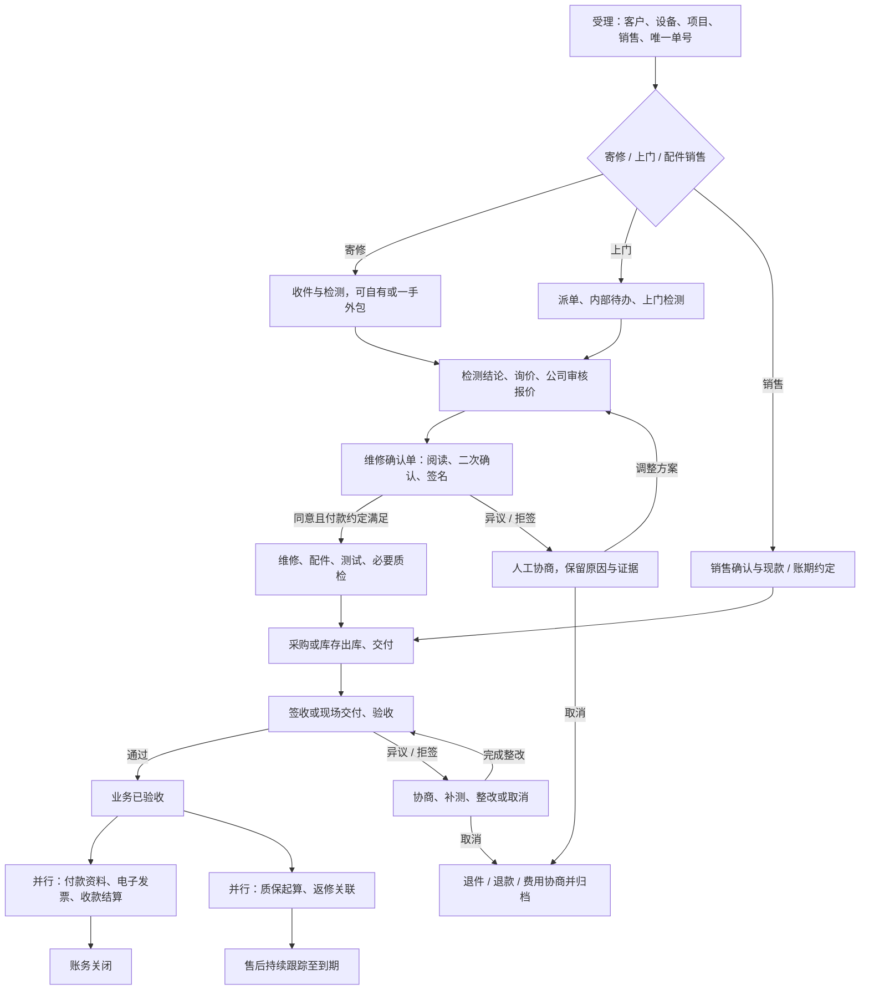

### 3.2、<span id="written-confirmation">检测与询价后的书面维修确认</span> <a href="#前言" style="font-size:17px; color:green;"><b>🔼</b></a> <a href="#🔚" style="font-size:17px; color:green;"><b>🔽</b></a>

确认故障定位、检测结果和询价结束后，公司审核客户报价，形成《维修确认单》。它是客户第二次确认维修事项的书面表达，不能用聊天中的一句“同意报价”替代完整内容。

| 确认内容 | 必须表达的信息 |
| :--- | :--- |
| 主体与对象 | 维修单号、甲方企业／个人、乙方公司、经办人与授权依据、设备及故障 |
| 服务与范围 | 检测结论、维修方案、配件、交付方式、预计工期、范围及排除项 |
| 报价与付款 | 费用明细、含税总价、账期／现款、预付款及抵扣约定；如有独立上门收费须明示并协商 |
| 验收与质保 | 测试／验收标准、适用的验收方式与窗口、默认或自定义质保、起算规则 |
| 风险与沟通 | 已知限制、变更和取消处理、异议渠道、联系人交接办法 |
| 留痕 | 检测及报价版本、资料引用、确认单版本、签署人、时间、签名方式及内容摘要 |

第一阶段流程为“查看完整单据 → 明确同意该版本 → 手写签名 → 提交 → 生成可下载确认单”。PC 使用鼠标，移动端使用手指／触笔；支持清空重签、放大阅读，空白签名不可提交。维修确认与最终验收分别签署，不能复用第一次签名自动完成验收。

签名前可更正草稿；签署后冻结正文、报价和签名关联版本。价格、维修范围、关键配件、质保或付款约定改变时，生成新版本并重新确认，旧版本保留且标注失效／被替代原因；未完成变更确认不得按新范围继续施工。紧急处置需走[人工例外](#negotiation)，不能绕过签署留下空记录。

《验收确认单》在维修测试／质检及交付完成后生成，包含实际维修内容、测试结果、设备／配件清单、完成时间、遗留问题、确认结论、质保起止和最终签署人。存在遗留问题时记录整改或协商条款，不能默认全项合格。

第一阶段手写签名用于业务确认与留痕；普通文件哈希用于校验完整性，不等同第三方认证或可信存证。第二阶段接入腾讯电子签的认证、签署、回调及文件归档；签署平台、合同版本、认证结果和存证资料按实际能力记录，法律效力仍需结合授权、签署过程和适用规则评估，见[官方依据](#official-references)。

### 3.3、<span id="mail-repair-flow">寄修流程（含自有及外包）</span> <a href="#前言" style="font-size:17px; color:green;"><b>🔼</b></a> <a href="#🔚" style="font-size:17px; color:green;"><b>🔽</b></a>

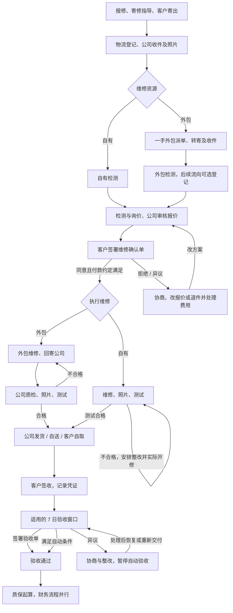

收货照片默认 ≥ 2 张、维修照片 ≥ 3 张、公司质检照片 ≥ 2 张；这是提交时的资料校验。现场无法满足时允许有权限人员登记原因并审批补交，形成未补资料待办；后续删除不回滚已完成的业务，改为标注资料缺失并提醒补充。外包寄修默认公司中转、公司质检后交付客户。

### 3.4、<span id="onsite-flow">上门检测与维修流程</span> <a href="#前言" style="font-size:17px; color:green;"><b>🔼</b></a> <a href="#🔚" style="font-size:17px; color:green;"><b>🔽</b></a>

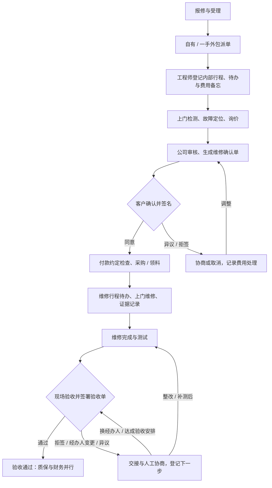

上门维修不适用寄修／销售的 7 日自动验收。经办人离职、怕担责拒签或未回复时，进入交接／协商与催办，不能自动生成客户签名。若协商以其他资料办理业务结案，应登记批准人、依据和结案类型，不把它标成客户已签验收。

### 3.5、<span id="onsite-todo">内部上门行程、时间锁定与基础费用备忘</span> <a href="#前言" style="font-size:17px; color:green;"><b>🔼</b></a> <a href="#🔚" style="font-size:17px; color:green;"><b>🔽</b></a>

上门检测、二次维修及返修的每次行程均可关联同一维修单，工程师必须登记未来行程并生成待办提醒。该模块及基础费用备忘用于企业内部管理，客户页面、客户资料导出及 AI 客服均不得读取内部内容。

| 项目 | 规则 |
| :--- | :--- |
| 行程记录 | 工单、执行人、地址、上门目的、计划时间、提醒、状态、费用处理备忘 |
| 时间输入 | 年、月、日、小时必选；分钟可选；界面和业务导出不显示秒 |
| 日期控件 | 日历选择年月日 |
| 时间控件 | 小时／分钟支持上下拨动；也允许手动输入并做合法性校验 |
| 分钟未填 | 保存“小时精度”，显示如 `2026年10月8日14时`；填分钟则如 `2026年10月8日14时30分`；不能把未填展示为用户选了 `00分` |
| 发生前 | 执行人可以改未来安排、备注和取消；变更保留旧值，重新计算提醒 |
| 发生后 | 执行人不可改事件时间或用删除重建绕过锁定；其他说明可追加，不能覆盖原事件 |
| 管理员纠正 | 可更正已发生的事件时间，必须填写原因并保留改前／改后、操作者和操作时间；不自动改动已签合同或财务金额 |
| 待办提醒 | 第一阶段站内待办及提醒列表；第二阶段接推送，提醒提前量可配置 |
| 基础费用 | 必填处理备忘，如“计入最终报价”“协商减免”“待确认”；可记内部预计／实际费用，不默认生成额外应收 |

**本版实施口径**：以服务端时间判断锁定；实际上门开始一经登记即锁定事件时间，计划时间已到也不允许执行人把旧行程改成未来行程。小时精度按该小时起点参与提醒和锁定，并保留精度字段。未赴约、提前出发或现场延期均通过状态／追加说明处理；必要的历史时间纠正交管理员。

基础费用现实中常包含在最终报价内，内部备忘必须体现处理结果，不能重复计费。对外确需单独收费时，由报价及维修确认单明确约定；如取消维修后是否收费仍有分歧，转人工协商。

### 3.6、<span id="parts-sales-flow">配件销售、采购与库存</span> <a href="#前言" style="font-size:17px; color:green;"><b>🔼</b></a> <a href="#🔚" style="font-size:17px; color:green;"><b>🔽</b></a>

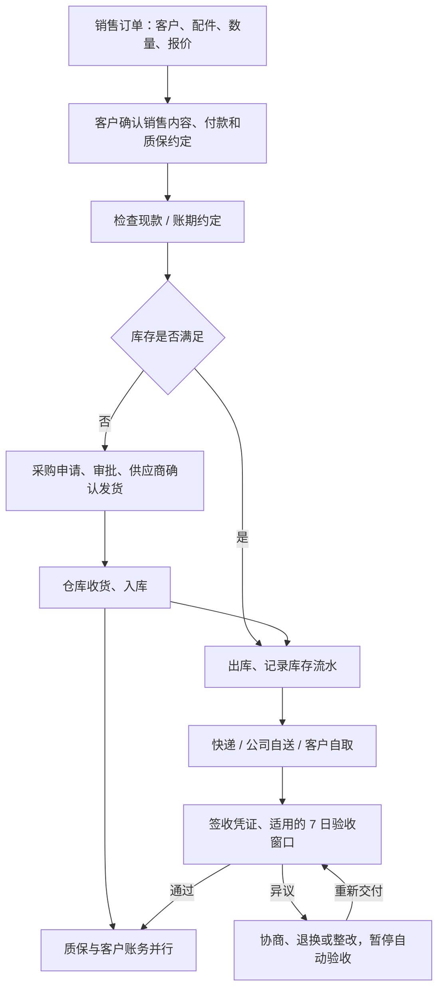

采购保留供应商档案、价格协议、审批、采购明细、分批发货／收货、对账、付款及发票。库存保留入库、出库、盘点、退货、安全库存提醒和旧件管理。第一阶段以人工单据及后台代录走通，自动采购和独立门户交互可后续完善。供应商对账付款与出库并行跟踪，只有存在明确的付款前置约定时才阻塞交付。

### 3.7、<span id="outsource-chain">一手外包责任与后续转包流向</span> <a href="#前言" style="font-size:17px; color:green;"><b>🔼</b></a> <a href="#🔚" style="font-size:17px; color:green;"><b>🔽</b></a>

公司对接、审核、追责与结算只认一手外包机构／个人。即使一手外包再次转包，也不自动新增公司对二手及以后人员的合同、付款或账号授权关系。

从二手外包开始，流向记录是可选的，可登记已知信息或“后续流向未知”，资料不全不能阻塞主维修流程。支持继续添加后续层级；每个节点可记录上游、接收机构／人员、转交／回流时间、目的、设备或配件、物流、证据、登记人及信息来源。未知姓名和时间允许留空并标记待补；不能编造完整链路。

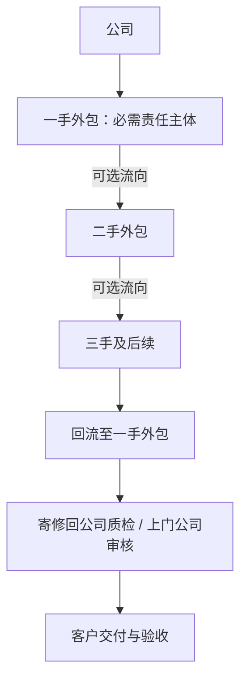

流向和运输段是不同记录：线下交接可以无运单，快递运输则关联一条物流段。客户展示公司审核后的进度和必要证据，内部转包、结算价格和联系人细节按授权隐藏。默认公司中转质检；外包直接发客户是单独例外，必须登记公司批准、质检替代依据及交付责任，不是默认捷径。

一手外包结算支持按单、月结、季结，需公司审核、质检／上门审核结果及约定依据。扣款须记录原因、证据和审批，不凭后续流向自动扣款。

### 3.8、<span id="finance-flow">财务闭环、电子发票与账期</span> <a href="#前言" style="font-size:17px; color:green;"><b>🔼</b></a> <a href="#🔚" style="font-size:17px; color:green;"><b>🔽</b></a>

企业通常不收维修押金／预付款，以客户账期及双方约定为准。验收后准备并发送付款资料；根据客户通知开电子发票，跟踪预计付款日、回款、逾期和催收。个人客户可选是否开票，付款时点由单据约定；不得因用户不需要发票而强制阻塞收款。

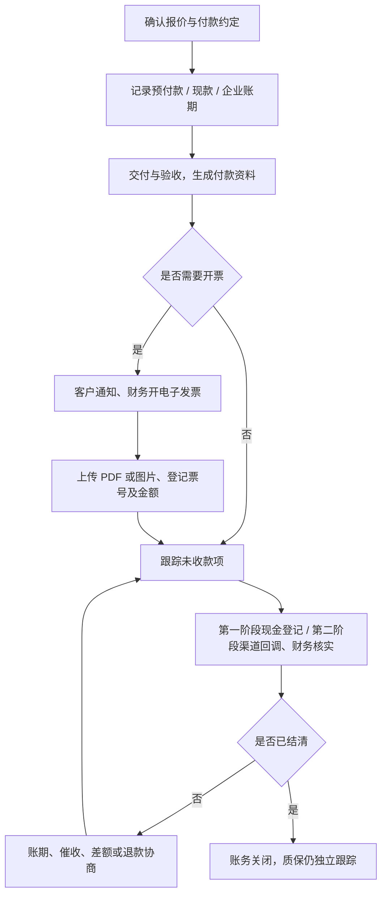

图为常见办理顺序；按约定可先付、部分付、多次付或先款后票。各项财务动作分别确认实际事实，收款汇总不再人工切换；付款不控制质保起算。

电子发票须以 PDF 或图片留存，关联客户、工单、发票号、抬头／税号、金额、开票日、文件类型和上传人。支持多张附件、预览／下载；红冲与重开关联旧票，不能覆盖旧版本。上传电子发票不等于系统已经接入税务开票接口。

第一阶段所有客户收款采用现金，包括企业回款、个人预付款／尾款、收费返修和配件销售款。收款人登记现金已实际收取的事实，财务核实后才进入已收金额；不提供银行转账、微信／支付宝作为首期实际收款方式。第二阶段支付成功以服务端校验的渠道结果与对账为准，前端“支付成功”页面不能直接核销；第一阶段模拟收付款独立展示，不计入真实应收、收入、提成或结算。

#### 3.8.1、<span id="cash-collection">第一阶段现金登记与核销</span> <a href="#前言" style="font-size:17px; color:green;"><b>🔼</b></a> <a href="#🔚" style="font-size:17px; color:green;"><b>🔽</b></a>

| 项目 | 要求 |
| :--- | :--- |
| 收款记录 | 维修／销售单号、客户、款项用途（预付款／尾款／销售款等）、金额、收款人、实际收款时间、现金收据号或确认资料、登记人 |
| 记录状态 | 待财务核实、已核实、已作废；仅已核实真实收款计入实收，并支持部分和多次收款 |
| 客户操作 | 可查看本方收款确认；提交“已交现金”说明不直接增加实收，也不能在线点击出假支付成功 |
| 现金交接 | 收款人与财务记录已交接／未交接、交接人及时间；已收客户款与内部现金交接分开，避免交接再计一次收入 |
| 核对与更正 | 可按收款人、日期、工单核对现金账；重复登记用唯一收款记录识别。更正或作废保留原记录、原因与财务处理人 |
| 现金退款 | 关联原收款，记录退款金额、执行人、时间、客户收讫依据及财务核实，冲减实收；不覆盖原收款 |

现金收据与电子发票分别归档，收据不能替代发票。企业账期依然保留，只是第一阶段到期后的实际收款渠道为现金。预付款仍可选，收款方式为现金并不使个人预付款变成必收。

### 3.9、<span id="advance-payment">个人散客的可选预付款</span> <a href="#前言" style="font-size:17px; color:green;"><b>🔼</b></a> <a href="#🔚" style="font-size:17px; color:green;"><b>🔽</b></a>

个人散客录单时必须出现推荐提醒：“建议与个人客户协商预付款，可选择不收；请记录约定。”选择为“收取／不收取／待协商”，不能默认强制扣款；不收仍可录单和推进，待协商则生成待办。企业客户默认不收，不套用个人提醒；特殊约定可人工登记。

收取时登记金额或比例、截止环节、收款方式、是否到账、尾款抵扣及取消／退款约定，形成客户确认内容。若双方约定“到账后开修”，由已核实收款控制开修；需要例外施工时登记批准人、原因及客户约定。未选择该限制的个人工单不因无预付款被卡住。

预付款是应收中的提前收款，本版不自动赋予“定金”性质。支持部分收款、抵扣和退款记录，禁止重复累计；取消维修由人工核定已发生费用及退款，不默认没收。

### 3.10、<span id="evidence">证据类型、归档与删除</span> <a href="#前言" style="font-size:17px; color:green;"><b>🔼</b></a> <a href="#🔚" style="font-size:17px; color:green;"><b>🔽</b></a>

文字、图片、视频、语音均可关联工单的报修、检测、询价、维修确认、上门、转包、维修、质检、交付、验收、协商或财务环节。文字有版本及作者；媒体有上传账号、业务环节、创建时间、文件类型、大小、摘要及访问范围。本版上传操作账号即发布账号，享有自己的证据删除权；后台代上传另记实际提供人作为资料来源，不把提供人自动当作有删除权限的账号。

资料页支持预览、播放、下载、筛选及资料包导出；签名、电子发票、收付款凭证作为专门业务文件管理并关联同一工单。录音或上传语音不要求第一阶段自动转写；视频／语音失败要可重试，大小和类型限制可配置。未知、未提供和已删除资料各有标记。

#### 3.10.1、<span id="evidence-deletion">谁上传谁删除与证据固定的折衷</span> <a href="#前言" style="font-size:17px; color:green;"><b>🔼</b></a> <a href="#🔚" style="font-size:17px; color:green;"><b>🔽</b></a>

**明确权限**：发布者可以删除自己上传的证据；系统管理员可以删除任意证据；其他参与人不能删除他人的证据。报价、验收或结算已经完成，不取消原发布者的删除权限。

**本版实施口径**：常规删除采用逻辑删除。删除前提示涉及的工单、环节及单据引用；完成后，业务页面、搜索、普通下载、旧文件地址及新导出资料包均不再提供该原件，显示“已删除”占位。审计保留上传／删除账号、时间、原因、环节、摘要及关联关系，客户端无权覆盖或删除审计记录。

已签单据保留原正文、版本及签署事实。引用附件被删时，应标出引用资料已删除，资料包不能再称全套证据完整；删除附件不会自动撤销已经核实的收款、验收或签署结论，相关人员通过纠错／协商处理。新生成单据避免把可删除附件原件嵌入不可移除的正文；涉及既有嵌入件时需同步限制对应文件访问并登记处理结果。

逻辑删除不等于永久隐蔽保存原件。删除后的隔离保留期限、恢复方式、备份清除及物理清除策略需在内测使用真实客户资料前明确，见[评审确认项](#review-items)。物理清除后无法调取原件，只能调取残留审计和业务记录；被删除的资料不能承诺可永久恢复。账号离职／封停撤销的是当前操作权限，不改历史作者。

## 四、<span id="work-order-states">工单主状态、人工确认与协商</span> <a href="#前言" style="font-size:17px; color:green;"><b>🔼</b></a> <a href="#🔚" style="font-size:17px; color:green;"><b>🔽</b></a>

### 4.1、<span id="state-list">状态分类与工单主线</span> <a href="#前言" style="font-size:17px; color:green;"><b>🔼</b></a> <a href="#🔚" style="font-size:17px; color:green;"><b>🔽</b></a>

工单是最主要的业务表。每条工单只有一个当前业务主状态，回答“这张单现在走到哪一阶段”；同时记录当前待办、处理人、期限及阻塞原因，回答“接下来由谁做什么”。完整单据、参与链路和证据以工单 ID 关联，不要求把所有资料塞入一行。

V3.5 的“分维度”保留业务、收款和质保可并存的意思，但不再表现为八套需要员工分别维护的状态机。人员操作具体业务，系统根据经过确认的事实更新主表和相关明细。主状态在 `work_order.business_status` 保存，所有端使用同一字典。

主状态表达本单当前有效确认范围的整体阶段。多设备或分批处理可以记录部分完工、部分发货及部分签收事实，但不能据此把整单标成完工、已完整交付或已验收。确需不同范围独立报价、执行、交付与验收时，由经办人确认拆为关联工单，保留来源关系和资料；款项及成本明确归属，不重复复制计入。单据范围、拆单方式和统计口径在流程评审时确认。

#### 4.1.1、<span id="state-classification">哪些算状态，哪些不算</span> <a href="#前言" style="font-size:17px; color:green;"><b>🔼</b></a> <a href="#🔚" style="font-size:17px; color:green;"><b>🔽</b></a>

| 分类 | 用途 | 本平台示例 | 人工操作方式 |
| :--- | :--- | :--- | :--- |
| 工单主状态 | 可以停留、筛选、交接的业务阶段 | 待客户确认、维修中、待质检、待验收 | 提交有效业务确认，由服务端推进 |
| 阶段内待办／阻塞 | 当前阶段具体在等什么及谁负责 | 待公司收件、待派单、等配件、等约定预付款、等外包回寄、验收异议 | 安排、认领、处理或解决待办，不另改主状态下拉框 |
| 已发生事件 | 记录某件事确实发生过 | 已受理、已收件、已派单、已发货、已交付 | 人确认事实与时间，系统追加时间轴 |
| 业务单据／明细状态 | 描述某一份报价、运输段、付款或审批记录 | 某版报价待审核、某段物流在途、某笔现金待核实 | 在对应业务表单确认一次，工单摘要同步 |
| 只读派生信息 | 从已确认事实计算的结果 | 未收／部分已收／结清／超收、逾期天数、质保中／已过期 | 不提供独立人工改状态按钮 |

“已收件”与“待公司收件”分别是事件和待办；“已发货／在途”属于交付明细。它们仍完整保留在时间轴、工作清单与明细中，只是不再各占一个工单主状态。发票办理和付款资料也不合成一个可人工随意切换的“财务状态”。

#### 4.1.2、<span id="primary-states">建议的 12 个工单主状态</span> <a href="#前言" style="font-size:17px; color:green;"><b>🔼</b></a> <a href="#🔚" style="font-size:17px; color:green;"><b>🔽</b></a>

| 主状态 | 代码 | 阶段含义／常见待办 | 进入阶段的确认依据 | 主要处理角色 |
| :--- | :--- | :--- | :--- | :--- |
| 待受理 | `pending_intake` | 已提交报修／销售需求，等客服接手 | 客户／客服提交有效录单 | 客服／调度 |
| 待安排 | `pending_arrangement` | 等收件、派单、到访或销售资料准备 | 客服确认受理并安排负责人 | 客服／仓库／工程师 |
| 检测报价中 | `diagnosis_quotation` | 检测、询价、提交检测结论、公司审核报价 | 人员确认开始检测；仅寄修／上门 | 工程师／一手外包／报价审核人 |
| 待客户确认 | `pending_customer_confirmation` | 等客户确认当前维修单据／销售内容 | 公司审核通过并发出该版本确认单 | 客户；客服催办 |
| 待执行 | `pending_execution` | 已确认，等配件、备货、约定预付款或排期 | 客户完成有效维修签署／销售确认 | 调度／工程师／仓库，财务核实约定预付款 |
| 维修中 | `repairing` | 正在执行维修及维修记录 | 维修方确认开始维修，开修条件满足 | 自有工程师／一手外包 |
| 待质检 | `pending_quality_check` | 等测试／公司质检，外包可正等待回寄及收件 | 维修方提交完工报告；不代表质量合格 | 工程师／仓库／质检员 |
| 待交付 | `pending_delivery` | 等发货、运输、现场交付或客户自取 | 人工确认测试／质检合格，或销售备货完成且付款约定满足 | 仓库／工程师／交付负责人 |
| 待验收 | `pending_acceptance` | 已有效交付，等客户验收或处理异议 | 有权限人员确认客户签收／现场交接及凭证 | 客户；客服跟踪 |
| 已验收 | `accepted` | 本次服务验收通过，付款、资料及质保可继续处理 | 客户有效签署；仅约定适用时的受控自动验收例外 | 客服／财务负责后续事项 |
| 协商结案 | `closed_by_agreement` | 通过已批准的协商结果停止本次履约，未必验收合格 | 授权人员确认协商结果、客户依据及审批 | 客服／授权批准人；财务跟进余项 |
| 已取消 | `cancelled` | 本次服务取消，可能还需退件、退款或费用协商 | 授权人员确认取消原因与处理安排 | 客服；仓库／财务处理余项 |

“待执行”用于避免客户签了确认单就被系统误写为“已开始维修”，也覆盖销售的备货与约定付款等待。配件销售跳过检测报价、维修和维修质检，经过销售内容确认与备货进入交付；不为它虚构维修记录。

“待质检”独立保留，是因为完工和公司质量确认常由不同人员处理，需能按此阶段交接、筛选。外包回寄／待收件属于该阶段内的具体待办，公司质检合格仍是交付条件。质检不合格或验收前整改，批准处理安排后先回待执行；实际开修才进入维修中。销售退换／补发则重新备货和交付，不能进入维修节点。若自有维修人员同时有测试权限且已实际完成测试，可在一个“提交完工与测试结果”表单内确认两个事实，满足条件后直接进入待交付；未测试或无权限则停在待质检，不能替外包通过公司质检。

已验收、协商结案、已取消只表达履约结果，不等于现金已经收齐，也不等于所有事项已经办完。原单质保、收款、退款、返件和联系待办仍按事实保留。质保返修生成关联子工单，不把原单主状态改回维修中。

#### 4.1.3、<span id="manual-actions">人工确认动作、责任与同步结果</span> <a href="#前言" style="font-size:17px; color:green;"><b>🔼</b></a> <a href="#🔚" style="font-size:17px; color:green;"><b>🔽</b></a>

表中“人工”指承担该事项的人确认实际事实。系统同步字段不需要再点一次，但也不能以上传了文件、过了预计时间或收到了聊天消息代替业务确认。

| 操作入口 | 谁确认 | 需确认的事实 | 系统同步什么／是否推进主状态 |
| :--- | :--- | :--- | :--- |
| 确认受理 | 客服／调度 | 客户、类型、设备／配件、负责人 | 受理事件、待安排、下一待办 |
| 确认收件 | 仓库／有权限收件人 | 实物、数量、照片、实际收件时间 | 收件明细及事件，检测安排待办；不谎报已开始检测 |
| 派单／改派 | 调度 | 执行资源、接手范围和人员 | 派单明细、责任人、接单／上门待办；不另要求维护“已派单”主状态 |
| 确认开始检测 | 工程师／一手外包 | 已接到设备或实际到场、开始处理 | 检测开始事件与检测报价中 |
| 提交检测／询价结果 | 检测人／负责询价人员 | 结论、方案、报价依据及附件 | 报告、询价资料、审核待办；仍在检测报价中 |
| 审核并发送报价 | 公司授权审核人 | 报价、方案、质保、付款与单据版本 | 审核记录、确认单、待客户确认；不表示客户已经同意 |
| 客户维修签署／销售确认 | 客户授权经办人 | 阅读并同意当前版本，维修签署有效 | 签署／确认记录、待执行；预付款检查及备货／开修待办 |
| 确认开始维修 | 维修执行人 | 实际开修、有效确认及适用的付款条件 | 开修事件与维修中；不因排期到点自动开修 |
| 提交维修完工 | 维修执行人 | 完工内容、资料及实际时间 | 完工明细、待质检和测试／回寄待办；合并测试仅限有权且确已完成 |
| 确认测试／质检结论 | 工程师／质检员 | 测试数据及合格／不合格结果 | 质量记录；合格进待交付；不合格确认整改安排后回待执行，实际开修才进入维修中 |
| 确认销售备货 | 仓库／销售责任人 | 配件及数量齐备、出库和付款约定满足 | 出库关联、待交付，跳过维修节点 |
| 确认发货／交付出发 | 仓库／交付人 | 本次运输或自送实已发出、运输段及物件 | 发货事件、物流明细、签收待办；仍为待交付 |
| 确认客户签收／现场交接 | 客户或有权限人员依据凭证确认 | 客户实收、数量齐全、签收依据及时间 | 有效交付事件、待验收及适用窗口；运输“在途”不等于签收 |
| 客户验收签署 | 客户授权验收人 | 测试／交付内容、验收合格结论、有效签名 | 合格验收记录、已验收、质保日期及后续付款资料待办 |
| 登记／核实现金 | 收款人登记，财务核实 | 每笔实收或实退现金、收据及用途 | 现金明细、金额、收款标签和相关待办；不倒改履约阶段 |
| 发送资料／上传电子发票 | 客服／财务 | 本次已发送／已开出的真实资料及附件 | 资料、开票事实与待办；不修改成“已验收”或“已收款” |
| 提交异议／记录协商结果 | 客户反馈；客服及有权限处理人确认结果 | 问题、负责人、下一步和依据 | 阻塞信息及协商记录；有明确结果才恢复、整改、取消或协商结案 |

受理、收件、检测、报价审核、开修、完工、质检、交付、现金核实与协商结果主要由人工确认。主动验收由客户签署确认。签名只是已表达该结论的依据，结论必须为本单有效范围验收合格才进入已验收；不合格、部分通过或保留异议均保留待验收并办理协商，不能因有签名文件自动通过。管理员纠错同样用带原因的动作，不能直接篡改主状态或代签。

#### 4.1.4、<span id="derived-information">哪些信息可以由系统计算</span> <a href="#前言" style="font-size:17px; color:green;"><b>🔼</b></a> <a href="#🔚" style="font-size:17px; color:green;"><b>🔽</b></a>

| 信息 | 计算依据 | 是否需要另一次人工确认 |
| :--- | :--- | :--- |
| 工单主状态同步 | 上表已经提交成功的人工业务动作及有效前置条件 | 不重复确认；业务事实本身需要人确认 |
| 收款标签与余额 | 有效应收约定、财务已核实的现金收款／退款；后期为可信渠道结果 | 每笔款项要核实，汇总不再人工选择“结清” |
| 质保起止与在保／过期 | 经双方确认的时长、有效验收或特殊协商依据、当前日期 | 约定／验收要确认，日期和到期标签自动计算 |
| 逾期、倒计时及提醒 | 已确认的实际时间、约定期限和配置 | 不再逐单勾选“逾期” |
| 物流状态 | 首期人工物流记录；第二期有效渠道轨迹 | 可同步明细，第一阶段客户交付仍须按凭证确认 |
| 7 日自动验收 | 已告知且接受的规则、已确认交付、无异议、未暂停、截止日期 | 有限例外，详见[窗口规则](#acceptance-window)；上门不适用 |

到预计维修时间、上传照片、生成报价草稿、打印确认单、收到快递在途轨迹，都不是自动确认完成业务的理由。付款／质保可以并行显示，不能因此要求员工再维护一套“付款主流程”或“质保主流程”。

#### 4.1.5、<span id="operation-efficiency">效率：确认一次，下一步清楚</span> <a href="#前言" style="font-size:17px; color:green;"><b>🔼</b></a> <a href="#🔚" style="font-size:17px; color:green;"><b>🔽</b></a>

工单列表默认展示单号、客户／项目、主状态、当前待办、当前处理人、截止时间和异常提示；按角色加收款／质保等只读标签。客服有“我负责的单”，执行人员有“待我处理”，财务有“待核实／待催收”。各角色的工作清单来自相应业务待办及办理条件，不以主表当前关键处理人必须是本人为条件。客户清单只显示其授权范围内的维修确认、验收和补充资料等公开事项；内部成本、行程及转包信息仍遵守可见范围。

1、表单先预填工单、客户、设备、最近有效版本和已有附件；输入草稿可保存，草稿不推进阶段。

2、一次“确认收件”或“提交完工”保存本次事实及必要资料，由同一动作同步主表、明细、时间轴和下一步待办；不要求跳转多个页面分别修改。

3、系统只展示当前人员可执行的业务按钮，并说明缺少的条件。没有权限的审核、客户签名或财务核实不能为了少点一次而合并代办。

4、同一人员有权限、事实已经发生时，可合并同一表单中的连续确认，如完工与自有测试、审核报价与发送确认单；现场完工、测试及交接均已实际完成且该人员有相应权限时，也可同表一次提交至待验收，并分别留事件，客户验收签署仍由客户另行完成。不同责任人的真实确认各自保留。

5、一个阶段的异常有负责人、原因和处理期限。客服可以重新指定处理人并留记录，不能仅把单改成“协商中”后无人接手。

6、批量操作适合分配责任人、生成提醒等同类工作；每单仍单独鉴权和校验。首期不提供无依据的一键批量验收、现金结清或客户签署。

首期主表保存当前关键待办；发票、采购、催收、补资料等并行工作由对应业务事实生成工作清单，不再由员工手工维护同一事项的第二份待办状态。详情可展开全部关联工作。完成单项事实不必强制主阶段变化。例如师傅正在维修、财务有一笔现金待核实，两人都能在自己的清单看到相应事项；财务核实不覆盖师傅的开修／完工待办，也不推进维修主阶段。

操作效率验收记录完成业务的确认次数、重复填写字段和跨页面次数；查询效率另测列表／详情接口，不用减少必要的签署、质检或现金核实来换指标。

### 4.2、<span id="state-diagram">工单主状态流转图</span> <a href="#前言" style="font-size:17px; color:green;"><b>🔼</b></a> <a href="#🔚" style="font-size:17px; color:green;"><b>🔽</b></a>

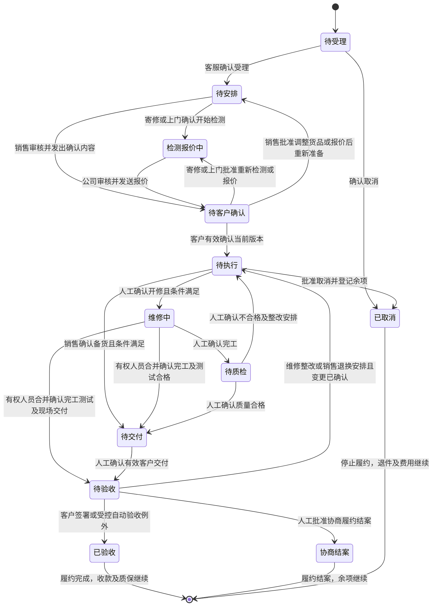

图中只画 12 个主状态，不把“协商中、等配件、外包回寄中、已发货、质保中”画成额外的主状态。任一未结束阶段提出异议时保留原阶段，挂阻塞及协商待办；需重新确认范围时，由处理人明确批准返回对应阶段。任一适用阶段的取消／协商结案均须走有依据的授权动作，图只展示代表入口，不限定只能从图示两处取消。

例：`维修中 + 等配件 + 张师傅处理`、`待质检 + 等一手外包回寄 + 仓库跟踪`、`待交付 + 在途待签收 + 客服跟踪`、`已验收 + 部分已收现金 + 质保中`。这些组合只有一个主状态，其他内容不是需要分别人工切换的工单状态。

### 4.3、<span id="acceptance-window">寄修／销售的 7 日验收窗口</span> <a href="#前言" style="font-size:17px; color:green;"><b>🔼</b></a> <a href="#🔚" style="font-size:17px; color:green;"><b>🔽</b></a>

保留原有寄修和销售的 7 日验收规则，上门不适用。这是多数人工确认节点中的有限自动例外，不能扩展为默认自动验收所有工单。自动验收须在销售确认／维修确认中告知并经客户接受，有可靠交付／签收依据、完整交付且不存在未解决异议。未达条件时只生成逾期待办，由人工处理。

**本版实施口径**：统一使用 `Asia/Shanghai` 自然日。签收当日为第 1 日，截至第 7 日 23:59；第 8 日 00:00 到达自动验收条件。例如 2026-10-06 任意时刻签收，窗口至 2026-10-12 结束，2026-10-13 00:00 起可自动验收。不再同时使用“精确加 7×24 小时”和 `DATEDIFF ≥ 7` 两套算法。对外展示截止年月日时分，内部截止瞬间使用第 8 日 00:00。

第一阶段须由客户或有权限人员根据实际签收／交接凭证确认完整客户交付；发货、快递在途或公司收到外包回件都不能代替这一确认。客户主动验收必须签署验收确认单；异议、待整改、签收时间待核实、分批未交齐均暂停自动验收。物流已签收只是启动窗口的依据，不等于维修验收。协商后由客服登记恢复剩余窗口或重新交付后的新窗口，并记录客户确认依据，不能默默重开。

### 4.4、<span id="auto-acceptance">自动验收任务与停机补跑</span> <a href="#前言" style="font-size:17px; color:green;"><b>🔼</b></a> <a href="#🔚" style="font-size:17px; color:green;"><b>🔽</b></a>

第一阶段由 Go 后台任务执行，可按分钟扫描并在服务启动后补扫到期订单。每次在事务内重新核对验收模式、客户确认的规则版本、交付、截止时间、异议及暂停标记；客户异议和任务并发时以已提交的业务记录为准，截止前已收到的异议必须阻止自动验收。

生成的是“系统自动验收记录”，包含规则版本、签收依据、通知记录、截止瞬间、实际执行时间、业务生效时间及校验摘要，不绘制客户签名、不伪造电子章、不调用尚未接入的认证平台。

任务以工单和验收版本做幂等控制，同一版本只生效一次。停机后补跑需校验停机期间可能收到的异议，由负责人补录线下异议；待核实单先生成待办。确认符合规则后，本版将验收生效时间记为截止瞬间，实际执行时间另记，避免因本机停机而延长／缩短合同质保。历史批量补跑提供预览与审计。

### 4.5、<span id="negotiation">人工协商、拒签与流程例外</span> <a href="#前言" style="font-size:17px; color:green;"><b>🔼</b></a> <a href="#🔚" style="font-size:17px; color:green;"><b>🔽</b></a>

报价拒绝、付款分歧、经办人离职、验收拒签、故障定位变化、缺证据、外包不配合、快递异常、延期和退款均可进入协商。记录触发环节、问题、双方诉求、相关文字／媒体、责任人、下一步、期限、处理结果和客户确认依据；每次联系可追加记录。

可处理为调整报价重新签署、换经办人、补测／返修、退货／退件、部分结算、取消、恢复验收或经批准的其他结案。管理员可以纠正流程，但必须保存原因、证据、批准人与前后状态，不得手动把拒签人标为已经签名。需要例外先施工的，还需记录可执行范围、风险承担、补确认截止和审批；不能批量跳过关键确认。

提出异议时保留原主状态，系统显示阻塞原因、协商处理人和下一步；付款争议发生在已验收之后，也不撤销原验收或质保。协商解决后，处理人选择真实结果及恢复动作，不用重复选择多个状态。每次解决／撤回问题后重新检查其余未结问题与前置条件；只清除已处理事项对应的阻塞，不能把整单 `is_blocked` 或 `acceptance_paused` 一并清空。仍有阻塞的问题继续限制相应动作及自动验收。取消或协商履约结案仍保留未结现金、退款、返件等工作；归档只在余项已有明确处理结果后由责任人确认，且不终止质保记录。未结协商应有提醒及负责人，不能因拖延而强制合格。需要法务判断的争议升级为人工待处理，不由系统或 AI 决定责任。

### 4.6、<span id="customer-notices">通知与催办</span> <a href="#前言" style="font-size:17px; color:green;"><b>🔼</b></a> <a href="#🔚" style="font-size:17px; color:green;"><b>🔽</b></a>

| 节点 | 第一阶段 | 第二阶段 |
| :--- | :--- | :--- |
| 待客户确认、待验收、异议 | 站内消息和客服待办，登记联系结果 | 微信／短信渠道推送与状态记录 |
| 签收当日、第 3 日、第 6 日 | 提示规则和实际截止日期，客户页面展示倒计时 | 同内容推送，失败转人工待办 |
| 自动验收与质保到期前 30 日 | 生成记录和提示；续保问题转客服 | 按可用渠道与授权发送 |
| 上门前、逾期付款、资料待补 | 内部提醒，可配置提前量 | 接入推送，仍保留提醒列表 |

内部上门提醒不推给客户。第一阶段站内记录或“客服准备联系”不能标成短信已送达；第二阶段发送成功也须与实际送达状态区分。重复任务不重复通知，失败可重试并转人工处理。

## 五、<span id="features">各端功能与第三方接入</span> <a href="#前言" style="font-size:17px; color:green;"><b>🔼</b></a> <a href="#🔚" style="font-size:17px; color:green;"><b>🔽</b></a>

### 5.1、<span id="customer-features">客户侧</span> <a href="#前言" style="font-size:17px; color:green;"><b>🔼</b></a> <a href="#🔚" style="font-size:17px; color:green;"><b>🔽</b></a>

P0 为第一阶段闭环必需，P1 为第一阶段的基础登记／查询，可简化交互并由后台代录，P2 为体验优化。本表优先级不替代阶段：付费接口统一第二阶段，AI 对话统一第三阶段。

| 功能 | 优先级 | 第一阶段行为 |
| :--- | :--- | :--- |
| 注册／登录、企业及个人资料审核 | P0 | 账号体系与人工核验，区分资料审核和第三方实名认证；不默认要求每位个人上传完整身份证 |
| 在线报修 | P0 | 寄修／上门／销售，多设备、多故障、文字／图／视频／语音，关联统一单号 |
| 寄修指引与地址 | P0 | 打包、收件人、电话、邮寄地址、可复制；地址由公司维护，不写死未知地址 |
| 工单进度与物流 | P0 | 一条主状态、当前公开进度、多段物流明细与时间轴；具体状态来自对应确认动作 |
| 维修确认及验收签署 | P0 | 阅读版本与单据、二次确认、鼠标／触摸签名、下载，拒签可反馈 |
| 验收窗口与异议 | P0 | 倒计时、签署、上传证据、协商及联系人交接 |
| 预付款、现金收款及账务查询 | P0 | 个人可选提醒，现金由收款人登记、财务核实；客户可查看收款确认与余额 |
| 开票申请与电子发票 | P0 | 可选开票、抬头、通知、已上传 PDF／图片预览下载 |
| 付款资料、设备历史、质保、返修 | P0 | 查看资料及质保起止，关联原工单申请返修 |
| 企业多联系人 | P1 | 负责人维护授权和交接，企业可查询自己的质保 |
| 评价反馈 | P2 | 评价与投诉登记，绩效参考；核心工单不依赖完成评价 |
| 企业知识库／AI 客服 | 第三阶段 | 见[AI 范围](#ai-service) |

### 5.2、<span id="engineer-features">自有工程师与一手外包侧</span> <a href="#前言" style="font-size:17px; color:green;"><b>🔼</b></a> <a href="#🔚" style="font-size:17px; color:green;"><b>🔽</b></a>

| 功能 | 优先级 | 第一阶段行为 |
| :--- | :--- | :--- |
| 接单／派单 | P0 | 查看分配工单、按技能和区域筛选、接单／拒单／改派；抢单可后续补 |
| 检测与维修 | P0 | 检测数据、方案、配件、措施、工时、测试结果、四类证据与提交审核 |
| 内部上门行程 | P0 | 日历／拨轮／输入、提醒、费用备忘及发生后锁定 |
| 维修照片 | P0 | 默认数量校验，特殊原因审批补交，资料缺失可跟踪 |
| 配件申请与采购 | P1 | 申请、审核、领用、采购关联与库存流水 |
| 成本录入与工时 | P0 | 材料、差旅、外修等凭证及工时登记 |
| 外包收件／回寄 | P0 | 收货照片、物流段、包装照片、维修记录、公司质检 |
| 后续转包流向 | P1 | 二手及以后可选、可未知、可补录，责任仍归一手 |
| 外包结算 | P0 | 按单／月／季申请、对账、扣款依据、财务审核，不由外包自核销 |
| 返修与评价查询 | P1 | 原单关联、维修处理与本方评价 |
| 维修资料检索 | P1 | 基础关键词资料查询；AI 客服另属第三阶段 |

### 5.3、<span id="admin-features">管理后台、仓库、质检与财务</span> <a href="#前言" style="font-size:17px; color:green;"><b>🔼</b></a> <a href="#🔚" style="font-size:17px; color:green;"><b>🔽</b></a>

| 模块 | 优先级 | 基础能力 |
| :--- | :--- | :--- |
| 工单／项目／销售 | P0 | 主状态、当前处理人／待办、受理与派单、完整资料；人工业务按钮一次确认同步，批量操作逐单校验 |
| 客户与人员交接 | P0 | 企业／个人、资料审核、信用评级人工调整、账期、多联系人、账号禁用与交接 |
| 检测／报价／确认 | P0 | 公司审核、报价模板与历史版本、两份确认单、重新签署及待办 |
| 上门内部管控 | P0 | 行程、提醒、费用备忘、管理员纠时与审计，禁止客户可见 |
| 外包及流向 | P0 | 一手档案、派单、收寄、公司质检、按单／月／季结、后续可选流向 |
| 供应商、采购、库存 | P1 | 档案、价格、申请审批、采购明细、入出库、旧件、预警、收货对账 |
| 交付及多段物流 | P0 | 快递／自送／自取、签收凭证、异常、人工轨迹、多次回寄 |
| 收货／维修／质检证据 | P0 | 查看、数量校验、补交审批、上传者删除、管理员删除、缺失标记 |
| 财务／账期／电子发票 | P0 | 应收、现金收款与交接核对、部分收款、预付款抵扣、核销、现金退款、催收、付款资料、PDF／图片 |
| 成本与提成 | P0 | 分类录入、审核、多个提成方、结算和基础利润查询 |
| 返修及质保 | P0 | 原单关联、人工判断免费／收费、默认 3 个月与单据自定义、起止及提醒 |
| 报表及资料导出 | P1 | 维修量、故障、绩效、回款、成本、返修、项目、客户类型的基础查询和导出 |
| 系统配置与权限 | P0 | 账号、角色、授权、规则、公司邮寄地址、审计和备份 |
| 高级评级与看板 | P2 | 规则化信用评分、图表和效率优化，先保留基础录入及统计 |

### 5.4、<span id="supplier-features">供应商侧</span> <a href="#前言" style="font-size:17px; color:green;"><b>🔼</b></a> <a href="#🔚" style="font-size:17px; color:green;"><b>🔽</b></a>

第一阶段至少具备采购单、确认发货、物流、分批收货、应付及对账、发票上传的后台入口；独立供应商门户可用角色页面逐步替换代录，历史记录保存供应商身份和录入人。供应商发票同样支持 PDF／图片。供应商只看本方数据，其上传证据执行统一删除权限。

### 5.5、<span id="integrations">第二阶段接入清单与降级</span> <a href="#前言" style="font-size:17px; color:green;"><b>🔼</b></a> <a href="#🔚" style="font-size:17px; color:green;"><b>🔽</b></a>

| 接入项 | 接入要求 | 不可用时 |
| :--- | :--- | :--- |
| 云服务器 | 域名、HTTPS、网络、备份、监控、TiDB 正式方案及附件迁移，供应商另行选定 | 受控内测可保留本机，正式故障转人工并标记服务状态 |
| 聚合支付 | 合法渠道及商户资质、微信／支付宝、签名校验、幂等回调、主动查询、对账退款 | 保留现金登记与人工核实；未知付款不能显示失败后重新扣款 |
| 百度地图 | 授权定位、地址解析及密钥管理；费用和调用范围按实际账号确认 | 人工地址、设备位置和校正 |
| 快递100／快递鸟 | 择一主接入，承运商、订阅／查询、回调校验、异常及多段运输关联 | 人工物流记录，显示查询时间和来源，不伪造实时轨迹 |
| 微信／短信推送 | 消息资格、用户授权、模板、发送及送达结果、失败重试与去重 | 站内待办、人工联系并登记 |
| 腾讯电子签 | 平台接入资质、甲乙主体与签署人认证／授权、两类单据、签署回调、版本、文件及存证资料 | 签署失败转待办；经双方接受可新增手写方式记录，保留失败原因和来源 |

电子发票自动开具和公安实名认证接口不属于本次明确要求的付费清单，按业务资质及后续确认增加；第一阶段人工审核不宣称公安核验成功。腾讯电子签作为本次确定的电子签方向，不再并列 e签宝／法大大作为必选实现。

### 5.6、<span id="ai-service">第三阶段企业知识库与 AI 客服</span> <a href="#前言" style="font-size:17px; color:green;"><b>🔼</b></a> <a href="#🔚" style="font-size:17px; color:green;"><b>🔽</b></a>

| 用户输入／问题 | 处理 | 返回内容 |
| :--- | :--- | :--- |
| 物流单号 | 校验格式，关联授权工单；多个承运商或运输段时提示选择 | 承运商、当前轨迹、时间、异常及人工联系入口 |
| 维修单号 | 通过已登录身份与企业／个人授权查询实时业务 API | 维修流程、参与师傅、检测及故障反馈、核准报价／价格、确认、交付、验收和质保等允许查看的信息 |
| 公司邮寄地址 | 检索已审核的现行公司地址配置 | 收件人、电话、地址、收件时间、打包及邮寄须知，可复制 |
| 常见问题 | 检索已审核的企业知识资料 | 附来源与更新时间的回答，缺依据时转人工 |

订单价格、物流与进度从实时业务接口读取，知识库保存稳定的公司资料和流程解释，不用模型记忆编造动态状态。公司可维护多地址和适用地区／业务／有效期；无法唯一确定时询问或转人工，不随意给旧地址。

工单号和运单号不是访问凭证。匿名用户可查公开的公司寄送须知，查询工单与关联物流须通过身份及授权验证；无授权、查无此单和服务失败使用适当提示，避免泄露他人订单是否存在。内部上门备忘、成本提成、未经审核转包信息及无授权联系人不进入客户答案。

AI 可解释和引导，不能代表客户签署、自动验收、改价、付款、删除证据、决定责任或免除费用。复杂故障、争议、离职交接、退款及无可信来源的答案转人工；记录查询、数据来源、回答和转交结果。模型与检索方案、额度和费用在第三阶段实施前评估，不预先锁定供应商。

## 六、<span id="nonfunctional">非功能需求</span> <a href="#前言" style="font-size:17px; color:green;"><b>🔼</b></a> <a href="#🔚" style="font-size:17px; color:green;"><b>🔽</b></a>

| 类别 | 第一阶段底线 | 第二／三阶段目标 |
| :--- | :--- | :--- |
| 可运行 | Go API、TiDB、文件目录、主要角色页面可启动；重启不丢真实记录 | 云环境与数据迁移后业务连续 |
| 访问边界 | 受控本机／局域网内测，数据库不直接向客户开放，真实资料必须鉴权 | HTTPS、最小授权、密钥服务端保存、监控与正式安全评估 |
| 性能 | 区分人工操作效率与查询效率；列表读工单当前摘要并分页，详情按需加载明细，媒体独立上传 | 1000+ 企业、5000+ 个人、200 并发下核心 API 目标 < 2s，按明确压测条件验收 |
| 可用性 | 本机停机风险可见，任务补跑、每日备份及恢复抽查 | 目标 99.9% 可用、恢复 < 30 分钟，依据云部署方案验证 |
| 数据一致性 | 一次确认的业务明细、主表摘要、事件与待办提交一致；权限、版本、幂等及并发校验；草稿不推进 | 渠道对账、跨服务重试与告警 |
| 证据安全 | 文件类型／大小校验、访问鉴权、删除后旧链接失效、可导出审计 | 云存储、备份生命周期及实际存证材料 |
| 隐私及合规 | 最少必要收集、敏感字段保护、访问审计、授权及告知 | 按适用法律和业务资质完成正式隐私、电子签与数据处理审查 |
| 兼容及交互 | PC、移动浏览器签名；日历、拨轮／输入；已有端侧继续按项目计划 | [**微信小程序**](https://developers.weixin.qq.com/miniprogram/dev/framework/)、[**iOS**](https://www.apple.com/ios/)、[**Android**](https://www.android.com/)、[**Chrome**](https://www.google.com/chrome/)／[**Edge**](https://www.microsoft.com/edge)按交付范围验证 |
| 扩展 | 第三方适配层、数据来源字段、统一工单关联 | AI 只通过权限过滤后的查询接口读取 |

全端遵守服务端优先、本地演示回退：进入／刷新／写操作均正常请求 API，首屏可先显示本地样例；成功后替换为服务端结果，失败／超时／解码失败在独立演示副本操作。默认短超时并可配置。演示签名、发票、物流、财务和证据与真实数据隔离，不能标记为服务端已办理，不自动重放未知付款或签署请求。

每个动态列表有完整空态与重新加载入口；API 成功返回空列表时显示真空态，不以假数据覆盖。iOS 优先复用 JobsEmptyAuto 按钮空态。视觉素材默认打包本地；网络图失败保留本地 Logo。部署说明应明确 API 回退、空态、图片兜底、离线预览以及真实业务数据的备份方式。

## 七、<span id="architecture">技术架构</span> <a href="#前言" style="font-size:17px; color:green;"><b>🔼</b></a> <a href="#🔚" style="font-size:17px; color:green;"><b>🔽</b></a>

### 7.1、<span id="recommended-stack">已确定技术栈</span> <a href="#前言" style="font-size:17px; color:green;"><b>🔼</b></a> <a href="#🔚" style="font-size:17px; color:green;"><b>🔽</b></a>

| 层级 | 选型与约束 |
| :--- | :--- |
| 后端 | [**Go**](https://go.dev/)，复用现有 `Server/`，按业务模块组织；框架与库依据现有实现选，后端语言固定为 Go |
| 数据库 | [**TiDB**](https://docs.pingcap.com/tidb/stable/)，第一阶段沿用本地开发环境，第二阶段设计正式部署和迁移；保留 TiDB 主库，兼容协议只用于连接及适配 |
| 前端 | 保留现有 iOS 原生与 Web 工程；新角色可先用共享页面。是否迁移到其他前端框架不由本次 PRD 强制决定 |
| iOS | <u>[**Swift**](https://www.swift.org/)</u>与现有 Jobs 封装，业务请求统一 JobsNetworking，保持用户／师傅身份边界 |
| 文件 | 第一阶段本地持久化目录、文件元数据与鉴权下载；第二阶段按所选云服务迁移对象存储，不只把临时 URL 写入数据库 |
| 部署 | 复用 [**Docker**](https://www.docker.com/)／[**Kubernetes**](https://kubernetes.io/)双轨配置，本地内测优先使用已验证路线，第二阶段迁移云环境 |
| 后台任务 | Go 任务服务、任务表／锁／幂等、停机补扫及日志；任务随现有 Go 服务运行或独立部署 |
| 支付／地图／物流／签署／消息 | 业务接口与渠道适配层分离，人工登记适配器先运行，真实渠道第二阶段接入 |
| AI 与知识检索 | 第三阶段独立模块，接权限过滤后的业务查询与审核知识源；具体模型及检索技术待评估 |

本地 TiDB 开发／测试环境不作为生产高可用保证。正式容量、节点、备份与运维须依据第二阶段方案落实。Go 与 TiDB 为明确选型，其他表中未确定的云、聚合支付商及模型服务不当作已采购。

### 7.2、<span id="architecture-flow">业务及渠道分层</span> <a href="#前言" style="font-size:17px; color:green;"><b>🔼</b></a> <a href="#🔚" style="font-size:17px; color:green;"><b>🔽</b></a>

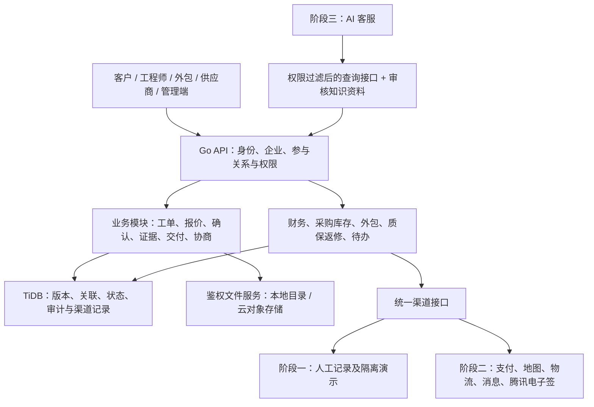

各端提交“确认收件／审核报价／确认开修”等动作，而非任意工单状态值。服务端校验权限、当前主状态、单据版本、前置事实和例外依据，在一次业务提交中写相关明细、工单摘要及事件；失败不留半套有效记录。重复提交按动作业务键处理，并发旧版本须重新加载，后到的旧回调不能覆盖当前主状态。付款、确认、验收、库存和费用使用事务及唯一业务键；渠道回调必须验签并处理重复／乱序。内容摘要、文件摘要和签署摘要区分用途；普通哈希不能命名为区块链存证。审计时间可保存秒或更高精度，用户规定的“无秒”针对上门业务时间控件与展示。

## 八、<span id="database">数据库设计</span> <a href="#前言" style="font-size:17px; color:green;"><b>🔼</b></a> <a href="#🔚" style="font-size:17px; color:green;"><b>🔽</b></a>

**关联阅读**：[基础表结构](#core-tables) · [新增业务表](#extended-tables) · [主状态与信息分类](#state-list) · [现金登记](#cash-collection)

本章为逻辑设计，以 `work_order` 为核心保留原版 26 张基础表的业务内容和 14 张关联／事件表，共 40 张概念表。明细支撑证据与事实，不代表一线人员必须分别操作 40 张表。它不是可直接执行的建表脚本；实施时须对照现有 TiDB 迁移与命名映射，不覆盖现有数据。

金额统一建议使用整数分（`bigint`），比例与工时另用精确小数；不使用二进制浮点表示金额。所有关联必须检查主体与工单归属；`FK` 表达逻辑引用，是否建立数据库外键依据所部署版本和迁移方案确定。结构化业务记录与上传附件分开：删除附件不删除签署、收款、发票或审计事件。

工单对设备、物流、发票、收款、返修和证据为一对多／多对多关系；主表摘要字段不是唯一资料来源。附件使用文件 ID／存储键及鉴权访问，不保存永久公开下载地址。

### 8.1、<span id="table-index">表清单</span> <a href="#前言" style="font-size:17px; color:green;"><b>🔼</b></a> <a href="#🔚" style="font-size:17px; color:green;"><b>🔽</b></a>

| 序号 | 表名 | 中文名称 |
| :--- | :--- | :--- |
| 1 | [`customer`](#db-customer) | 客户表 |
| 2 | [`customer_contact`](#db-customer-contact) | 客户联系人表 |
| 3 | [`device`](#db-device) | 设备表 |
| 4 | [`work_order`](#db-work-order) | 工单表 |
| 5 | [`quotation`](#db-quotation) | 报价表 |
| 6 | [`repair_record`](#db-repair-record) | 维修记录表 |
| 7 | [`part`](#db-part) | 配件信息表 |
| 8 | [`part_inventory`](#db-part-inventory) | 库存流水表 |
| 9 | [`payment`](#db-payment) | 支付表 |
| 10 | [`acceptance`](#db-acceptance) | 验收单表 |
| 11 | [`invoice`](#db-invoice) | 发票表 |
| 12 | [`logistics`](#db-logistics) | 物流表 |
| 13 | [`cost_record`](#db-cost-record) | 成本记录表 |
| 14 | [`work_order_cost_summary`](#db-work-order-cost-summary) | 工单成本汇总表 |
| 15 | [`commission`](#db-commission) | 提成记录表 |
| 16 | [`outsource_provider`](#db-outsource-provider) | 外包商表 |
| 17 | [`outsource_dispatch`](#db-outsource-dispatch) | 外包派单表 |
| 18 | [`outsource_settlement`](#db-outsource-settlement) | 外包结算表 |
| 19 | [`supplier`](#db-supplier) | 供应商表 |
| 20 | [`purchase_order`](#db-purchase-order) | 采购单表 |
| 21 | [`purchase_order_item`](#db-purchase-order-item) | 采购明细表 |
| 22 | [`user`](#db-user) | 用户表 |
| 23 | [`role`](#db-role) | 角色表 |
| 24 | [`permission`](#db-permission) | 权限表 |
| 25 | [`role_permission`](#db-role-permission) | 角色权限关联表 |
| 26 | [`knowledge_base`](#db-knowledge-base) | 知识库表 |
| 27 | [`work_order_device`](#db-work-order-device) | 工单设备关联表 |
| 28 | [`service_agreement`](#db-service-agreement) | 维修／验收书面单据表 |
| 29 | [`signature_record`](#db-signature-record) | 签署事件表 |
| 30 | [`evidence_attachment`](#db-evidence-attachment) | 证据及业务附件表 |
| 31 | [`work_order_event`](#db-work-order-event) | 工单时间轴与审计事件表 |
| 32 | [`onsite_visit`](#db-onsite-visit) | 内部上门行程待办表 |
| 33 | [`outsource_flow_node`](#db-outsource-flow-node) | 后续转包流向表 |
| 34 | [`negotiation_record`](#db-negotiation-record) | 协商与流程例外表 |
| 35 | [`warranty_record`](#db-warranty-record) | 质保约定与历史表 |
| 36 | [`notification_record`](#db-notification-record) | 提醒、消息与任务记录表 |
| 37 | [`company_address`](#db-company-address) | 公司邮寄地址配置表 |
| 38 | [`cash_receipt`](#db-cash-receipt) | 现金收据与内部交接表 |
| 39 | [`knowledge_source`](#db-knowledge-source) | 企业知识来源与审核表 |
| 40 | [`ai_session_audit`](#db-ai-session-audit) | AI 查询与转人工记录表 |

### 8.2、<span id="core-tables">核心表结构</span> <a href="#前言" style="font-size:17px; color:green;"><b>🔼</b></a> <a href="#🔚" style="font-size:17px; color:green;"><b>🔽</b></a>

#### 8.2.1、<span id="db-customer">`customer` 客户表</span> <a href="#前言" style="font-size:17px; color:green;"><b>🔼</b></a> <a href="#🔚" style="font-size:17px; color:green;"><b>🔽</b></a>

| 字段 | 类型 | 说明 | 约束 |
| :--- | :--- | :--- | :--- |
| `id` | `bigint` | 主键 | `PK` |
| `customer_type` | `varchar(10)` | 企业/个人 | `NOT NULL` |
| `company_name` | `varchar(200)` | 企业名称 | 企业必填 |
| `real_name` | `varchar(50)` | 个人姓名 | 个人必填 |
| `id_card_no` | `varchar(100)` | 业务确需时收集，加密保护 | 非首期默认必填 |
| `credit_code` | `varchar(50)` | 统一社会信用代码 | 企业必填, `UNIQUE` |
| `address` | `varchar(300)` | 地址 | |
| `contact_name` | `varchar(50)` | 联系人 | |
| `contact_phone` | `varchar(20)` | 联系电话 | `NOT NULL` |
| `contact_email` | `varchar(100)` | 邮箱 | |
| `credit_rating` | `varchar(10)` | 信用评级 | `DEFAULT 'B'` |
| `is_credit_customer` | `boolean` | 是否账期客户 | `DEFAULT false` |
| `credit_days` | `int` | 账期天数 | `DEFAULT 0` |
| `bank_name` | `varchar(100)` | 开户行 | |
| `bank_account` | `varchar(50)` | 银行账号 | |
| `tax_no` | `varchar(50)` | 税号 | |
| `invoice_title` | `varchar(200)` | 发票抬头 | |
| `auth_status` | `varchar(20)` | 认证状态 | `DEFAULT '未认证'` |
| `status` | `varchar(20)` | 正常/冻结 | `DEFAULT '正常'` |
| `created_at` | `datetime` | 创建时间 | |
| `updated_at` | `datetime` | 更新时间 | |

#### 8.2.2、<span id="db-customer-contact">`customer_contact` 客户联系人表</span> <a href="#前言" style="font-size:17px; color:green;"><b>🔼</b></a> <a href="#🔚" style="font-size:17px; color:green;"><b>🔽</b></a>

| 字段 | 类型 | 说明 | 约束 |
| :--- | :--- | :--- | :--- |
| `id` | `bigint` | 主键 | `PK` |
| `customer_id` | `bigint` | 客户ID | `FK` |
| `name` | `varchar(50)` | 姓名 | |
| `phone` | `varchar(20)` | 电话 | |
| `email` | `varchar(100)` | 邮箱 | |
| `position` | `varchar(50)` | 职位 | |
| `is_primary` | `boolean` | 是否主要联系人 | `DEFAULT false` |
| `status` | `varchar(20)` | 在任／已离职／停用 | 仅控制当前权限 |
| `authorization_files` | `json` | 授权材料及核实记录引用 | 历史确认另存快照 |
| `replaced_by` | `bigint` | 新经办人及交接关联 | 变更不覆盖历史签署人 |

#### 8.2.3、<span id="db-device">`device` 设备表</span> <a href="#前言" style="font-size:17px; color:green;"><b>🔼</b></a> <a href="#🔚" style="font-size:17px; color:green;"><b>🔽</b></a>

| 字段 | 类型 | 说明 | 约束 |
| :--- | :--- | :--- | :--- |
| `id` | `bigint` | 主键 | `PK` |
| `customer_id` | `bigint` | 所属客户 | `FK` |
| `device_name` | `varchar(100)` | 设备名称 | `NOT NULL` |
| `device_type` | `varchar(50)` | 设备类型 | |
| `brand` | `varchar(50)` | 品牌 | |
| `model` | `varchar(100)` | 型号 | |
| `serial_no` | `varchar(100)` | 序列号 | 已知时按客户与设备校验，不强制所有设备有编号 |
| `location` | `varchar(200)` | 安装位置 | |
| `purchase_date` | `date` | 购买日期 | |
| `warranty_end` | `date` | 设备当前质保摘要，具体约定见工单质保记录 | 不覆盖各次维修历史 |
| `status` | `varchar(20)` | 在用/停用/报废 | `DEFAULT '在用'` |
| `remark` | `varchar(500)` | 备注 | |
| `created_at` | `datetime` | 创建时间 | |
| `updated_at` | `datetime` | 更新时间 | |

#### 8.2.4、<span id="db-work-order">`work_order` 工单表</span> <a href="#前言" style="font-size:17px; color:green;"><b>🔼</b></a> <a href="#🔚" style="font-size:17px; color:green;"><b>🔽</b></a>

**关联阅读**：[主状态字典](#primary-states) · [人工动作](#manual-actions) · [主表与明细职责](#work-order-read-model) · [验收规则](#acceptance-window) · [质保管理](#warranty)

主表承载工单身份、当前阶段、责任安排和列表所需摘要；每张工单只有一个 `business_status`。人员提交业务动作，服务端校验后写入阶段，不提供普通用户任意修改主状态的接口。当前负责人和下一步任务用于交接，不能替代客户签署、实物收件或财务核实。

下表为需求层面的字段建议，不是可直接执行的建表或迁移脚本。“只读摘要”由明细或事件同步，不能与明细分别人工填写；纯日期计算的标签优先在查询时计算。

| 字段 | 类型 | 说明 | 写入依据／约束 |
| :--- | :--- | :--- | :--- |
| `id / order_no` | `bigint / varchar(50)` | 主键、唯一工单号 | 录单生成，编号唯一 |
| `project_name / customer_id` | `varchar(200) / bigint` | 项目、客户 | 人工录单、核实与有权限更正 |
| `customer_type / customer_company_name` | `varchar(10) / varchar(200)` | 客户类型及名称摘要 | 来源于客户资料；单据另保留签署快照 |
| `device_id / service_type` | `bigint / varchar(20)` | 主设备、寄修／上门／销售 | 多设备见关联表；销售无设备不强制造设备 |
| `fault_desc` | `text` | 客户报修摘要 | 检测结论另记，不能覆盖客户原始诉求 |
| `owner_user_id` | `bigint` | 持续跟踪这张单的公司经办负责人 | 受理／改派确认；不因阶段切换丢失总负责人 |
| `current_handler_id / current_handler_role` | `bigint / varchar(30)` | 当前关键待办的处理人或处理角色 | 依据派单、签署人、审核安排同步；未认领队列由总负责人兜底 |
| `engineer_id / outsource_id / salesperson_id` | `bigint` | 当前自有师傅、一手外包、销售人员引用 | 分配事实；历史参与人另保留，不被改派抹除 |
| `business_status` | `varchar(30)` | [12 个主状态](#primary-states)中的唯一当前值 | 有效业务动作推进；不存在第二个同义可写状态列 |
| `stage_entered_at` | `datetime` | 当前阶段进入时间 | 服务端成功推进时同步，实际发生时间见事件 |
| `next_action_code / next_action_due_at` | `varchar(50) / datetime` | 当前关键待办及期限 | 阶段条件和处理安排生成，完成业务即同步下一项 |
| `next_action_ref_id / next_action_ref_type` | `bigint / varchar(30)` | 关键待办对应的明细／事件 | 以实际业务记录为依据，不另造一份手工完成状态 |
| `is_blocked / block_reason` | `boolean / text` | 是否存在阻塞及主要原因摘要 | 来源于未结异议、缺件或已约定的前置条件；其余问题在详情展开 |
| `version` | `bigint` | 当前工单并发版本 | 成功业务修改递增；旧页面提交先核对版本 |
| `current_quotation_id / current_agreement_id` | `bigint` | 当前报价版本、维修／销售确认单 | 审核、发版、确认动作同步；旧版仍可查 |
| `current_acceptance_id` | `bigint` | 当前有效验收结果记录 | 来源于真实签署或受控自动验收，不由客服补选“已验收” |
| `current_logistics_id / delivery_method` | `bigint / varchar(20)` | 当前主要运输摘要引用、物流／自送／自取 | 明细可有多段及分批，主引用不代表已完整交付 |
| `order_accepted_at` | `datetime` | 公司受理时间摘要 | 已确认受理事件 |
| `shipped_at` | `datetime` | 对客户发货时间摘要 | 已确认发货事件，不表示签收 |
| `received_at / customer_delivery_event_id` | `datetime / bigint` | 已核实完整客户交付的时间及依据 | 人工确认客户实收，不能混用公司／外包收件时间 |
| `acceptance_deadline / acceptance_rule_version` | `datetime / varchar(30)` | 验收窗口截止瞬间及已确认规则 | 上海时区签收日为第 1 日，第 8 日 00:00；不适用时为空 |
| `acceptance_paused` | `boolean` | 自动验收是否被异议／待核实暂停 | 未结协商等事实生成，不能随意清除绕过异议 |
| `acceptance_type / accepted_at / auto_accepted_at` | `varchar(20) / datetime / datetime` | 验收来源、生效时间、自动任务实际执行时间 | 验收记录只读摘要；不伪造客户签名 |
| `payment_type / credit_days / expected_payment_date` | `varchar(20) / int / date` | 现款／账期、约定天数及付款日 | 经确认付款约定；付款渠道首期均为现金 |
| `prepayment_decision / prepayment_required_amount` | `varchar(20) / bigint` | 收取／不收取／待协商及约定预付款（分） | 个人录单推荐，企业默认不收；最终以确认约定为准 |
| `start_requires_prepayment` | `boolean` | 是否约定先收到预付款再开修 | 默认 false；满足只解除限制，不自动开始维修 |
| `quoted_amount / payable_amount` | `bigint` | 当前确认报价、有效应收总额（分） | 有效报价及批准的调价／减免；退款不擅自改应收 |
| `received_amount / refunded_amount` | `bigint` | 财务已核实的客户现金收款／退款累计（分） | `payment` 明细汇总，内部交接不再累计 |
| `net_received_amount / outstanding_amount / surplus_amount` | `bigint` | 净实收、应收余额、超收额（分） | 净实收＝实收－实退；余额＝max(应收－净实收, 0)，超收＝max(净实收－应收, 0) |
| `payment_status` | `varchar(20)` | 未收／部分已收／结清／超收／无需收款标签 | 依据有效应收及核实款项只读生成；有登记未核实款项另提示 |
| `payment_docs_sent_at / payment_docs_event_id` | `datetime / bigint` | 最近有效付款资料发送时间与依据 | 人工确认发送事实；历史发送记录可查 |
| `need_invoice / invoice_title_type` | `boolean / varchar(10)` | 客户开票要求、企业／个人抬头类型 | 客户需求，由有权限人员核实 |
| `invoice_requested_at / current_invoice_id` | `datetime / bigint` | 通知开票时间、最近有效发票引用 | 请求事实与发票明细；红冲及多张发票仍见明细 |
| `invoiced_amount` | `bigint` | 有效发票金额摘要（分） | 有效开票及红冲明细汇总，不能据此推断已收款 |
| `total_cost / gross_profit / profit_rate` | `bigint / bigint / decimal(5,2)` | 已审核成本、经营毛利、毛利率摘要 | 成本和收入约定计算；财务权限可见 |
| `current_warranty_id / warranty_months` | `bigint / int` | 当前质保约定引用、确认月数 | 默认 3，可自定义；确认后变更另留版本 |
| `warranty_start / warranty_end` | `date` | 本单有效质保起止摘要 | 有效约定及验收生效／双方确认的特殊协商起算依据计算，不等收齐现金 |
| `parent_work_order_id` | `bigint` | 拆单来源工单 | 经办人确认拆单时建立；不同于返修原单引用，金额及范围不得双计 |
| `is_rework / original_work_order_id / rework_type / rework_reason` | `boolean / bigint / varchar(20) / text` | 返修标记、原单及原因 | 人工核实后创建关联子单；原单不回退 |
| `archived_at / archived_by` | `datetime / bigint` | 整理归档时间与人员 | 履约结束且余项已处理的人工归档事实；质保和后续查询继续 |
| `record_source / created_at / updated_at` | `varchar(20) / datetime / datetime` | 真实／隔离演示来源及创建更新时间 | 真实和演示数据隔离，服务端维护时间 |

不再设置独立人工维护的 `acceptance_status`、`finance_status` 或 `payment_received`。验收以有效验收记录和主阶段表达；财务按款项、资料及发票分别表达；“质保中／已过期”和逾期天数按起止日、余额及当前日期计算，不保存每天要人去改的 `warranty_status`、`overdue_days`。

照片、语音、视频、完整物流、每次外包发出／回寄、质检结果和参与历史在关联明细与事件中保存，主表按需要保留引用。已有库中的同义字段应在差距清单中逐项映射再迁移；本版不删除现库字段、不改既有业务数据。

#### 8.2.5、<span id="db-quotation">`quotation` 报价表</span> <a href="#前言" style="font-size:17px; color:green;"><b>🔼</b></a> <a href="#🔚" style="font-size:17px; color:green;"><b>🔽</b></a>

| 字段 | 类型 | 说明 | 约束 |
| :--- | :--- | :--- | :--- |
| `id` | `bigint` | 主键 | `PK` |
| `work_order_id` | `bigint` | 工单ID | `FK` |
| `quotation_no` | `varchar(50)` | 报价单号 | `UNIQUE` |
| `version` | `int` | 版本号 | `DEFAULT 1` |
| `fault_analysis` | `varchar(500)` | 故障分析 | |
| `repair_plan` | `varchar(500)` | 维修方案 | |
| `labor_cost` | `bigint` | 人工费（单位：分） | |
| `material_cost` | `bigint` | 材料费（单位：分） | |
| `other_cost` | `bigint` | 其他费用（单位：分） | |
| `total_amount` | `bigint` | 总金额（不含税）（单位：分） | |
| `tax_rate` | `decimal(5,2)` | 税率(%) | |
| `total_with_tax` | `bigint` | 含税总金额（单位：分） | |
| `status` | `varchar(20)` | 草稿／待审核／待确认／已确认／已拒绝／已替代 | 绑定确认单版本 |
| `confirmed_at` | `datetime` | 客户确认时间 | |
| `rejected_reason` | `varchar(500)` | 拒绝原因 | |
| `created_by` | `bigint` | 创建人 | `FK` |
| `created_at` | `datetime` | 创建时间 | |
| `updated_at` | `datetime` | 更新时间 | |
| `warranty_months` | `int` | 该报价约定质保月数 | 默认 3，确认后冻结 |
| `items` | `json` | 多设备／多故障及费用明细 | 含税口径、范围清楚 |
| `approved_by` / `approved_at` | `bigint` / `datetime` | 公司审核人及时间 | 未审核不得发起签署 |

#### 8.2.6、<span id="db-repair-record">`repair_record` 维修及测试／质检记录表</span> <a href="#前言" style="font-size:17px; color:green;"><b>🔼</b></a> <a href="#🔚" style="font-size:17px; color:green;"><b>🔽</b></a>

| 字段 | 类型 | 说明 | 约束 |
| :--- | :--- | :--- | :--- |
| `id` | `bigint` | 主键 | `PK` |
| `work_order_id` | `bigint` | 工单ID | `FK` |
| `engineer_id` | `bigint` | 工程师ID | `FK` |
| `engineer_type` | `varchar(10)` | 自有/外包 | |
| `repair_desc` | `varchar(1000)` | 维修内容 | |
| `parts_replaced` | `varchar(500)` | 更换配件清单 | |
| `test_data` | `varchar(500)` | 测试数据 | |
| `test_result` | `varchar(20)` | 本次测试／质检合格或不合格 | 不依据照片数量推断结论 |
| `record_type / performed_by / confirmed_by / confirmed_at` | `varchar(20) / bigint / bigint / datetime` | 维修进度／自有测试／公司质检、执行及确认人与时间 | 公司质检仅公司有权人员确认；外包不能代确认 |
| `device_scope / evidence_ids / outsource_dispatch_id` | `json / json / bigint` | 本次涉及设备、证据与适用外包派单 | 可记录多次检验及失败；关联当前交付范围 |
| `work_hours` | `decimal(5,2)` | 工时 | |
| `start_time` | `datetime` | 开始时间 | |
| `end_time` | `datetime` | 结束时间 | |
| `created_at` | `datetime` | 创建时间 | |

#### 8.2.7、<span id="db-part">`part` 配件信息表</span> <a href="#前言" style="font-size:17px; color:green;"><b>🔼</b></a> <a href="#🔚" style="font-size:17px; color:green;"><b>🔽</b></a>

| 字段 | 类型 | 说明 | 约束 |
| :--- | :--- | :--- | :--- |
| `id` | `bigint` | 主键 | `PK` |
| `part_name` | `varchar(100)` | 配件名称 | `NOT NULL` |
| `part_code` | `varchar(50)` | 配件编码 | `UNIQUE` |
| `brand` | `varchar(50)` | 品牌 | |
| `model` | `varchar(100)` | 型号 | |
| `specification` | `varchar(200)` | 规格 | |
| `unit` | `varchar(20)` | 单位 | |
| `purchase_price` | `bigint` | 参考进价（单位：分） | |
| `sale_price` | `bigint` | 参考售价（单位：分） | |
| `safety_stock` | `int` | 安全库存 | `DEFAULT 0` |
| `current_stock` | `int` | 当前库存 | `DEFAULT 0` |
| `location` | `varchar(100)` | 库位 | |
| `supplier_id` | `bigint` | 默认供应商 | `FK` |
| `remark` | `varchar(500)` | 备注 | |
| `created_at` | `datetime` | 创建时间 | |
| `updated_at` | `datetime` | 更新时间 | |

#### 8.2.8、<span id="db-part-inventory">`part_inventory` 库存流水表</span> <a href="#前言" style="font-size:17px; color:green;"><b>🔼</b></a> <a href="#🔚" style="font-size:17px; color:green;"><b>🔽</b></a>

| 字段 | 类型 | 说明 | 约束 |
| :--- | :--- | :--- | :--- |
| `id` | `bigint` | 主键 | `PK` |
| `part_id` | `bigint` | 配件ID | `FK` |
| `change_type` | `varchar(20)` | 入库/出库/盘点/退货 | |
| `change_qty` | `int` | 变动数量 | |
| `before_qty` | `int` | 变动前库存 | |
| `after_qty` | `int` | 变动后库存 | |
| `related_order` | `varchar(50)` | 关联单号 | |
| `operator_id` | `bigint` | 操作人 | `FK` |
| `remark` | `varchar(500)` | 备注 | |
| `created_at` | `datetime` | 创建时间 | |

#### 8.2.9、<span id="db-payment">`payment` 支付表</span> <a href="#前言" style="font-size:17px; color:green;"><b>🔼</b></a> <a href="#🔚" style="font-size:17px; color:green;"><b>🔽</b></a>

| 字段 | 类型 | 说明 | 约束 |
| :--- | :--- | :--- | :--- |
| `id` | `bigint` | 主键 | `PK` |
| `work_order_id` | `bigint` | 工单ID | `FK` |
| `payment_no` | `varchar(50)` | 支付单号 | `UNIQUE` |
| `amount` | `bigint` | 金额（单位：分） | |
| `payment_method` | `varchar(20)` | 第一阶段仅现金；第二阶段增加已接入渠道 | 首期 `cash` |
| `payment_voucher` | `json` | 现金收据／确认资料等附件 ID | 鉴权访问 |
| `status` | `varchar(20)` | 待收／待退／待核实／已核实／已作废；退款另建记录 | 财务核实动作更新，分别汇总实收或实退 |
| `paid_at` | `datetime` | 实际现金收付时间；第二阶段为渠道实际收款／退款时间 | 随收款或退款用途解释，与录入时间区分 |
| `confirmed_by` | `bigint` | 确认人 | `FK` |
| `confirmed_at` | `datetime` | 确认时间 | |
| `remark` | `varchar(500)` | 备注 | |
| `created_at` | `datetime` | 创建时间 | |
| `payment_kind` | `varchar(20)` | 预付款／尾款／销售款／退款 | 退款关联原收款 |
| `original_payment_id` | `bigint` | 退款／更正引用原记录 | 不删除原账务事实 |
| `collector_id` / `recorded_by` | `bigint` | 实际现金收款人或退款执行人／登记人 | 首期现金必记，按款项用途解释 |
| `source` | `varchar(20)` | 人工现金／渠道／模拟 | 首期真实只用人工现金 |
| `idempotency_key` | `varchar(100)` | 收款／退款唯一业务标识 | 防止重复计入 |
| `channel_trade_no` | `varchar(100)` | 第二阶段渠道流水 | 未接渠道不生成假流水 |

#### 8.2.10、<span id="db-acceptance">`acceptance` 验收单表</span> <a href="#前言" style="font-size:17px; color:green;"><b>🔼</b></a> <a href="#🔚" style="font-size:17px; color:green;"><b>🔽</b></a>

| 字段 | 类型 | 说明 | 约束 |
| :--- | :--- | :--- | :--- |
| `id` | `bigint` | 主键 | `PK` |
| `work_order_id` | `bigint` | 工单ID | `FK` |
| `acceptance_no` | `varchar(50)` | 验收单号 | `UNIQUE` |
| `acceptance_data` | `json` | 验收范围、测试及交付数据 | 对应当前确认版本 |
| `result` | `varchar(20)` | 合格／不合格／部分通过／有异议 | 仅有效范围合格且满足签署／规则条件才形成已验收；签名存在不代表合格 |
| `sign_status` | `varchar(20)` | 待签署／已签署／系统记录无客户签名 | 自动验收不记已签署 |
| `acceptance_type` | `varchar(20)` | 手动确认/自动验收 | |
| `signer_name` | `varchar(50)` | 签署人 | |
| `signer_phone` | `varchar(20)` | 签署人电话 | |
| `sign_time` | `datetime` | 签署时间 | |
| `sign_hash` | `varchar(128)` | 本地文件／内容摘要 | 不等于区块链或第三方存证 |
| `sign_platform` | `varchar(50)` | 签署平台 | |
| `file_id` | `bigint` | 已生成验收单文件 | 鉴权读取 |
| `created_at` | `datetime` | 创建时间 | |
| `agreement_id` / `signature_record_id` | `bigint` | 验收单据版本及真实签署事件 | 系统自动记录无客户签署 ID |
| `effective_at` / `executed_at` | `datetime` | 验收生效与执行时刻 | 停机补跑须区分 |
| `rule_version` / `receipt_evidence_ids` | `varchar(30)` / `json` | 自动规则与签收依据 | 条件不齐转人工 |
| `evidence_completeness` | `varchar(20)` | 完整／缺失／待补 | 附件删除后标记 |

#### 8.2.11、<span id="db-invoice">`invoice` 发票表</span> <a href="#前言" style="font-size:17px; color:green;"><b>🔼</b></a> <a href="#🔚" style="font-size:17px; color:green;"><b>🔽</b></a>

| 字段 | 类型 | 说明 | 约束 |
| :--- | :--- | :--- | :--- |
| `id` | `bigint` | 主键 | `PK` |
| `work_order_id` | `bigint` | 工单ID | `FK` |
| `invoice_no` | `varchar(50)` | 本张电子发票号 | 结合开票主体校验重复 |
| `invoice_type` | `varchar(20)` | 专票/普票 | |
| `invoice_title_type` | `varchar(10)` | 企业/个人 | |
| `amount` | `bigint` | 金额（不含税）（单位：分） | |
| `tax_amount` | `bigint` | 税额（单位：分） | |
| `invoice_date` | `date` | 开票日期 | |
| `file_ids` | `json` | 电子发票 PDF／图片附件 ID | 保留原票和红冲重开关系 |
| `status` | `varchar(20)` | 已开票/已红冲 | |
| `created_at` | `datetime` | 创建时间 | |
| `original_invoice_id` | `bigint` | 红冲／重开关联原票 | 历史版本保留 |
| `uploaded_by` | `bigint` | 发票上传人 | 统一附件删除规则 |
| `invoice_title_snapshot` / `tax_no_snapshot` | `varchar(200)` / `varchar(50)` | 开票时抬头与税号快照 | 不随客户档案修改 |
| `issuer_snapshot` / `customer_snapshot` | `json` | 开票方、客户主体及必要票面信息 | 与当时票面一致 |

#### 8.2.12、<span id="db-logistics">`logistics` 物流表</span> <a href="#前言" style="font-size:17px; color:green;"><b>🔼</b></a> <a href="#🔚" style="font-size:17px; color:green;"><b>🔽</b></a>

**关联阅读**：[寄修流程](#mail-repair-flow) · [外包流程](#outsource-chain)

| 字段 | 类型 | 说明 | 约束 |
| :--- | :--- | :--- | :--- |
| `id` | `bigint` | 主键 | `PK` |
| `work_order_id` | `bigint` | 工单ID | `FK` |
| `logistics_no` | `varchar(50)` | 本运输段运单号 | 多段分别记录，自送／自取可空 |
| `company` | `varchar(50)` | 快递公司 | |
| `direction` | `varchar(30)` | 客户寄入／公司转寄／外包回寄／公司寄出／后续流向运输 | 直发客户须批准与替代质检依据 |
| `sender` | `varchar(100)` | 寄件人 | |
| `receiver` | `varchar(100)` | 收件人 | |
| `send_time` | `datetime` | 发出时间 | |
| `receive_time` | `datetime` | 签收时间 | |
| `status` | `varchar(20)` | 在途/已签收/异常 | |
| `remark` | `varchar(500)` | 备注 | |
| `related_party_type` | `varchar(20)` | 客户/外包商/供应商 | |
| `related_party_id` | `bigint` | 关联方ID | |
| `created_at` | `datetime` | 创建时间 | |
| `segment_no` / `flow_node_id` | `int` / `bigint` | 运输段次序与可选转包流向 | 一单多段 |
| `status_source` / `queried_at` | `varchar(20)` / `datetime` | 人工／接口及更新时间 | 来源真实 |
| `receipt_evidence_ids` | `json` | 签收凭证附件 | 自送／自取也可登记 |
| `approval_record_id` | `bigint` | 外包直发客户例外审批 | 非默认流程 |

#### 8.2.13、<span id="db-cost-record">`cost_record` 成本记录表</span> <a href="#前言" style="font-size:17px; color:green;"><b>🔼</b></a> <a href="#🔚" style="font-size:17px; color:green;"><b>🔽</b></a>

| 字段 | 类型 | 说明 | 约束 |
| :--- | :--- | :--- | :--- |
| `id` | `bigint` | 主键 | `PK` |
| `work_order_id` | `bigint` | 关联工单 | `FK` |
| `cost_type` | `varchar(20)` | 外修/材料/物流/差旅/提成/其它 | `NOT NULL` |
| `amount` | `bigint` | 金额（单位：分） | `NOT NULL` |
| `cost_date` | `date` | 发生日期 | |
| `payer` | `varchar(50)` | 付款人 | |
| `payee` | `varchar(100)` | 收款方 | |
| `voucher_file_ids` | `json` | 成本凭证附件 ID | 鉴权读取，记录删除引用 |
| `remark` | `varchar(500)` | 备注 | |
| `created_by` | `bigint` | 录入人 | `FK` |
| `created_at` | `datetime` | 创建时间 | |
| `review_status` / `reviewed_by` / `reviewed_at` | `varchar(20)` / `bigint` / `datetime` | 草稿／待审核／已通过／已驳回，审核人和时间 | 只有已通过计入审核成本 |
| `review_reason` / `related_business_id` | `text` / `bigint` | 审核／调整依据及采购、外包、提成等关联 | 防止同一支出重复入成本 |

#### 8.2.14、<span id="db-work-order-cost-summary">`work_order_cost_summary` 工单成本汇总表</span> <a href="#前言" style="font-size:17px; color:green;"><b>🔼</b></a> <a href="#🔚" style="font-size:17px; color:green;"><b>🔽</b></a>

| 字段 | 类型 | 说明 | 约束 |
| :--- | :--- | :--- | :--- |
| `work_order_id` | `bigint` | 工单ID | `PK`, `FK` |
| `total_revenue` | `bigint` | 最终有效约定收入（单位：分） | 不等于实收净额，另查收款明细 |
| `total_cost` | `bigint` | 总成本（单位：分） | |
| `commission_amount` | `bigint` | 提成总金额（单位：分） | |
| `gross_profit` | `bigint` | 毛利（单位：分） | |
| `profit_rate` | `decimal(5,2)` | 毛利率(%) | |
| `cost_breakdown` | `json` | 各类型成本明细 | |
| `updated_at` | `datetime` | 更新时间 | |

#### 8.2.15、<span id="db-commission">`commission` 提成记录表</span> <a href="#前言" style="font-size:17px; color:green;"><b>🔼</b></a> <a href="#🔚" style="font-size:17px; color:green;"><b>🔽</b></a>

| 字段 | 类型 | 说明 | 约束 |
| :--- | :--- | :--- | :--- |
| `id` | `bigint` | 主键 | `PK` |
| `work_order_id` | `bigint` | 关联工单 | `FK` |
| `commission_type` | `varchar(20)` | 渠道方/项目方 | `NOT NULL` |
| `party_name` | `varchar(100)` | 提成方名称 | `NOT NULL` |
| `contact` | `varchar(50)` | 联系人 | |
| `phone` | `varchar(20)` | 电话 | |
| `base_amount` | `bigint` | 计算基数（单位：分） | |
| `rate` | `decimal(5,2)` | 提成比例(%) | |
| `amount` | `bigint` | 提成金额（单位：分） | `NOT NULL` |
| `status` | `varchar(20)` | 待结算/已结算/已付款 | `DEFAULT '待结算'` |
| `settle_date` | `date` | 结算日期 | |
| `paid_date` | `date` | 付款日期 | |
| `invoice_file_ids` | `json` | 发票／收据附件 ID | 鉴权读取，记录删除引用 |
| `remark` | `varchar(500)` | 备注 | |
| `created_by` | `bigint` | 录入人 | `FK` |
| `created_at` | `datetime` | 创建时间 | |
| `updated_at` | `datetime` | 更新时间 | |
| `review_status` / `reviewed_by` / `reviewed_at` | `varchar(20)` / `bigint` / `datetime` | 提成审核状态、人和时间 | 未审核通过不得结算付款或计入审核成本 |
| `review_reason` | `text` | 计算基数、比例和调整依据 | 结算状态与审核状态分开 |

#### 8.2.16、<span id="db-outsource-provider">`outsource_provider` 外包商表</span> <a href="#前言" style="font-size:17px; color:green;"><b>🔼</b></a> <a href="#🔚" style="font-size:17px; color:green;"><b>🔽</b></a>

| 字段 | 类型 | 说明 | 约束 |
| :--- | :--- | :--- | :--- |
| `id` | `bigint` | 主键 | `PK` |
| `type` | `varchar(10)` | 个人/公司 | `NOT NULL` |
| `name` | `varchar(100)` | 姓名/公司名 | `NOT NULL` |
| `contact` | `varchar(50)` | 联系人 | |
| `phone` | `varchar(20)` | 电话 | |
| `id_card` | `varchar(100)` | 必要时的身份证资料，保护存储 | 最小权限，不公开 |
| `business_license` | `varchar(100)` | 营业执照 | |
| `skills` | `varchar(200)` | 技能标签 | |
| `service_area` | `varchar(200)` | 服务区域 | |
| `settlement_type` | `varchar(20)` | 按单/月结/季结 | |
| `bank_account` | `varchar(50)` | 收款账户 | |
| `rating` | `decimal(3,2)` | 评分 | `DEFAULT 5.00` |
| `status` | `varchar(20)` | 正常/暂停/淘汰 | `DEFAULT '正常'` |
| `created_at` | `datetime` | 创建时间 | |
| `updated_at` | `datetime` | 更新时间 | |

#### 8.2.17、<span id="db-outsource-dispatch">`outsource_dispatch` 外包派单表</span> <a href="#前言" style="font-size:17px; color:green;"><b>🔼</b></a> <a href="#🔚" style="font-size:17px; color:green;"><b>🔽</b></a>

| 字段 | 类型 | 说明 | 约束 |
| :--- | :--- | :--- | :--- |
| `id` | `bigint` | 主键 | `PK` |
| `work_order_id` | `bigint` | 关联工单 | `FK` |
| `provider_id` | `bigint` | 外包商ID | `FK` |
| `dispatch_time` | `datetime` | 派单时间 | |
| `accept_time` | `datetime` | 接单时间 | |
| `finish_time` | `datetime` | 完成时间 | |
| `status` | `varchar(30)` | 该外包派单明细的接单、转寄、检测、维修、回寄及公司质检进度 | 由对应人工动作同步，不额外要求手改第二套工单状态；历史可查 |
| `dispatch_remark` | `varchar(500)` | 派单备注 | |
| `created_at` | `datetime` | 创建时间 | |

#### 8.2.18、<span id="db-outsource-settlement">`outsource_settlement` 外包结算表</span> <a href="#前言" style="font-size:17px; color:green;"><b>🔼</b></a> <a href="#🔚" style="font-size:17px; color:green;"><b>🔽</b></a>

**关联阅读**：[外包流程](#outsource-chain) · [管理后台结算规则](#admin-features)

| 字段 | 类型 | 说明 | 约束 |
| :--- | :--- | :--- | :--- |
| `id` | `bigint` | 主键 | `PK` |
| `provider_id` | `bigint` | 外包商ID | `FK` |
| `work_order_id` | `bigint` | 关联工单 | `FK` |
| `amount` | `bigint` | 结算汇总摘要（单位：分） | 以 final_amount 为有效应付，避免双计 |
| `settlement_type` | `varchar(20)` | 按单／月结／季结 | 与一手外包约定一致 |
| `status` | `varchar(20)` | 待结算/已结算/已付款 | |
| `settle_date` | `date` | 结算日期 | |
| `paid_date` | `date` | 付款日期 | |
| `invoice_file_ids` | `json` | 发票／收据附件 ID | 鉴权读取，记录删除引用 |
| `remark` | `varchar(500)` | 备注 | |
| `outsource_type` | `varchar(20)` | 上门外包/寄修外包 | |
| `qc_pass` | `boolean` | 质检是否合格 | |
| `rework_count` | `int` | 返修次数 | |
| `deduction_amount` | `bigint` | 扣款金额（单位：分） | |
| `final_amount` | `bigint` | 最终结算金额（单位：分） | |
| `created_at` | `datetime` | 创建时间 | |
| `base_amount` | `bigint` | 已确认基础应付（分） | 与 final_amount 区分 |
| `deduction_details` | `json` | 质检／返修扣款及证据、批准人 | 同一事项不重复扣 |
| `adjustment_amount` | `bigint` | 已批准调整（分） | 有原因与依据 |

#### 8.2.19、<span id="db-supplier">`supplier` 供应商表</span> <a href="#前言" style="font-size:17px; color:green;"><b>🔼</b></a> <a href="#🔚" style="font-size:17px; color:green;"><b>🔽</b></a>

| 字段 | 类型 | 说明 | 约束 |
| :--- | :--- | :--- | :--- |
| `id` | `bigint` | 主键 | `PK` |
| `name` | `varchar(100)` | 供应商名称 | `NOT NULL` |
| `contact` | `varchar(50)` | 联系人 | |
| `phone` | `varchar(20)` | 电话 | |
| `address` | `varchar(200)` | 地址 | |
| `category` | `varchar(100)` | 供应品类 | |
| `credit_days` | `int` | 账期天数 | `DEFAULT 0` |
| `bank_name` | `varchar(100)` | 开户行 | |
| `bank_account` | `varchar(50)` | 银行账号 | |
| `tax_no` | `varchar(50)` | 税号 | |
| `rating` | `decimal(3,2)` | 评分 | `DEFAULT 5.00` |
| `status` | `varchar(20)` | 正常/暂停 | `DEFAULT '正常'` |
| `created_at` | `datetime` | 创建时间 | |
| `updated_at` | `datetime` | 更新时间 | |

#### 8.2.20、<span id="db-purchase-order">`purchase_order` 采购单表</span> <a href="#前言" style="font-size:17px; color:green;"><b>🔼</b></a> <a href="#🔚" style="font-size:17px; color:green;"><b>🔽</b></a>

| 字段 | 类型 | 说明 | 约束 |
| :--- | :--- | :--- | :--- |
| `id` | `bigint` | 主键 | `PK` |
| `order_no` | `varchar(50)` | 采购单号 | `UNIQUE` |
| `supplier_id` | `bigint` | 供应商ID | `FK` |
| `work_order_id` | `bigint` | 关联工单 | `FK` |
| `total_amount` | `bigint` | 总金额（单位：分） | |
| `status` | `varchar(20)` | 待发货/已发货/已收货/已对账/已付款 | |
| `expected_date` | `date` | 预计到货日 | |
| `created_by` | `bigint` | 创建人 | `FK` |
| `created_at` | `datetime` | 创建时间 | |
| `updated_at` | `datetime` | 更新时间 | |

#### 8.2.21、<span id="db-purchase-order-item">`purchase_order_item` 采购明细表</span> <a href="#前言" style="font-size:17px; color:green;"><b>🔼</b></a> <a href="#🔚" style="font-size:17px; color:green;"><b>🔽</b></a>

| 字段 | 类型 | 说明 | 约束 |
| :--- | :--- | :--- | :--- |
| `id` | `bigint` | 主键 | `PK` |
| `purchase_order_id` | `bigint` | 采购单ID | `FK` |
| `part_id` | `bigint` | 配件ID | `FK` |
| `part_name` | `varchar(100)` | 配件名称 | |
| `quantity` | `int` | 数量 | |
| `unit_price` | `bigint` | 单价（单位：分） | |
| `total_price` | `bigint` | 小计（单位：分） | |
| `received_qty` | `int` | 已收货数量 | `DEFAULT 0` |

#### 8.2.22、<span id="db-user">`user` 用户表</span> <a href="#前言" style="font-size:17px; color:green;"><b>🔼</b></a> <a href="#🔚" style="font-size:17px; color:green;"><b>🔽</b></a>

| 字段 | 类型 | 说明 | 约束 |
| :--- | :--- | :--- | :--- |
| `id` | `bigint` | 主键 | `PK` |
| `username` | `varchar(50)` | 用户名 | `UNIQUE` |
| `password_hash` | `varchar(255)` | 密码安全哈希 | 不保存明文密码 |
| `real_name` | `varchar(50)` | 真实姓名 | |
| `phone` | `varchar(20)` | 电话 | |
| `email` | `varchar(100)` | 邮箱 | |
| `role_id` | `bigint` | 角色ID | `FK` |
| `customer_id` | `bigint` | 关联客户 | `FK` |
| `provider_id` | `bigint` | 关联外包商 | `FK` |
| `supplier_id` | `bigint` | 关联供应商 | `FK` |
| `status` | `varchar(20)` | 正常/禁用 | `DEFAULT '正常'` |
| `last_login` | `datetime` | 最后登录时间 | |
| `created_at` | `datetime` | 创建时间 | |
| `updated_at` | `datetime` | 更新时间 | |

#### 8.2.23、<span id="db-role">`role` 角色表</span> <a href="#前言" style="font-size:17px; color:green;"><b>🔼</b></a> <a href="#🔚" style="font-size:17px; color:green;"><b>🔽</b></a>

| 字段 | 类型 | 说明 | 约束 |
| :--- | :--- | :--- | :--- |
| `id` | `bigint` | 主键 | `PK` |
| `role_name` | `varchar(50)` | 角色名称 | `UNIQUE` |
| `description` | `varchar(200)` | 描述 | |
| `created_at` | `datetime` | 创建时间 | |

#### 8.2.24、<span id="db-permission">`permission` 权限表</span> <a href="#前言" style="font-size:17px; color:green;"><b>🔼</b></a> <a href="#🔚" style="font-size:17px; color:green;"><b>🔽</b></a>

| 字段 | 类型 | 说明 | 约束 |
| :--- | :--- | :--- | :--- |
| `id` | `bigint` | 主键 | `PK` |
| `perm_name` | `varchar(50)` | 权限名称 | `UNIQUE` |
| `perm_code` | `varchar(50)` | 权限编码 | `UNIQUE` |
| `module` | `varchar(50)` | 所属模块 | |
| `description` | `varchar(200)` | 描述 | |

#### 8.2.25、<span id="db-role-permission">`role_permission` 角色权限关联表</span> <a href="#前言" style="font-size:17px; color:green;"><b>🔼</b></a> <a href="#🔚" style="font-size:17px; color:green;"><b>🔽</b></a>

| 字段 | 类型 | 说明 | 约束 |
| :--- | :--- | :--- | :--- |
| `id` | `bigint` | 主键 | `PK` |
| `role_id` | `bigint` | 角色ID | `FK` |
| `permission_id` | `bigint` | 权限ID | `FK` |

#### 8.2.26、<span id="db-knowledge-base">`knowledge_base` 知识库表</span> <a href="#前言" style="font-size:17px; color:green;"><b>🔼</b></a> <a href="#🔚" style="font-size:17px; color:green;"><b>🔽</b></a>

| 字段 | 类型 | 说明 | 约束 |
| :--- | :--- | :--- | :--- |
| `id` | `bigint` | 主键 | `PK` |
| `title` | `varchar(200)` | 标题 | |
| `device_type` | `varchar(50)` | 设备类型 | |
| `fault_code` | `varchar(50)` | 故障代码 | |
| `content` | `text` | 内容 | |
| `attachments` | `json` | 审核知识附件 ID | 与客户工单私有附件权限分开 |
| `created_by` | `bigint` | 创建人 | `FK` |
| `created_at` | `datetime` | 创建时间 | |
| `updated_at` | `datetime` | 更新时间 | |
| `visibility` / `review_status` | `varchar(20)` | 内部／公开／授权及审核状态 | 只有已审核可用于客服 |
| `source_id` / `valid_until` | `bigint` / `datetime` | 知识来源及有效期 | 第三阶段使用 |


### 8.3、<span id="extended-tables">新增业务表与关键字段</span> <a href="#前言" style="font-size:17px; color:green;"><b>🔼</b></a> <a href="#🔚" style="font-size:17px; color:green;"><b>🔽</b></a>

#### 8.3.1、<span id="db-work-order-device">`work_order_device` 工单设备关联表</span> <a href="#前言" style="font-size:17px; color:green;"><b>🔼</b></a> <a href="#🔚" style="font-size:17px; color:green;"><b>🔽</b></a>

**实施阶段**：第一阶段。

| 字段 | 类型 | 说明 | 约束 |
| :--- | :--- | :--- | :--- |
| `id / work_order_id / device_id` | `bigint` | 关系 ID、工单、设备 | 工单与设备组合唯一 |
| `fault_desc / item_scope` | `text / json` | 该设备的故障、维修／销售内容及报价关联 | 支持一单多设备、多故障 |

#### 8.3.2、<span id="db-service-agreement">`service_agreement` 维修／验收书面单据表</span> <a href="#前言" style="font-size:17px; color:green;"><b>🔼</b></a> <a href="#🔚" style="font-size:17px; color:green;"><b>🔽</b></a>

**实施阶段**：第一阶段。

| 字段 | 类型 | 说明 | 约束 |
| :--- | :--- | :--- | :--- |
| `id / work_order_id / quotation_id` | `bigint` | 单据、工单、报价版本关联 | 报价引用对应版本 |
| `document_type / version / status` | `varchar(20) / int / varchar(20)` | 维修确认／验收确认／销售确认；草稿、待签、已签、已替代等 | (work_order_id, document_type, version) 联合唯一 |
| `party_snapshot / contact_snapshot` | `json` | 甲乙主体、经办人、岗位、授权依据与联系方式快照 | 历史快照不随通讯录修改 |
| `content / content_hash / file_id` | `json / varchar(128) / bigint` | 服务范围、价格、付款、验收、质保、风险与文件摘要 | 已签正文冻结 |
| `superseded_by / change_reason` | `bigint / text` | 被替代版本及更改依据 | 保留旧单据和关系 |

#### 8.3.3、<span id="db-signature-record">`signature_record` 签署事件表</span> <a href="#前言" style="font-size:17px; color:green;"><b>🔼</b></a> <a href="#🔚" style="font-size:17px; color:green;"><b>🔽</b></a>

**实施阶段**：第一／二阶段。

| 字段 | 类型 | 说明 | 约束 |
| :--- | :--- | :--- | :--- |
| `id / agreement_id / signer_id` | `bigint` | 事件、单据版本、签署账号 | 幂等键绑定单据版本、签署人和签署角色 |
| `signer_snapshot / authorized_party` | `json` | 签署人、企业、角色及授权核实 | 管理员不得冒充客户 |
| `method / signed_at` | `varchar(30) / datetime` | 鼠标／触摸手写或腾讯电子签及时间 | 维修确认与验收分别记录 |
| `signature_file_id / content_hash` | `bigint / varchar(128)` | 签名文件和确认正文摘要 | 绑定签署时单据 |
| `platform_flow_id / certification_result / evidence_files` | `varchar(100) / json / json` | 第二阶段实际认证、合同流程及存证文件 | 第一阶段不伪造平台结果 |

#### 8.3.4、<span id="db-evidence-attachment">`evidence_attachment` 证据及业务附件表</span> <a href="#前言" style="font-size:17px; color:green;"><b>🔼</b></a> <a href="#🔚" style="font-size:17px; color:green;"><b>🔽</b></a>

**实施阶段**：第一阶段。

| 字段 | 类型 | 说明 | 约束 |
| :--- | :--- | :--- | :--- |
| `id / work_order_id / stage` | `bigint / bigint / varchar(30)` | 文件或文字、工单和业务环节 | 统一关联 |
| `media_type / text_content / storage_key` | `varchar(20) / text / varchar(500)` | 文字／图片／视频／语音／单据、内容、存储键 | 不暴露永久公网地址 |
| `publisher_id / provided_by / created_at` | `bigint / json / datetime` | 发布账号、实际提供人、时间 | 谁上传谁删除 |
| `visibility / mime_type / size_bytes / content_hash` | `varchar(20) / varchar(100) / bigint / varchar(128)` | 可见范围、类型、大小、摘要 | 读取／导出统一鉴权 |
| `deleted_at / deleted_by / delete_reason` | `datetime / bigint / text` | 删除时间、操作者及原因 | 作者或管理员；删除后链接失效 |
| `retention_until / purged_at / referenced_by` | `datetime / datetime / json` | 隔离留存、物理清除及单据引用 | 生命周期待确认，已删不称资料完整 |

#### 8.3.5、<span id="db-work-order-event">`work_order_event` 工单时间轴与审计事件表</span> <a href="#前言" style="font-size:17px; color:green;"><b>🔼</b></a> <a href="#🔚" style="font-size:17px; color:green;"><b>🔽</b></a>

**实施阶段**：第一阶段。

| 字段 | 类型 | 说明 | 约束 |
| :--- | :--- | :--- | :--- |
| `id / work_order_id / event_type` | `bigint / bigint / varchar(50)` | 时间轴、业务、删除、更正、交接与审批类型 | 系统审计事件不可由发布者覆盖 |
| `actor_id / happened_at / recorded_at` | `bigint / datetime / datetime` | 确认操作者、实际发生与记录时间 | 操作时间由服务端记录；允许有依据补录实际时间，不伪造确认时间 |
| `action_code / source_type / request_key` | `varchar(50) / varchar(20) / varchar(100)` | 业务动作、人工／规则任务／渠道来源、去重请求键 | 同一有效动作重复提交不得重复推进或核销 |
| `source_order_version / resulting_order_version` | `bigint` | 操作前后工单版本 | 用于并发冲突、修正及乱序结果追溯 |
| `before_data / after_data / reason / related_ids` | `json / json / text / json` | 前后状态、依据和资料关联 | 按角色过滤查询 |

#### 8.3.6、<span id="db-onsite-visit">`onsite_visit` 内部上门行程待办表</span> <a href="#前言" style="font-size:17px; color:green;"><b>🔼</b></a> <a href="#🔚" style="font-size:17px; color:green;"><b>🔽</b></a>

**实施阶段**：第一阶段。

| 字段 | 类型 | 说明 | 约束 |
| :--- | :--- | :--- | :--- |
| `id / work_order_id / assignee_id` | `bigint` | 行程、工单、执行人 | 仅内部可见 |
| `purpose / address / planned_at / time_precision` | `text / text / datetime / varchar(10)` | 目的、位置、年月日时、可选分；hour 或 minute | 不把未填分钟显示为准确 00分 |
| `actual_started_at / locked_at / status` | `datetime / datetime / varchar(20)` | 实际开始、锁定、待办／已发生／未赴约／取消 | 发生后执行人不能改时或删除绕过 |
| `remind_at / fee_memo / estimated_fee` | `datetime / text / bigint` | 提醒、必填费用处理备忘、内部预估费用（分） | 备忘不自动变应收或成本 |
| `correction_reason / corrected_by / event_id` | `text / bigint / bigint` | 管理员纠时理由及审计 | 保留改前改后，管理员之外无权改历史时间 |

#### 8.3.7、<span id="db-outsource-flow-node">`outsource_flow_node` 后续转包流向表</span> <a href="#前言" style="font-size:17px; color:green;"><b>🔼</b></a> <a href="#🔚" style="font-size:17px; color:green;"><b>🔽</b></a>

**实施阶段**：第一阶段。

| 字段 | 类型 | 说明 | 约束 |
| :--- | :--- | :--- | :--- |
| `id / work_order_id / first_provider_id / parent_id` | `bigint` | 节点、工单、一手责任方、上游节点 | 一手必需，二手及以后可不建 |
| `level / receiving_party / known_status` | `int / json / varchar(20)` | 层级、接收机构／人员、已知／未知／待补 | 后续字段可空，不强制账号 |
| `transferred_at / returned_at / purpose / device_ids` | `datetime / datetime / text / json` | 转交、回流、用途、设备 | 未知时间不编造 |
| `logistics_id / evidence_ids / source / recorded_by` | `bigint / json / varchar(30) / bigint` | 运输、证据、信息来源、登记人 | 不自动生成公司对下游的应付 |

#### 8.3.8、<span id="db-negotiation-record">`negotiation_record` 协商与流程例外表</span> <a href="#前言" style="font-size:17px; color:green;"><b>🔼</b></a> <a href="#🔚" style="font-size:17px; color:green;"><b>🔽</b></a>

**实施阶段**：第一阶段。

| 字段 | 类型 | 说明 | 约束 |
| :--- | :--- | :--- | :--- |
| `id / work_order_id / trigger_stage / original_state` | `bigint / bigint / varchar(30) / varchar(30)` | 触发环节及当时工单主状态 | 异议不默认替换主阶段，可有多个未结问题 |
| `issue / claims / evidence_ids / responsible_id` | `text / json / json / bigint` | 问题、诉求、证据、负责人 | 支持连续追加记录 |
| `next_action / deadline / result / customer_basis` | `text / datetime / text / json` | 下一步、期限、结果、客户确认依据 | 未解决生成待办 |
| `status / blocking / resolved_at` | `varchar(20) / boolean / datetime` | 问题待处理／处理中／已解决／撤回，是否阻塞及解决时间 | 问题明细状态，由处理动作确认；不等于工单主状态 |
| `approval_by / approval_reason / resume_to` | `bigint / text / varchar(30)` | 例外批准与拟恢复主阶段 | 服务端校验当前状态和前提，不伪造客户签署 |

#### 8.3.9、<span id="db-warranty-record">`warranty_record` 质保约定与历史表</span> <a href="#前言" style="font-size:17px; color:green;"><b>🔼</b></a> <a href="#🔚" style="font-size:17px; color:green;"><b>🔽</b></a>

**实施阶段**：第一阶段。

| 字段 | 类型 | 说明 | 约束 |
| :--- | :--- | :--- | :--- |
| `id / work_order_id / agreement_id / version` | `bigint / bigint / bigint / int` | 质保、工单、确认版本 | 变更另建，不回写旧约定 |
| `months / start_date / end_date` | `int / date / date` | 默认 3、自定义月数及起止 | 约定确认后，由有效验收生效日或双方确认的特殊协商日期起算，与付款无关 |
| `status`（查询展示） | `varchar(20)` | 未起算／质保中／已过期／已被新约定替代 | 从有效版本和日期计算，不人工每日切换；优先不落库 |
| `reason / approved_by / superseded_by` | `text / bigint / bigint` | 谈判、自定义、返修延保或续保依据 | 新的时长经双方确认 |
| `start_basis_type / start_basis_id` | `varchar(20) / bigint` | 验收／特殊协商起算及依据引用 | 特殊协商不制造合格验收或客户签名；明确范围与双方确认 |

#### 8.3.10、<span id="db-notification-record">`notification_record` 提醒、消息与任务记录表</span> <a href="#前言" style="font-size:17px; color:green;"><b>🔼</b></a> <a href="#🔚" style="font-size:17px; color:green;"><b>🔽</b></a>

**实施阶段**：第一／二阶段。

| 字段 | 类型 | 说明 | 约束 |
| :--- | :--- | :--- | :--- |
| `id / work_order_id / recipient_id / visit_id` | `bigint` | 提醒、工单、接收人、内部行程可选关联 | 客户不接内部行程提醒 |
| `channel / scheduled_at / source / status` | `varchar(20) / datetime / varchar(20) / varchar(20)` | 站内／人工联系／微信／短信，排期和真实来源 | 首期不虚报短信送达 |
| `dedupe_key / delivered_at / failure_reason / attempts` | `varchar(100) / datetime / text / int` | 去重、送达、失败及重试 | 停机补跑和人工待办可追踪 |

通知发送／送达状态只描述联系渠道，不等于业务待办已经完成。收件、验收、现金核实等待办以对应的真实业务确认作为完成依据，不能用“消息已读／已送达”推进工单。

#### 8.3.11、<span id="db-company-address">`company_address` 公司邮寄地址配置表</span> <a href="#前言" style="font-size:17px; color:green;"><b>🔼</b></a> <a href="#🔚" style="font-size:17px; color:green;"><b>🔽</b></a>

**实施阶段**：第一阶段维护，第三阶段查询。

| 字段 | 类型 | 说明 | 约束 |
| :--- | :--- | :--- | :--- |
| `id / name / receiver / phone / address` | `bigint / varchar(100) / varchar(100) / varchar(30) / text` | 地址名称、收件人、电话和详细地址 | 真实配置，不填虚构地址 |
| `applicable_scope / receiving_hours / packing_guide` | `json / text / text` | 地区／业务、收件时间、打包须知 | 支持多地址 |
| `valid_from / valid_until / status / reviewed_by` | `datetime / datetime / varchar(20) / bigint` | 有效期、启停、审核人 | 客服与 AI 只返回有效审核版本 |

#### 8.3.12、<span id="db-cash-receipt">`cash_receipt` 现金收据与内部交接表</span> <a href="#前言" style="font-size:17px; color:green;"><b>🔼</b></a> <a href="#🔚" style="font-size:17px; color:green;"><b>🔽</b></a>

**实施阶段**：第一阶段。

| 字段 | 类型 | 说明 | 约束 |
| :--- | :--- | :--- | :--- |
| `id / payment_id / receipt_no` | `bigint / bigint / varchar(100)` | 现金收据、收款／退款明细、收据编号 | 对 payment 一对一扩展，金额不再累计一次 |
| `collector_id / customer_ack_files / handover_status` | `bigint / json / varchar(20)` | 收款人、客户收讫／交款依据、内部交接状态 | 客户确认与财务核实分开 |
| `handed_to / handed_at / handover_evidence` | `bigint / datetime / json` | 交接人、时间、交接资料 | 内部交接不新增客户实收 |
| `verified_by / verified_at / correction_event_id` | `bigint / datetime / bigint` | 财务核实、时间及更正审计 | 原记录留存，现金收据非发票 |

#### 8.3.13、<span id="db-knowledge-source">`knowledge_source` 企业知识来源与审核表</span> <a href="#前言" style="font-size:17px; color:green;"><b>🔼</b></a> <a href="#🔚" style="font-size:17px; color:green;"><b>🔽</b></a>

**实施阶段**：第三阶段。

| 字段 | 类型 | 说明 | 约束 |
| :--- | :--- | :--- | :--- |
| `id / source_type / source_ref / version` | `bigint / varchar(30) / varchar(500) / int` | 审核文档／FAQ／公司配置等来源 | 动态工单走实时 API |
| `visibility / reviewed_by / reviewed_at / valid_until` | `varchar(20) / bigint / datetime / datetime` | 授权范围、审核人、时间、有效期 | 已删私有附件不继续进入检索 |

#### 8.3.14、<span id="db-ai-session-audit">`ai_session_audit` AI 查询与转人工记录表</span> <a href="#前言" style="font-size:17px; color:green;"><b>🔼</b></a> <a href="#🔚" style="font-size:17px; color:green;"><b>🔽</b></a>

**实施阶段**：第三阶段。

| 字段 | 类型 | 说明 | 约束 |
| :--- | :--- | :--- | :--- |
| `id / actor_id / customer_id / session_id` | `bigint / bigint / bigint / varchar(100)` | 对话、身份、企业／个人主体 | 查询身份必须校验 |
| `query / authorized_refs / sources / answer_time` | `text / json / json / datetime` | 问题、授权订单范围、知识及 API 来源、时间 | 只存必要数据并限制访问 |
| `answer / handoff_status / responsible_id` | `text / varchar(20) / bigint` | 回答、转人工状态、接手人 | 争议不由 AI 自动裁决 |


### 8.4、<span id="work-order-read-model">主表、明细职责与查询效率</span> <a href="#前言" style="font-size:17px; color:green;"><b>🔼</b></a> <a href="#🔚" style="font-size:17px; color:green;"><b>🔽</b></a>

工单主表是业务查询入口；相关表用 `work_order_id` 串起资料。事实有明确来源，工单列表读取必要摘要，详情按需展开原始资料；“工单最主要”不表示把全部物流、附件、现金流水和签名历史都堆进主表。

| 信息 | 事实来源／人工确认处 | 主表或列表如何使用 |
| :--- | :--- | :--- |
| 当前业务阶段 | 工单上的有效业务动作及角色、前置条件校验 | 一个 `business_status`；不根据最近一条物流或上传记录重新猜阶段 |
| 当前责任与待办 | 受理、改派、签署安排及各业务办理条件 | 当前关键处理人、任务、期限；并行工作各按事实进入相关人员的清单 |
| 报价与两次签署 | `quotation`、`service_agreement`、`signature_record`、`acceptance` | 当前版本引用、有效时间和金额摘要；历史版本与签名按需查询 |
| 收件、维修、质检与交付 | 检测／维修记录、物流记录和有效确认事件 | 展示阶段及关键日期；具体物件、测试结论和签收凭证在详情查 |
| 客户收款／退款 | `payment`、`cash_receipt` 的人工登记及财务核实 | 同步净实收、余额等只读摘要；不重复加内部交接金额 |
| 发票与付款资料 | `invoice` 和资料发送事件 | 显示办理情况与引用；不与现金实收混成一个笼统状态 |
| 协商与阻塞 | `negotiation_record` 及待补事实 | 保留主阶段，显示主要阻塞和负责人；多个问题可展开 |
| 质保与逾期 | 有效质保约定、验收／特殊协商起算依据、付款期限、余额及当前日期 | 按日期计算标签；无需每天跑遍工单逐行改“已过期” |
| 全链路证据 | `evidence_attachment` 和关联事件 | 列表只读数量／缺失提示，详情再读文字和媒体，不随列表加载全部文件 |

#### 8.4.1、<span id="action-consistency">业务动作的一次提交</span> <a href="#前言" style="font-size:17px; color:green;"><b>🔼</b></a> <a href="#🔚" style="font-size:17px; color:green;"><b>🔽</b></a>

服务端接收“确认收件、审核报价、客户签署、确认完工、确认质检、核实现金”等动作，而非任意一组状态值。按当前角色、工单版本和前置事实校验后，在同一数据库事务中保存本次相关明细、工单摘要、审计事件及下一步安排；只写本次涉及的记录，不要求每次同时更新 40 张表。

附件先独立上传，再在确认动作中引用；上传文件成功不代表业务确认成功。消息推送和第二阶段外部服务在事务提交后执行，失败可重试，不让外部响应阻塞数据库事务。用户看到的是一次业务提交结果，不能出现主状态已推进却没有对应完工／签署／现金事实的半套记录。

同一动作使用稳定请求键处理重复点击和超时重试。提交结果未知时先查询该请求的结果，再按原请求键重试；不能另造一笔现金或签署。旧页面、同时改派或更改报价造成版本冲突时，提示重新读取已保存事实，不能覆盖别人刚确认的结果。后台修复只读摘要要依据有效明细，不能制造业务确认或在列表查询时擅自推进主状态。

#### 8.4.2、<span id="query-efficiency">列表、工作清单与索引</span> <a href="#前言" style="font-size:17px; color:green;"><b>🔼</b></a> <a href="#🔚" style="font-size:17px; color:green;"><b>🔽</b></a>

1、列表按工单号、客户、主状态、负责人／处理角色、截止时间和更新时间筛选，先分页读取主表及必要的轻量关联；需要当前并行任务时按业务类型查询并分页，不为每一行恢复全部时间轴或联查所有表。

2、工单详情按报价／签署、物流、维修／质检、现金／发票、证据和协商分区加载；大媒体在用户打开时读取，历史事件与凭据分页。

3、对核实款项、确认新版本、质检结果等动作，只同步受影响工单的必要摘要。应收余额、质保起止可用于筛选，标签不再人工维护。成本与附件数量等非推进依据的统计可异步更新，显示更新时间；不得用尚未核实金额或滞后的权限摘要放行开修／签署。

4、根据确认后的高频查询设计组合索引，例如“当前处理人／角色＋主状态”“客户＋更新时间＋ID”“应收余额对应的催收条件”。索引数量与字段顺序以实际查询计划和测试为准，不能因为使用 TiDB 就假定所有查询自然高效。

5、以内测约定的工单数量、明细数量、并发人数及网络条件记录列表、详情、筛选的响应时间和查询计划；人操作的确认次数、重复输入、页面跳转另做体验指标。沿用[非功能要求](#nonfunctional)的目标作为验收依据，数据规模与可接受值在联调前确定，不承诺未实测的容量。

第一阶段使用固定且统一的状态字典、业务动作和权限映射即可；不为“分维度”额外建设可随意拼状态的通用流程引擎。角色、关键动作及状态粒度确认后再实施。

## 九、<span id="cost-commission">成本与提成管理</span> <a href="#前言" style="font-size:17px; color:green;"><b>🔼</b></a> <a href="#🔚" style="font-size:17px; color:green;"><b>🔽</b></a>

### 9.1、<span id="cost-types">成本分类与基础费用</span> <a href="#前言" style="font-size:17px; color:green;"><b>🔼</b></a> <a href="#🔚" style="font-size:17px; color:green;"><b>🔽</b></a>

| 分类 | 内容 |
| :--- | :--- |
| 外修 | 一手外包维修、按约定的上门费用 |
| 材料 | 配件、耗材、采购分摊 |
| 物流 | 客户往返、外包转寄／回寄、保价及包装 |
| 差旅 | 上门交通、住宿等实际支出 |
| 提成 | 渠道方、项目方及约定提成 |
| 其他 | 检测、服务等其他实际费用 |

内部上门费用备忘不是实际成本或客户应收；财务审核后的实际支出才计成本，计入报价的金额不重复增加应收。录入、审核、调整和凭证均关联工单，按责任范围可查询。

### 9.2、<span id="profit-calculation">经营毛利与收款分开统计</span> <a href="#前言" style="font-size:17px; color:green;"><b>🔼</b></a> <a href="#🔚" style="font-size:17px; color:green;"><b>🔽</b></a>

```text
有效约定收入 = 最终有效客户约定总额（已包含确认变更与减免）
总成本 = 外修 + 材料 + 物流 + 差旅 + 提成 + 其他（不重复计入）
经营毛利估算 = 有效约定收入 - 审核成本
毛利率 = 经营毛利估算 / 有效约定收入 × 100%（收入为 0 时标记不适用）
实收净额 = 已核销真实收款 - 已核销真实退款
应收约定总额 = 最终有效含税约定总额（确认变更与减免只计一次）
净应收差额 = 应收约定总额 - 实收净额
应收余额（待收金额） = max(净应收差额, 0)
超收额 = max(-净应收差额, 0)
```

此为经营口径估算，含税／不含税、退货及会计收入确认由财务配置，不能将未收报价当作实际现金收入。预付款和尾款每笔只核销一次，均已包含在实收净额内；已计入约定总额的减免不能再扣一次。退款导致应收约定改变时，同时登记对应取消、退货或减价依据；净应收差额为负时显示超收额并生成处理待办，应收余额显示 0。演示账务单独统计。

### 9.3、<span id="commission-management">提成与外包结算</span> <a href="#前言" style="font-size:17px; color:green;"><b>🔼</b></a> <a href="#🔚" style="font-size:17px; color:green;"><b>🔽</b></a>

一个工单支持多个渠道／项目提成方，保存计算基数、比例或固定金额、审核人、结算和付款凭证。支持按工单、提成方及时间查询；结算条件如“回款后支付”按约定配置，不能硬编码为所有业务一致。

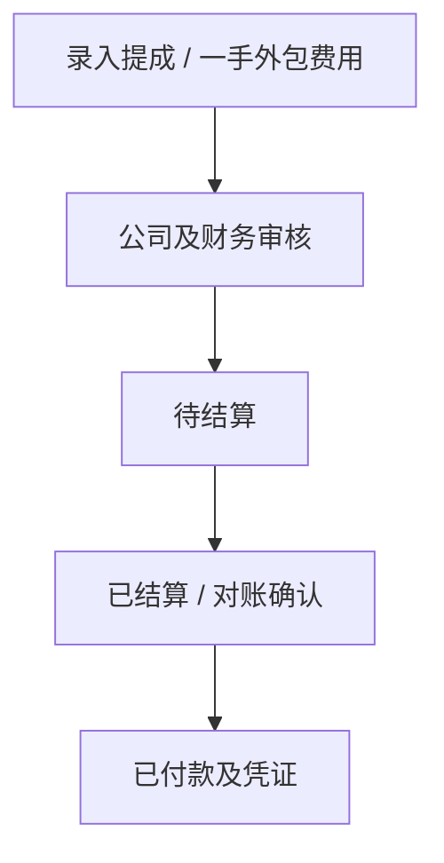

一手外包最终应付 = 已确认基础金额 − 有依据的质检扣款 − 有依据的返修扣款 + 已批准调整。同一扣款不得在两个类别重复扣除，后续转包机构不自动生成公司应付。

## 十、<span id="rework">返修管理</span> <a href="#前言" style="font-size:17px; color:green;"><b>🔼</b></a> <a href="#🔚" style="font-size:17px; color:green;"><b>🔽</b></a>

### 10.1、<span id="rework-types">返修判断与原单关联</span> <a href="#前言" style="font-size:17px; color:green;"><b>🔼</b></a> <a href="#🔚" style="font-size:17px; color:green;"><b>🔽</b></a>

每次返修生成子工单并关联原单号、设备、故障、质保约定及历史链路。客服／技术人员依据质保和检测证据判断免费质保、收费返修或待协商；系统提示质保日期，但不自行判定人为损坏与责任。

免费质保仍记录维修方案、客户确认、交付及验收，客户价格可为 0，保留实际成本；成本可以归集原单或独立核算，统计时避免双计。收费返修执行正常询价、报价、维修确认及收付款流程。

### 10.2、<span id="rework-detail-flow">返修流程与统计</span> <a href="#前言" style="font-size:17px; color:green;"><b>🔼</b></a> <a href="#🔚" style="font-size:17px; color:green;"><b>🔽</b></a>

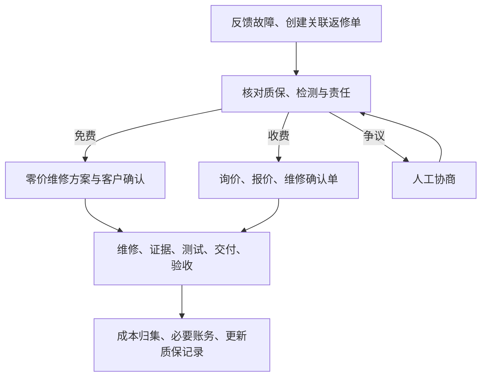

按工程师、设备、故障、月份、项目及企业／个人类型统计返修，统一分母、重复返修次数和统计区间。返修不默认重置原质保；确需延长或重新起算时按双方确认的新约定另存版本。

## 十一、<span id="warranty">质保管理</span> <a href="#前言" style="font-size:17px; color:green;"><b>🔼</b></a> <a href="#🔚" style="font-size:17px; color:green;"><b>🔽</b></a>

### 11.1、<span id="warranty-rules">默认 3 个月与单据自定义</span> <a href="#前言" style="font-size:17px; color:green;"><b>🔼</b></a> <a href="#🔚" style="font-size:17px; color:green;"><b>🔽</b></a>

维修质保一视同仁默认 **3 个月**，不按设备类型建立不同默认值。大客户可协商 **6 个月**或其他时长，单据级别允许自定义；填写调整原因／谈判依据和审批人，维修确认单明确展示并经客户确认。

配件销售沿用 3 个月默认约定；供应商质保单独记录，不覆盖公司已对客户作出的承诺。客户／项目可有推荐约定值，但新工单必须明确带入并确认，不能静默覆盖统一默认或历史单据。

| 项目 | 本版实施口径 |
| :--- | :--- |
| 输入 | 正整数月，默认 3；6 个月只是常见示例，允许其他正整数，特殊日数约定另行评审 |
| 起算 | 客户签署验收通过日或符合约定的系统自动验收生效日，与是否收到款项无关 |
| 截止 | 从起算日按日历月相加；目标月无同日则取月末，截止日当日仍在质保内，次日过期 |
| 示例 | 2026-10-06 起算，3 个月截止 2027-01-06；6 个月截止 2027-04-06；2026-01-31 加 3 个月取 2026-04-30 |
| 变更 | 签署前可修改草稿；签署后新增约定版本并重新确认，不回写旧记录 |
| 提醒与续保 | 到期前 30 日提醒，可配置；续保生成新记录与确认依据，不在第一阶段自动收续保费 |

未达到有效验收条件不自行起算；若协商结案另约质保起算，需记录明确依据及双方确认，不能伪造验收通过。

### 11.2、<span id="warranty-examples">质保展示与返修</span> <a href="#前言" style="font-size:17px; color:green;"><b>🔼</b></a> <a href="#🔚" style="font-size:17px; color:green;"><b>🔽</b></a>

企业与个人均可查询自己的质保时长、起止日、剩余天数、适用范围、关联确认单和返修历史。后台可按 3 个月默认、自定义时长、即将到期和已过期筛选。未付款工单应同时显示“待付款”和“质保中”，不能隐藏或推迟售后。

## 十二、<span id="milestones">项目里程碑</span> <a href="#前言" style="font-size:17px; color:green;"><b>🔼</b></a> <a href="#🔚" style="font-size:17px; color:green;"><b>🔽</b></a>

| 阶段 | 工作与交付 | 完成条件 |
| :--- | :--- | :--- |
| 第一阶段：拉业务框架 | 对照现有工程补业务骨架，本机 Go + TiDB；角色与工单、确认签名、待办、证据、物流、外包质检、销售、采购库存、财务、质保返修、成本提成与基础报表 | 主要场景与例外可运行；人工替代可办理且可追踪；完成本机业务验收 |
| 第二阶段：接付费服务 | 云部署及迁移、微信／支付宝聚合支付、百度地图、物流聚合、微信／短信、腾讯电子签 | 真实账号和资质就绪；成功／失败／重复／异常处理及对账验证；历史数据可用 |
| 第三阶段：企业知识库与 AI 客服 | 审核知识源、维修单及物流查询、公司邮寄地址、自然语言回答、权限和转人工 | 可追溯来源、动态信息正确、未授权不泄露、疑难转人工 |

第一阶段内部可分批交付，但成本、返修、质保、质检和库存基础业务不再整体拖到第二阶段。周期待完成差距清单和人员估算后确认，不沿用原稿的固定月份承诺。任何阶段都保留人工干预和协商路径。

## 十三、<span id="acceptance-criteria">验收标准</span> <a href="#前言" style="font-size:17px; color:green;"><b>🔼</b></a> <a href="#🔚" style="font-size:17px; color:green;"><b>🔽</b></a>

### 13.1、<span id="phase-one-acceptance">第一阶段场景验收</span> <a href="#前言" style="font-size:17px; color:green;"><b>🔼</b></a> <a href="#🔚" style="font-size:17px; color:green;"><b>🔽</b></a>

| 编号 | 场景 | 通过标准 |
| :--- | :--- | :--- |
| A01 | 本机服务与持久化 | Go／TiDB／文件服务可运行；重启后账号、工单、签名与附件可读取；备份恢复抽查成功 |
| A02 | 自有寄修完整链路 | 收件→检测询价→维修确认签名→维修测试→发货签收→验收，无缺失确认或交付节点 |
| A03 | 寄修外包与质检 | 一手派单、转寄收件、维修回寄、质检不合格退修、复检、交付、结算可追踪 |
| A04 | 上门行程 | 年月日时必选、分可选、无秒；日历／拨轮／手输可用；变更更新提醒；客户看不到内部模块 |
| A05 | 时间锁定 | 发生前可改；实际开始或计划到点后执行人不可改，删除重建不能绕过；管理员改时有原因和前后审计 |
| A06 | 两次签名 | PC 鼠标、手机触摸可签；空白拒绝；维修确认与验收独立；改价／改范围／改质保需新版本及重新确认 |
| A07 | 离职与拒签 | 交接新经办人不丢旧快照，旧账号失去后续权限；拒签转协商，管理员不能伪造客户签名 |
| A08 | 多媒体与一单资料 | 文字／图片／视频／语音可归档及查询；授权资料包串起全部参与方和环节，缺失可见 |
| A09 | 删除权限 | 发布者可删自己证据，管理员可删任意；他人被拒；原件和旧链接不可访问，保留占位及审计 |
| A10 | 删除影响 | 已签版本不被静默篡改，删证据不倒退已核销状态；缺失引用和数量不达标产生补证待办 |
| A11 | 个人／企业预付款 | 个人录单推荐提醒，可不收仍推进；选择到账前提才限制开修；企业默认不收，不强制套提醒 |
| A12 | 现金与发票 | 首期所有收款为现金；收款人／时间／用途／收据、财务核实、现金交接、部分及多次收款、预付款抵扣、现金退款可查；PDF／图片发票与收据区分，模拟不计真账 |
| A13 | 默认／自定义质保 | 不同维修类型均默认 3 个月，可确认 6 或其他月数；验收起算，不等回款；月末及到期边界正确 |
| A14 | 自动验收边界 | 第 8 日条件一致；上门／异议／缺签收／未告知单不执行；幂等、并发异议、停机补跑可追溯，无伪造签章 |
| A15 | 后续外包可选 | 只录一手可走通；可录二手及多级／回流，未知可标记；不会为二手生成公司结算关系 |
| A16 | 销售／采购／库存 | 销售现款／账期、采购审批、分批收货、出入库、自送／自取、验收和供应商对账可登记 |
| A17 | 成本／提成／返修 | 多提成方、成本审核、扣款去重、免费及收费返修与原单关联可查询 |
| A18 | 权限与接口降级 | 跨客户／跨企业访问被拒；所有动态列表空态可重载；API 成功切真数据，失败在独立演示副本操作 |
| A19 | 人工例外 | 延期、缺证据、紧急施工、取消、部分结算均有原因／授权／后续待办，不能留下无负责人的中断 |
| A20 | 来源与阶段 | 未接渠道清楚标识人工／模拟；第一阶段没有付费接口也能办理业务；不把接口预留称作接入成功 |
| A21 | 主状态与分类 | 全端使用同一套经评审的主状态字典；收件、派单、发货事件及等待事项可查，不能被要求分别改成多个工单状态 |
| A22 | 人工确认与草稿 | 只上传照片、保存草稿、生成报价、到预计时间不推进阶段；有效确认一次后关联事实、主表、时间轴和下一待办一致 |
| A23 | 连续动作与责任 | 有测试权限的自有师傅可一次提交完工与真实测试结果；外包不能自行通过公司质检；客户签署和财务核实各由有权人员完成 |
| A24 | 服务分支 | 寄修／上门沿维修主线，销售跳过检测维修质检；发货后仍待交付，核实完整客户交付后才待验收，上门不能按 7 日自动验收 |
| A25 | 异议与终态余项 | 异议保留原主阶段并有阻塞、责任人和期限；批准整改先回待执行，实际开修才维修中；销售退换重新备货不进维修；已验收返修开子单；取消仍可处理退款／退件；两项阻塞仅解决一项时，另一项仍限制相关动作及自动验收 |
| A26 | 只读收款与质保 | 应收 1000 元、两笔已核实现金 300＋700 元时净实收 1000、余额 0；只登记未核实不计入；实退 100 后净实收 900、余额 100，获批调减应收另按新约定计算；再收到经核实的 200 后净实收 1100、余额 0、超收 100；交接不重计；质保依据日期变化，无人工切换 |
| A27 | 并发与重复提交 | 同请求键重复确认不重记现金、不重签、不重推进；过期页面不得覆盖新版本或改派；失败时不留下只有主状态变化的半套记录 |
| A28 | 操作与查询效率 | 收件、完工、现金核实等动作各只在对应表单确认本次事实，摘要无重复填写；记录必要确认次数及跨页次数，分页列表不逐行加载整条证据／事件链，按约定数据量检验响应指标 |

| A29 | 并行待办与可见范围 | 同单师傅维修、财务现金待核实，两方各自清单均可处理；核实现金不覆盖维修待办；客户不能看到内部行程、成本或转包任务 |
| A30 | 整单与分批事实 | 一单多设备时部分完工、发货、签收或验收不代表整单完成；独立范围经确认拆单后关联可查，款项、成本和统计不双计 |
| A31 | 签署结论与特殊质保 | 已签的不合格／有异议验收仍待验收；特殊协商起保有双方确认及范围依据，不能伪造验收通过或客户签名 |

第一阶段主要角色至少各走通一组真实内测或受控样例场景，P0 无阻塞问题，P1 有可办理的基本记录。可延续原稿“3 家企业、10 名个人”作为业务试用目标，最终样本和时间由业务安排；样例测试不能冒充真实客户验收。

### 13.2、<span id="phase-two-acceptance">第二阶段渠道验收</span> <a href="#前言" style="font-size:17px; color:green;"><b>🔼</b></a> <a href="#🔚" style="font-size:17px; color:green;"><b>🔽</b></a>

- 云迁移抽查数据库、媒体、已签单据和发票一致，恢复演练、监控和访问控制通过。
- 微信／支付宝实际授权渠道分别验证成功、失败、重复／乱序回调、主动查单、退款和对账，不能仅看沙箱页面。
- 百度定位拒绝授权可人工填址；物流异常和接口失效可人工登记；消息发送／送达／失败能区分。
- 腾讯电子签分别验证维修确认、验收确认、身份／授权、拒签／超时、回调去重及文件归档；法务复核实际模板及签署流程，不能以“接上接口”作为统一法律效力保证。
- 正式环境按约定条件做性能与安全验证，记录目标与实测差异，不把本机演示算成云可用性通过。

### 13.3、<span id="phase-three-acceptance">第三阶段 AI 客服验收</span> <a href="#前言" style="font-size:17px; color:green;"><b>🔼</b></a> <a href="#🔚" style="font-size:17px; color:green;"><b>🔽</b></a>

- 输入授权物流单号可获取对应运输段；输入维修单号可查流程、师傅、故障反馈及核准价格，答案与业务 API 对照一致。
- 邮寄地址来自当前有效公司配置，多地址不确定时澄清；公开指引与私有订单数据权限分开。
- 未授权单号、错误单号、接口失效、过期知识及提示诱导不能泄露内部资料或生成虚构进度。
- 无法回答／争议场景转人工并保留上下文；能追查回答的知识来源、查询时间与处理人。

## 十四、<span id="risks">风险与处理</span> <a href="#前言" style="font-size:17px; color:green;"><b>🔼</b></a> <a href="#🔚" style="font-size:17px; color:green;"><b>🔽</b></a>

| 实际风险 | 处理 |
| :--- | :--- |
| 经办人离职、授权不清、验收拒签 | 企业主体与人员快照、授权核实、两次书面确认、交接与人工协商 |
| 手写签名被当作已认证电子签 | 明确签署来源，冻结版本，第二阶段接认证和实际存证；不保证所有争议可自动解决 |
| 上传者删除导致证据缺失 | 保留删除权、旧链接失效、占位及审计、补证待办和资料包完整性提示 |
| 已发生上门时间被改 | 服务端判定锁定，追加说明，管理员纠正必须留痕 |
| 费用重复收取、个人误扣款 | 内部备忘与报价／成本分离，预付款可选、抵扣及核销去重 |
| 外包继续转包而信息不全 | 只认一手责任，后续可选且允许未知，已知流向和证据如实记录 |
| 公司质检缺失或直接交付争议 | 默认中转质检，例外登记批准、替代依据和责任 |
| 客户账期慢、验收与售后卡住 | 工单履约主状态与收款、质保事实区分；人工确认事实，标签计算，不因未付款推迟质保 |
| 本机停机或文件丢失 | 持久化、每日备份、恢复抽查、任务补扫、待核实异议先暂停自动处理 |
| 渠道失效或支付结果未知 | 显示来源和时间、主动查单、人工替代；不把未知结果直接变成重复扣款 |
| 个人资料过量收集 | 按业务必要性核验、最小访问、敏感字段保护和生命周期管理 |
| AI 编造价格／地址／责任 | 动态业务查询、审核知识源、权限过滤、出处和转人工 |

## 十五、<span id="appendix">变更对照与评审项</span> <a href="#前言" style="font-size:17px; color:green;"><b>🔼</b></a> <a href="#🔚" style="font-size:17px; color:green;"><b>🔽</b></a>

### 15.1、<span id="change-log">V3.4 → V3.6 需求对照</span> <a href="#前言" style="font-size:17px; color:green;"><b>🔼</b></a> <a href="#🔚" style="font-size:17px; color:green;"><b>🔽</b></a>

本表保留 V3.4 至 V3.5 的业务调整，并加入甲方审阅 V3.5 后提出的工单、状态维度、人工确认与效率要求。主状态枚举与字段仍是本版评审建议。

| 旧版事项 | V3.6 评审口径 | 入口 |
| :--- | :--- | :--- |
| V3.5 多维状态表混合主阶段、事件与待办 | 一单一个主状态；事件、待办、明细状态、只读派生信息分清，建议 12 个主状态 | [主状态](#primary-states) |
| V3.5 主表有多组含义重复的状态摘要 | 主表保存当前阶段、责任人、关键待办及只读摘要；完整事实在明细，避免重复人工填写 | [主表职责](#work-order-read-model) |
| 大部分状态需人工确认，但操作与效率未细化 | 一次业务动作同步相关记录，草稿不推进；职责不同的确认保留，列表分页按需读详情 | [动作与效率](#manual-actions) |
| 第一期付费接口、第二期补核心业务 | 第一期尽量覆盖全部业务并人工替代，第二期接付费渠道 | [阶段矩阵](#phase-matrix) |
| 原稿的后端／数据库备选和定时任务组件 | Go + TiDB，复用现有工程和 Go 任务 | [技术栈](#recommended-stack) |
| 多个电子签、地图及物流备选混杂 | 腾讯电子签、百度地图、快递100／快递鸟，均第二阶段 | [渠道清单](#integrations) |
| 报价按钮确认、仅最终电子验收 | 检测询价后维修确认单、最终验收单，两次独立签名 | [书面确认](#written-confirmation) |
| 经办人离职未定义 | 主体／授权／签署快照，人员交接与拒签协商 | [交接](#contact-handover) |
| 上门内部行程未细化 | 内部待办、费用备忘、年月日时必选分可选、发生后锁定 | [上门待办](#onsite-todo) |
| 证据仅照片／视频，删除规则缺失 | 四类媒体、同单全链路、上传者和管理员删除、审计与缺证提醒 | [证据](#evidence) |
| 质保按设备配置、付款后进入质保 | 统一默认 3 个月，可单据自定义，验收起算与收款并行 | [质保](#warranty-rules) |
| 发票只给 PDF 地址 | PDF／图片、多附件、开票／红冲／重开历史 | [财务](#finance-flow) |
| 一层外包、模式 A 不明确 | 公司中转质检为默认，只认一手，二手起可选多级流向 | [外包](#outsource-chain) |
| 个人先款分支、押金提醒不明 | 个人录单推荐可选预付款，企业默认不收 | [预付款](#advance-payment) |
| 第一版收款渠道进一步明确 | 首期所有收款统一现金，登记、财务核实、交接和退款可追溯 | [现金收款](#cash-collection) |
| 自动验收三种日期算法、自动签章 | 自然日口径、条件核验、异议暂停、系统记录无客户签章 | [验收窗口](#acceptance-window) |
| 协商直接进入财务／质保 | 主状态保留原阶段，协商作为阻塞及待办；有结果依据才推进，拒签不自动合格 | [协商](#negotiation) |
| 第三期智能派单／诊断／预测维护 | 企业知识库、物流号、维修号、邮寄地址问答与转人工 | [AI 客服](#ai-service) |

### 15.2、<span id="review-items">实施前可评审的参数与规则</span> <a href="#前言" style="font-size:17px; color:green;"><b>🔼</b></a> <a href="#🔚" style="font-size:17px; color:green;"><b>🔽</b></a>

以下不阻塞需求文档交付；涉及真实客户资料、合同与资金的规则应在对应上线前落实。未确认配置必须如实显示待配置，不能虚构地址、商户或签署认证。

| 确认项 | 本版建议／当前边界 | 确认时点 |
| :--- | :--- | :--- |
| 工单范围与分批处理 | 同一主状态表达同一有效范围；部分事实不代表整单通过，独立办理范围可确认拆单并明确账务归属 | 第一阶段流程设计前 |
| 主状态粒度与字典 | 本版建议 12 个；重点确认待安排、待执行、待质检是否符合实际交接，再统一代码与显示名称 | 第一阶段数据库及接口设计前 |
| 人工确认与责任安排 | 确认各动作的角色、总负责人、未认领队列兜底、允许合并的连续动作和例外批准人 | 第一阶段流程联调前 |
| 操作与查询效率 | 以典型寄修、上门、销售、外包单检查重复填写与跨页；约定工单／明细规模、并发与响应目标 | 第一阶段联调前 |
| 证据删除后生命周期 | 普通删除立即停用原件访问并保留审计；隔离保留期、恢复、备份清除及物理删除期限待定 | 真实资料内测前 |
| 验收窗口算法 | 签收日为第 1 日，第 8 日 00:00 起符合条件；停机补跑按生效时间起质保 | 自动验收启用前 |
| 授权、书面条款与例外结案 | 核实企业经办人权限、维修／验收模板、自动验收告知、紧急处置与争议依据 | 真实业务使用前 |
| 质保日界及特殊时长 | 统一正整数月、月末取末日、截止日有效；特殊天数与返修延保另约 | 合同模板启用前 |
| 费用、预付款与结算 | 内部备忘必填，是否收费及金额由报价确认；预付款可选、抵扣退款按约定；扣款有依据 | 真实收付款登记前 |
| 公司寄送配置 | 真实地址、收件人、电话、时间、多地址适用范围及打包须知 | 寄修业务内测前 |
| 媒体和提醒参数 | 文件大小／类型、提醒提前量、超时、资料数量例外批准角色 | 第一阶段联调前 |
| 云与真实渠道 | 云服务商、聚合支付商、物流供应商、短信及微信资格、腾讯电子签套餐及认证能力 | 第二阶段实施前 |
| AI 方案与指标 | 知识审核人、模型／检索方案、数据权限、预算及回答评测集 | 第三阶段实施前 |

### 15.3、<span id="official-references">官方依据与关联文档</span> <a href="#前言" style="font-size:17px; color:green;"><b>🔼</b></a> <a href="#🔚" style="font-size:17px; color:green;"><b>🔽</b></a>

- [V3.4 原需求](./物业设备维修服务平台%20PRD%20V3.4.md)、[V3.4 Jobs规范版](./物业设备维修服务平台%20PRD%20V3.4（Jobs规范版）.md)、[V3.5 Jobs规范版](./物业设备维修服务平台%20PRD%20V3.5（Jobs规范版）.md)：独立保留。
- [2026-10-05 阶段封板说明](../封板说明-2026-10-05.md)、[心愿单](../心愿单.md)：历史已实现范围与后续模块边界。
- [腾讯电子签开发者中心](https://qian.tencent.com/developers/)及[接口概览](https://qian.tencent.com/developers/companyApis/)：提供认证、签署、验签及存证相关能力，第二阶段按实际账号和产品能力联调。
- [《中华人民共和国电子签名法》官方原文](https://www.miit.gov.cn/jgsj/zfs/fl/art/2022/art_e3f623f70c23497e88a941170093446a.html)：第十三、十四条分别规定可靠电子签名条件和相应效力，不能仅凭签名图片或经办人任职事实推定已满足全部条件。
- [TiDB 本机测试说明](https://docs.pingcap.com/tidb/stable/tiup-playground/)与[生产部署管理](https://docs.pingcap.com/tidb/stable/tiup-cluster/)：本机测试与生产部署须区分；使用临时测试启动方式时核实数据保留机制，本项目内测必须显式持久化并备份。

## 十六、<span id="development">开发拆解建议</span> <a href="#前言" style="font-size:17px; color:green;"><b>🔼</b></a> <a href="#🔚" style="font-size:17px; color:green;"><b>🔽</b></a>

### 16.1、<span id="development-order">第一阶段实施顺序</span> <a href="#前言" style="font-size:17px; color:green;"><b>🔼</b></a> <a href="#🔚" style="font-size:17px; color:green;"><b>🔽</b></a>

1、对照现有封板代码与本版需求建立差距清单，先确认哪些模块可复用、哪些需要补齐；数据库采用增量迁移，不直接以 PRD 表结构覆盖现库。

2、完善身份、企业授权、人员交接、统一工单主状态、人工动作及只读派生信息，以及四类证据、审计、附件删除和时间轴。

3、完善检测询价、报价审核与版本、《维修确认单》《验收确认单》及 PC／移动签名。

4、走通自有寄修与上门，加入内部待办、时间锁定、费用备忘、交付和受控自动验收。

5、走通一手外包、可选后续流向、回寄质检及销售／采购／库存基本记录。

6、完善现金收款、财务核实与交接、现金退款、个人预付款推荐、企业账期、电子发票、成本提成、结算、质保和返修。

7、完成通知待办、报表导出、API 失败回退与空态、持久化及备份恢复，并逐项执行第一阶段场景验收。

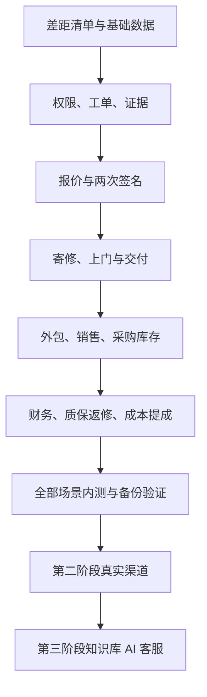

### 16.2、<span id="development-notes">模块与验证边界</span> <a href="#前言" style="font-size:17px; color:green;"><b>🔼</b></a> <a href="#🔚" style="font-size:17px; color:green;"><b>🔽</b></a>

工单、确认签署、证据、待办、物流、外包、采购库存、财务、质保返修、通知与 AI 查询分别有清晰模块边界，共用工单号和权限体系。独立聊天能力继续解耦；第一阶段可用协商记录办理沟通。

开发验收覆盖真实业务记录及独立演示副本、金额和库存幂等、版本变更、删除鉴权、时间锁定、自动验收日期／异议并发、企业交接和未授权查询。完成后记录“已实现／已验证／待验证”，分别区分本机、真实渠道和实体设备结果；本 PRD 升级不修改业务源码、不部署服务、不产生真实签约或扣款。

<a id="🔚" href="#前言" style="font-size:17px; color:green; font-weight:bold;">我是有底线的➤点我回到首页</a>
